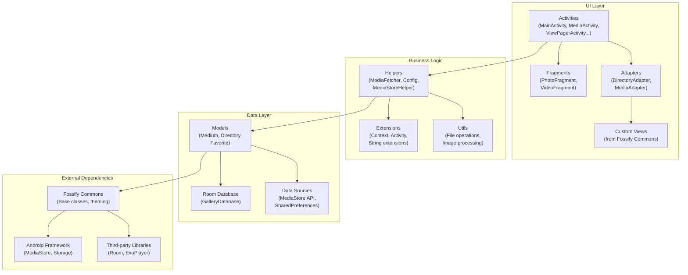
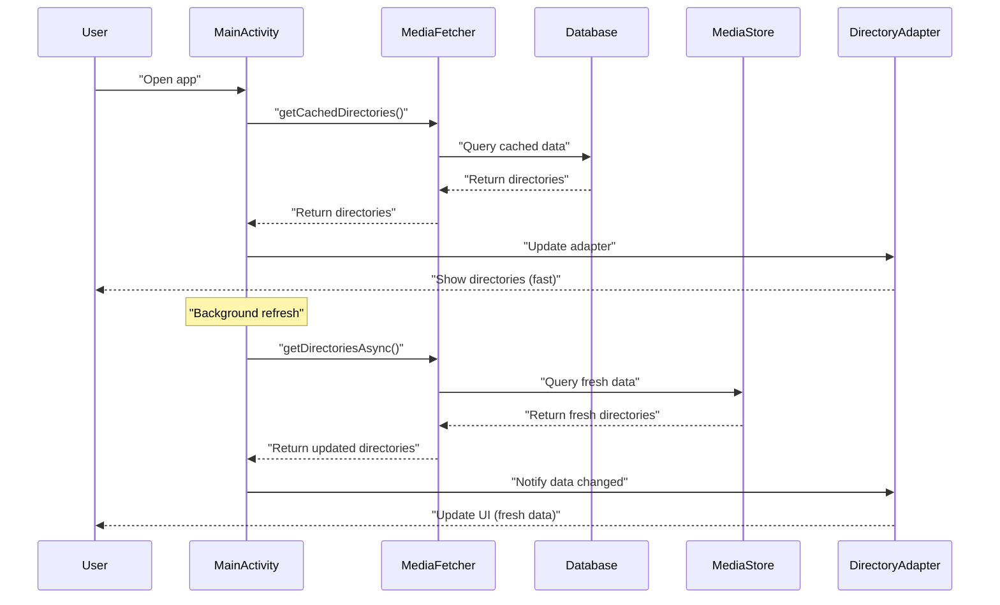

--- FILE: project_documentation/1_OVERVIEW/app_architecture.md ---

# App Architecture - Fossify Gallery

## Overview

Fossify Gallery is an open-source photo and video management application for Android, built with Activity-based architecture with focus on **privacy**, **performance** and **user experience**. The application uses 100% Kotlin and follows modern Android best practices.

## High-Level Architecture



## Component Breakdown

### 1. UI Layer (Presentation)

- **Activities**: 18 main activities handling different screens
  - `MainActivity`: Main screen displaying directories
  - `MediaActivity`: Display media in directory
  - `ViewPagerActivity`: View photos/videos fullscreen
  - `EditActivity`: Photo editing
  - `VideoPlayerActivity`: Video playback
  - `SettingsActivity`: App settings

- **Adapters**: Manage data display in RecyclerView
  - `DirectoriesAdapter`: Directory grid display
  - `MediaAdapter`: Media files display  
  - `MyPagerAdapter`: ViewPager management

- **Custom Views**: Inherit from Fossify Commons
  - Uses ViewBinding for type-safe view access
  - Material Design with Dynamic Theming

### 2. Business Logic Layer

- **Helpers**: Contains main application logic
  - `MediaFetcher`: Collect media from MediaStore
  - `Config`: SharedPreferences wrapper
  - `MediaStoreHelper`: MediaStore API operations
  - `DBHelper`: Database operations

- **Extensions**: Extend functionality for existing classes
  - Extension functions for Context, Activity, etc.

### 3. Data Layer

#### Data Models
- `Medium`: Entity for media files
- `Directory`: Entity for directories
- `Favorite`: Entity for favorites
- `Widget`: Entity for widgets

#### Core Models
- `Medium`: Represents media file (photo/video)
- `Directory`: Represents directory
- `AlbumCover`: Cover for album

## Architecture Flow



## Key Architecture Principles

### **1. Separation of Concerns**
- UI logic completely separated from business logic
- Data access encapsulated in helper classes
- Each Activity has clear responsibility

### **2. Single Responsibility**
- Each class has one main function
- Dependencies are managed centralized
- Clear interfaces between layers

### **3. Performance First**
- Lazy loading for media files
- Background threading for heavy operations
- Caching strategy with Room Database
- RecyclerView optimization with ViewHolder pattern

### **4. Privacy & Security**
- App lock with biometrics
- Hidden folder protection
- No analytics or tracking
- Local data storage (no cloud sync)

## Technology Stack

| Component | Technology |
|-----------|------------|
| Language | 100% Kotlin |
| UI Framework | Android Views + ViewBinding |
| Database | Room Database |
| Architecture | Activity-based |
| DI | Manual Dependency Injection |
| Threading | AsyncTask + Thread |
| Image Loading | Custom implementation |
| Video Playback | ExoPlayer |
| Testing | JUnit + Espresso |

## Project Structure

```
app/src/main/kotlin/org/fossify/gallery/
├── activities/         # UI Controllers
├── adapters/          # RecyclerView Adapters  
├── asynctasks/        # Background Tasks
├── databases/         # Room Database
├── dialogs/          # Custom Dialogs
├── extensions/       # Extension Functions
├── fragments/        # UI Fragments
├── helpers/          # Business Logic
├── interfaces/       # Contracts & Callbacks
├── models/           # Data Models
└── views/            # Custom Views
```

--- END FILE: project_documentation/1_OVERVIEW/app_architecture.md --- 