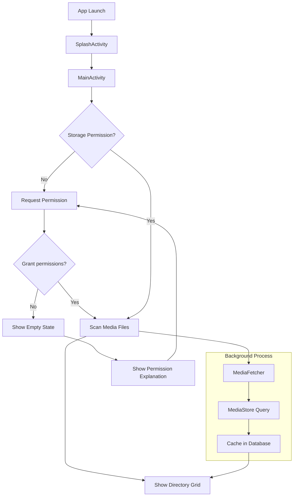
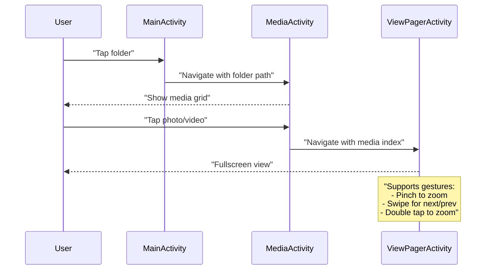
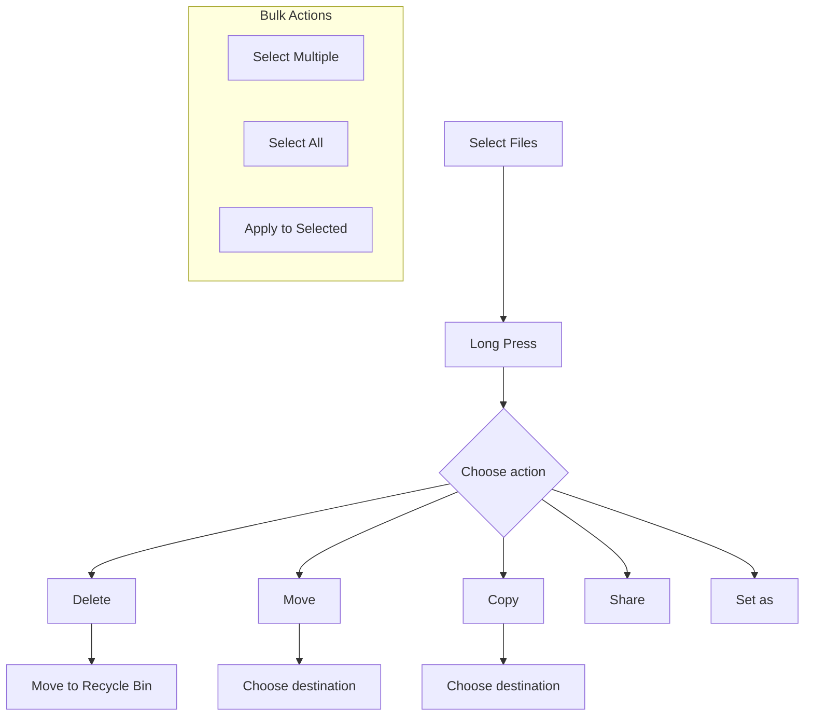
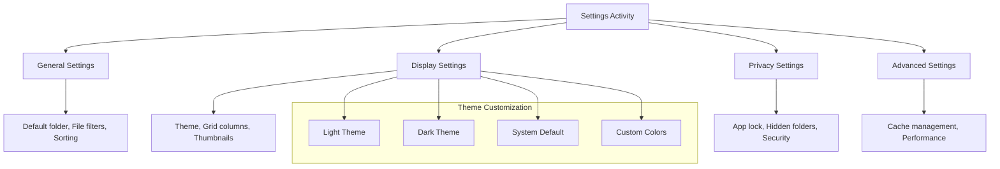
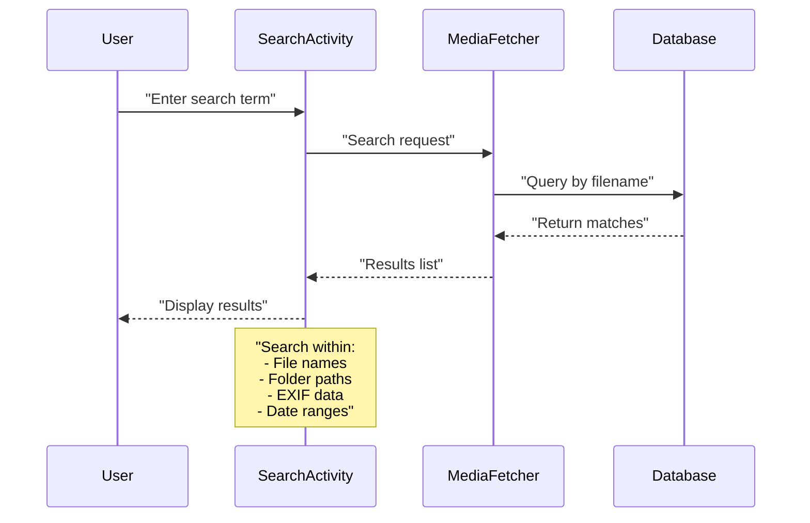
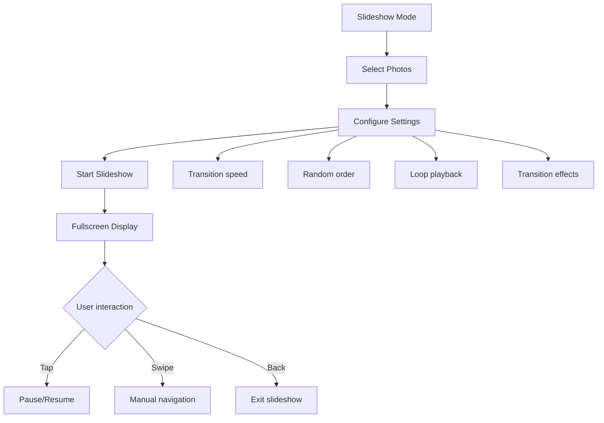

--- FILE: project_documentation/1_OVERVIEW/main_user_flows.md ---

# Fossify Gallery - Main User Flows

## Overview

This document describes the main user interaction flows with Fossify Gallery, from app startup to complex tasks like photo editing and folder management.

## 1. App Startup



### Startup Flow Details

1. **SplashActivity** displays briefly
2. **MainActivity** checks storage access permissions
3. If permissions missing → show permission request dialog
4. **MediaFetcher** scans media files from MediaStore
5. Display grid of directories with thumbnails

## 2. Media Browsing and Viewing



### Supported Media Types

| Type | Features |
|------|----------|
| **Photos** | Zoom, rotate, EXIF data viewing |
| **Videos** | Play/pause, seek, volume control |
| **GIFs** | Auto-play, Frame control |
| **RAW** | Basic viewing, EXIF data |

## 3. File and Folder Management



### File Management Actions

#### **Move/Copy Operations**
1. Select files (long press)
2. Choose "Move" or "Copy"
3. Navigate to destination folder
4. Confirm operation

#### **Delete Operations**
- **Soft Delete**: Move to recycle bin (can restore)
- **Permanent Delete**: Remove from storage completely

## 4. Photo Editing

```mermaid
graph TD
    A[Photo Selected] --> B[EditActivity]
    B --> C[Load Image]
    C --> D{Choose edit type}
    D --> E[Filters]
    D --> F[Adjustments]
    D --> G[Crop/Rotate]
    D --> H[Draw/Text]
    
    E --> I[Apply filter preset"]
    F --> J[Brightness, Contrast, Saturation]
    G --> K[Crop to aspect ratio]
    H --> L[Add drawings/annotations]
    
    I --> M[Preview Changes]
    J --> M
    K --> M
    L --> M
    
    M --> N{Save changes?}
    N -->|Yes| O[Save to Gallery]
    N -->|No| P[Discard Changes]
```

### Editing Features

| Category | Tools Available |
|----------|----------------|
| **Filters** | Vintage, B&W, Sepia, Blur, Sharpen |
| **Adjustments** | Brightness, Contrast, Saturation, Vibrance |
| **Crop** | Free crop, Aspect ratios, Manual coordinates |
| **Rotation** | 90° increments, Free rotation |
| **Draw** | Brush tool, Color picker, Opacity control |
| **Text** | Add text overlay, Font selection |

## 5. Settings and Customization



### Settings Categories

- **General**: Default directory, file type filters
- **Display**: Grid size, thumbnail style and spacing
- **Privacy**: Hidden folder access, app security
- **Advanced**: Performance settings, cache management
- **Security**: App lock with PIN/Pattern/Biometrics

### Performance Options
- **Load Quality**: Thumbnail vs full resolution
- **Animation**: Transition effects on/off
- **Memory**: Cache size configuration
- **File loading priority**: Speed vs Quality
- **Background refresh**: Auto-sync frequency
- **Thumbnail caching strategy**: Database vs file system

## 6. Search and Discovery



### Search Capabilities

| Search Type | Examples |
|-------------|----------|
| **Filename** | "vacation", "IMG_2023" |
| **Date range** | "2023", "December", "last week" |
| **File type** | Photos only, Videos only, RAW files |
| **Location** | EXIF GPS data (if available) |
| **EXIF data** | Camera model, settings |

## 7. Slideshow and Presentation



### Slideshow Features
- **Timer**: 1-30 seconds per photo
- **Transitions**: Fade, slide, zoom effects
- **Order**: Sequential or random
- **Loop**: Continuous playback
- **Interaction**: Pause, skip, exit anytime

## 8. Widgets and Shortcuts

### Home Screen Widget
- Display random photos from selected folder
- Click widget → open app directly
- Configurable refresh interval

### App Shortcuts
- **Camera**: Open camera directly
- **Last photo**: Jump to recent photo
- **Favorites**: Quick access to starred items

---
**End of Main User Flows Documentation**
