--- FILE: project_documentation/2_APP_MODULE/README.md ---

# App Module - Fossify Gallery

## Overview

The `app` module is the main module containing all logic and UI of Fossify Gallery. This module is organized with clear layered architecture with separation between UI, Business Logic and Data Layer.

## Module Structure

```mermaid
graph TD
    subgraph "App Module Structure"
        A["📁 activities/"] --> A1["MainActivity<br/>MediaActivity<br/>ViewPagerActivity<br/>..."]
        B["📁 adapters/"] --> B1["DirectoryAdapter<br/>MediaAdapter<br/>MyPagerAdapter"]
        C["📁 helpers/"] --> C1["MediaFetcher<br/>Config<br/>DBHelper"]
        D["📁 models/"] --> D1["Medium<br/>Directory<br/>Favorite"]
        E["📁 databases/"] --> E1["GalleryDatabase<br/>DAOs<br/>Entities"]
        F["📁 extensions/"] --> F1["Context extensions<br/>Activity extensions"]
        G["📁 dialogs/"] --> G1["Custom dialogs<br/>Confirmation dialogs"]
        H["📁 views/"] --> H1["Custom views<br/>RecyclerView components"]
        I["📁 interfaces/"] --> I1["Listeners<br/>Callbacks"]
        J["📁 fragments/"] --> J1["Photo/Video fragments"]
    end
```

## Layer Architecture

### 🎨 **UI Layer**
Responsible for display and user interaction:

- **[Activities & Fragments](ui_layer/activities_fragments.md)**: UI Controllers
- **[Views & Adapters](ui_layer/views_and_adapters.md)**: Custom views and data display

### 🧠 **ViewModel Layer**  
*Note: Fossify Gallery does not use traditional ViewModel pattern, instead uses logic in Activities*

- **[Architecture Pattern](viewmodel_layer/architecture_pattern.md)**: Why no ViewModels, Activity-based architecture

### 💾 **Data Layer**
Manages data and persistence:

- **[Data Sources](data_layer/data_sources.md)**: MediaStore and Room Database

### 🔧 **Dependency Injection**
- **[DI Setup](di_setup.md)**: Manual dependency injection patterns

## Build Configuration

### Gradle Files

| File | Purpose |
|------|---------|
| `build.gradle.kts` | Root project configuration |
| `app/build.gradle.kts` | App-level build configuration |
| `gradle/libs.versions.toml` | Version catalog for dependencies |

### Build Variants

## Dependencies

| Category | Libraries |
|----------|-----------|
| **UI** | ViewBinding, ConstraintLayout, SwipeRefreshLayout |
| **Database** | Room Database, SQLite |
| **Media** | ExoPlayer, Custom image loading |
| **Testing** | JUnit, Espresso, Mockito |
| **Utils** | Kotlin extensions |
| **Commons** | Fossify Commons library |

## Performance Considerations

### Memory Management
- Lazy loading for large image files
- Proper ViewHolder recycling in adapters
- Bitmap caching and compression
- Background processing for heavy operations

### Storage Optimization
- Thumbnail caching in database
- Efficient media scanning with MediaStore
- Progressive loading for large galleries

### Video Performance
- ExoPlayer optimization
- Efficient use of ExoPlayer
- Smart refresh strategies

### Security Features
- Private folder protection
- Local storage only (no cloud sync)
- Permission-based access
- Secure folder hiding with encryption
- App lock with biometric authentication

### Android Compliance
- Scoped storage compliance (Android 10+)
- Runtime permission handling
- Safe file operations with try-catch

## Testing Strategy

### Unit Tests
- Helper class logic
- Model validation
- Utility functions

### Integration Tests
- Database operations
- MediaStore interactions
- File system operations

### UI Tests
- Activity navigation
- User interaction simulation
- End-to-end workflows

--- END FILE: project_documentation/2_APP_MODULE/README.md --- 