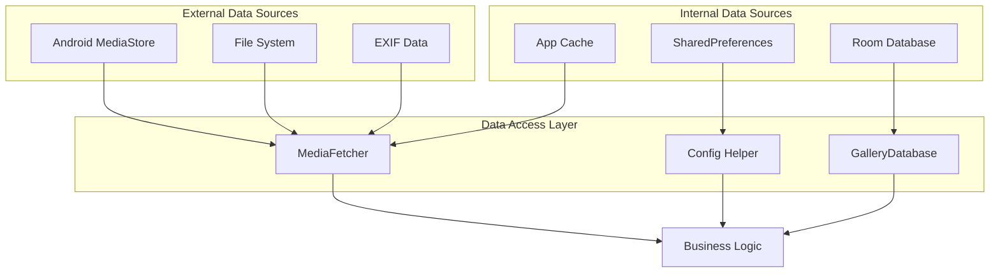
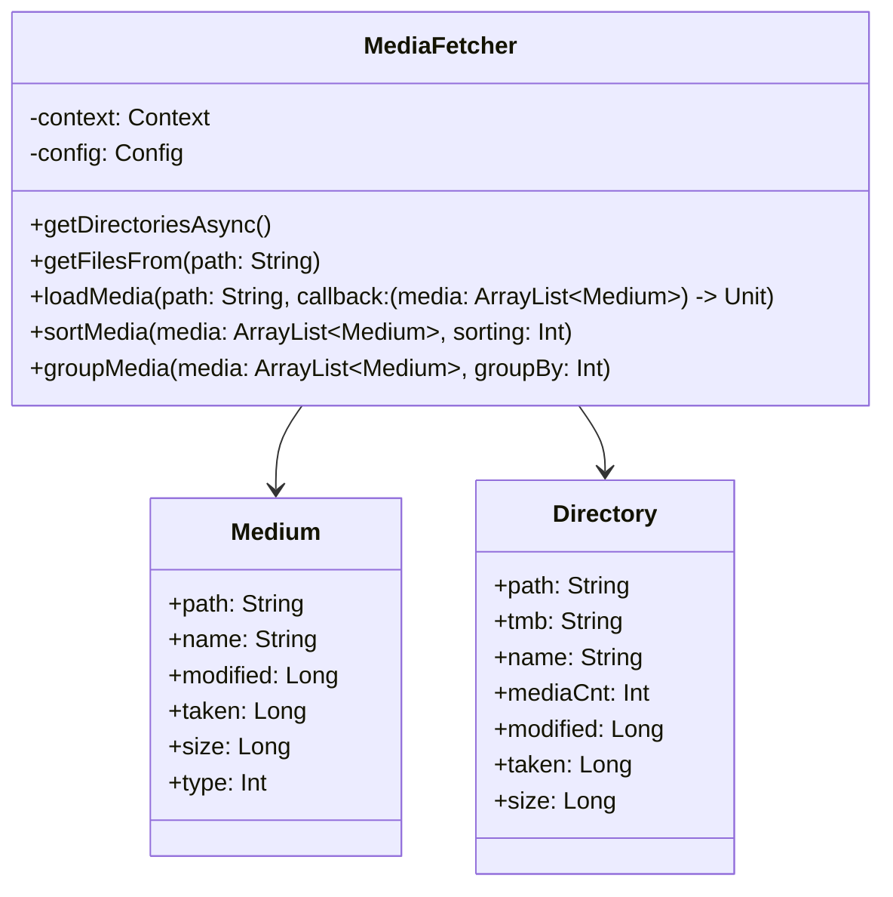
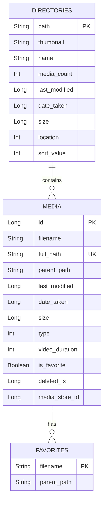
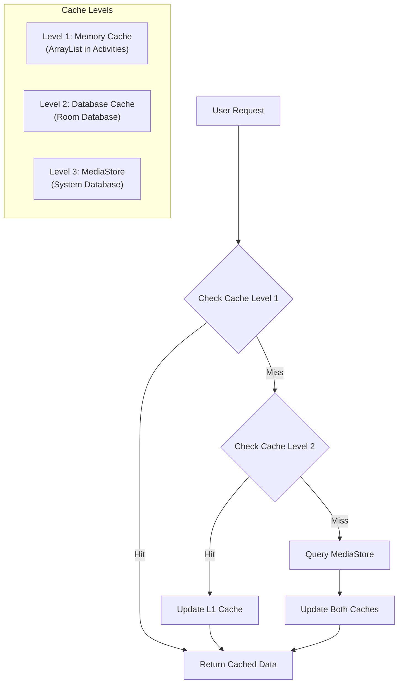

# Data Sources - Media Data Management

## Overview
Fossify Gallery uses two main data sources: **MediaStore API** to access media files from the Android system and **Room Database** to cache and manage metadata locally.

## Data Sources Architecture



## MediaStore API Integration

### **MediaFetcher Class**
**File**: `helpers/MediaFetcher.kt` (916 lines) - Core data fetching class



### **MediaStore Queries**

#### **Retrieving Media Files List**
```kotlin
private fun getMediaInFolder(folder: String): ArrayList<Medium> {
    val media = ArrayList<Medium>()
    val uri = MediaStore.Files.getContentUri("external")
    
    val projection = arrayOf(
        MediaStore.Files.FileColumns._ID,
        MediaStore.Files.FileColumns.DISPLAY_NAME,
        MediaStore.Files.FileColumns.DATA,
        MediaStore.Files.FileColumns.SIZE,
        MediaStore.Files.FileColumns.DATE_MODIFIED,
        MediaStore.Images.Media.DATE_TAKEN
    )
    
    val selection = "${MediaStore.Files.FileColumns.DATA} LIKE ?"
    val selectionArgs = arrayOf("$folder%")
    
    context.contentResolver.query(uri, projection, selection, selectionArgs, null)?.use { cursor ->
        // Process cursor data
    }
    
    return media
}
```

#### **Supported Media Types**
```kotlin
// Constants.kt - Media type definitions
const val TYPE_IMAGES = 1
const val TYPE_VIDEOS = 2  
const val TYPE_GIFS = 4
const val TYPE_RAWS = 8
const val TYPE_SVGS = 16
const val TYPE_PORTRAITS = 32

fun getDefaultFileFilter() = TYPE_IMAGES or TYPE_VIDEOS or TYPE_GIFS or TYPE_RAWS or TYPE_SVGS
```

### **File Format Support**

| Category | Formats | Implementation |
|----------|---------|----------------|
| **Images** | JPEG, PNG, HEIC, HEIF | Native MediaStore |
| **Animated** | GIF, APNG, WEBP | Custom decoders |
| **RAW** | DNG, CR2, NEF, ARW | EXIF parsing |
| **Vector** | SVG | AndroidSVG library |
| **Videos** | MP4, AVI, MKV, WEBM | ExoPlayer |
| **Modern** | AVIF, JXL | Glide integrations |

## Room Database

### **Database Schema**
**File**: `databases/GalleryDatabase.kt` (96 lines)



### **Database Entities**

#### **Medium Entity**
```kotlin
@Entity(tableName = "media", indices = [(Index(value = ["full_path"], unique = true))])
data class Medium(
    @PrimaryKey(autoGenerate = true) var id: Long?,
    @ColumnInfo(name = "filename") var name: String,
    @ColumnInfo(name = "full_path") var path: String,
    @ColumnInfo(name = "parent_path") var parentPath: String,
    @ColumnInfo(name = "last_modified") var modified: Long,
    @ColumnInfo(name = "date_taken") var taken: Long,
    @ColumnInfo(name = "size") var size: Long,
    @ColumnInfo(name = "type") var type: Int,
    @ColumnInfo(name = "video_duration") var videoDuration: Int,
    @ColumnInfo(name = "is_favorite") var isFavorite: Boolean,
    @ColumnInfo(name = "deleted_ts") var deletedTS: Long,
    @ColumnInfo(name = "media_store_id") var mediaStoreId: Long
)
```

#### **Directory Entity**  
```kotlin
@Entity(tableName = "directories", primaryKeys = ["path"])
data class Directory(
    @ColumnInfo(name = "path") var path: String,
    @ColumnInfo(name = "thumbnail") var tmb: String,
    @ColumnInfo(name = "name") var name: String,
    @ColumnInfo(name = "media_count") var mediaCnt: Int,
    @ColumnInfo(name = "last_modified") var modified: Long,
    @ColumnInfo(name = "date_taken") var taken: Long,
    @ColumnInfo(name = "size") var size: Long,
    @ColumnInfo(name = "location") var location: Int,
    @ColumnInfo(name = "sort_value") var sortValue: Int
)
```

### **Data Access Objects (DAOs)**

```kotlin
@Dao
interface MediumDao {
    @Query("SELECT * FROM media WHERE parent_path = :path")
    fun getMediaFromPath(path: String): List<Medium>
    
    @Query("SELECT * FROM media WHERE is_favorite = 1")
    fun getFavorites(): List<Medium>
    
    @Insert(onConflict = OnConflictStrategy.REPLACE)
    fun insertAll(media: List<Medium>)
    
    @Query("DELETE FROM media WHERE full_path = :path")
    fun deleteMedium(path: String)
}

@Dao  
interface DirectoryDao {
    @Query("SELECT * FROM directories ORDER BY sort_value")
    fun getDirectories(): List<Directory>
    
    @Insert(onConflict = OnConflictStrategy.REPLACE)
    fun insertAll(directories: List<Directory>)
    
    @Query("UPDATE directories SET media_count = :count WHERE path = :path")
    fun updateMediaCount(path: String, count: Int)
}
```

## Caching Strategy

### **Multi-Level Caching**



### **Cache Invalidation**
```kotlin
// File system watcher for auto-refresh
private fun setupFileObserver(path: String) {
    val observer = object : FileObserver(path, FileObserver.CREATE or FileObserver.DELETE) {
        override fun onEvent(event: Int, path: String?) {
            // Invalidate cache and refresh
            ensureBackgroundThread {
                refreshDirectory(path)
            }
        }
    }
    observer.startWatching()
}
```

## Performance Optimizations

### **Background Processing**
```kotlin
// MediaFetcher pattern
fun getDirectoriesAsync(callback: (dirs: ArrayList<Directory>) -> Unit) {
    ensureBackgroundThread {
        val dirs = getDirectoriesSync()
        runOnUiThread {
            callback(dirs)
        }
    }
}
```

### **Pagination & Lazy Loading**
- Load directories first, media files on-demand
- Thumbnail loading with progressive quality
- Background pre-loading for smooth scrolling

### **Memory Management**
```kotlin
// Efficient cursor handling
context.contentResolver.query(uri, projection, selection, selectionArgs, null)?.use { cursor ->
    if (cursor.moveToFirst()) {
        do {
            // Process row efficiently
            val medium = cursorToMedium(cursor)
            media.add(medium)
        } while (cursor.moveToNext())
    }
} // Auto-close cursor
```

## Error Handling & Edge Cases

### **Permission Handling**
```kotlin
private fun hasStoragePermission(): Boolean {
    return when {
        isRPlus() -> Environment.isExternalStorageManager()
        else -> hasPermission(PERMISSION_READ_STORAGE)
    }
}
```

### **Corrupted Media Handling**
```kotlin
private fun isValidMediaFile(path: String): Boolean {
    return try {
        val file = File(path)
        file.exists() && file.length() > 0 && file.canRead()
    } catch (e: Exception) {
        false
    }
}
```

### **Storage Location Detection**
```kotlin
fun getStorageLocation(path: String): Int {
    return when {
        path.startsWith(internalStoragePath) -> LOCATION_INTERNAL
        path.startsWith(sdCardPath) -> LOCATION_SD  
        path.startsWith(otgPath) -> LOCATION_OTG
        else -> LOCATION_INTERNAL
    }
}
```

--- END FILE: project_documentation/2_APP_MODULE/data_layer/data_sources.md --- 