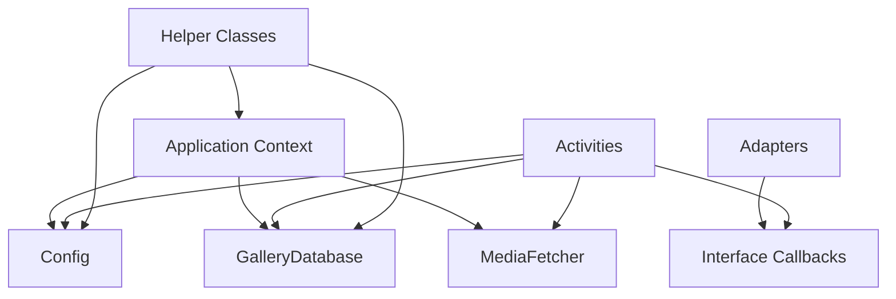

# Dependency Injection Setup

## Overview

Fossify Gallery uses **Manual Dependency Injection** rather than frameworks like Dagger, Hilt, or Koin. This document explains the dependency management approach and patterns used throughout the application.

## Dependency Injection Pattern

### Manual DI Approach


### Why Manual DI?

1. **Simplicity**: No complex DI framework setup
2. **Performance**: No reflection or annotation processing overhead
3. **Size**: Smaller APK size without DI framework dependencies
4. **Control**: Full control over object creation and lifecycle
5. **Compatibility**: Works consistently across all Android versions

## Core Dependencies

### 1. Application Context
The foundation of all dependency injection:

```kotlin
// In BaseActivity or SimpleActivity
abstract class SimpleActivity : AppCompatActivity() {
    val applicationContext: Context
        get() = super.getApplicationContext()
}

// Usage in Activities
class MainActivity : SimpleActivity() {
    // Dependencies created with application context
    private val config: Config by lazy { Config.newInstance(applicationContext) }
    private val galleryDB: GalleryDatabase by lazy { GalleryDatabase.getInstance(application) }
}
```

### 2. Configuration Management
```kotlin
// Config.kt - Singleton pattern for shared preferences
class Config(context: Context) {
    companion object {
        fun newInstance(context: Context) = Config(context)
    }
    
    private val prefs = context.getSharedPreferences(PREFS_KEY, Context.MODE_PRIVATE)
    
    // Configuration properties
    var viewType: Int
        get() = prefs.getInt(VIEW_TYPE, VIEW_TYPE_GRID)
        set(viewType) = prefs.edit().putInt(VIEW_TYPE, viewType).apply()
}
```

### 3. Database Injection
```kotlin
// GalleryDatabase.kt - Room Database singleton
@Database(entities = [Directory::class, Medium::class], version = 5)
abstract class GalleryDatabase : RoomDatabase() {
    abstract fun DirectoryDao(): DirectoryDao
    abstract fun MediumDao(): MediumDao
    
    companion object {
        @Volatile
        private var INSTANCE: GalleryDatabase? = null
        
        fun getInstance(context: Context): GalleryDatabase {
            return INSTANCE ?: synchronized(this) {
                val instance = Room.databaseBuilder(
                    context.applicationContext,
                    GalleryDatabase::class.java,
                    "gallery.db"
                ).build()
                INSTANCE = instance
                instance
            }
        }
    }
}
```

## Dependency Creation Patterns

### 1. Lazy Initialization
Most common pattern for expensive dependencies:

```kotlin
class MediaActivity : SimpleActivity() {
    // Lazy initialization - created only when first accessed
    private val config: Config by lazy { Config.newInstance(applicationContext) }
    private val galleryDB: GalleryDatabase by lazy { GalleryDatabase.getInstance(application) }
    
    // Helper classes with context injection
    private fun getMediaFetcher() = MediaFetcher(applicationContext)
}
```

### 2. Factory Pattern for Helpers
```kotlin
// MediaFetcher created fresh each time to avoid memory leaks
class MediaActivity : SimpleActivity() {
    private fun loadMedia() {
        val mediaFetcher = MediaFetcher(applicationContext)
        mediaFetcher.getMediaAsync(mPath, isVideo, isImage) { media ->
            runOnUiThread {
                gotMedia(media)
            }
        }
    }
}
```

### 3. Interface Injection for Communication
```kotlin
// Adapter dependencies injected via constructor
class DirectoriesAdapter(
    activity: SimpleActivity,
    var dirs: ArrayList<Directory>,
    val listener: DirOperationsListener // Interface injection
) : MyRecyclerViewAdapter(activity, recyclerView) {
    
    interface DirOperationsListener {
        fun refreshItems()
        fun deleteFolders(folders: ArrayList<File>)
        fun recheckPinnedFolders()
    }
}

// Activity implements the interface
class MainActivity : SimpleActivity(), DirectoriesAdapter.DirOperationsListener {
    override fun refreshItems() {
        getDirectories()
    }
}
```

## Dependency Lifecycle Management

### 1. Activity Scope
Dependencies tied to Activity lifecycle:

```kotlin
class MediaActivity : SimpleActivity() {
    // Activity-scoped dependencies
    private lateinit var mAdapter: MediaAdapter
    private var mMedia = ArrayList<ThumbnailItem>()
    
    override fun onCreate(savedInstanceState: Bundle?) {
        super.onCreate(savedInstanceState)
        // Initialize activity-scoped dependencies
        setupAdapter()
    }
    
    override fun onDestroy() {
        super.onDestroy()
        // Clean up if needed
        mMedia.clear()
    }
}
```

### 2. Application Scope
Long-lived dependencies:

```kotlin
// Application-scoped singletons
object MediaStoreHelper {
    fun getDirectoriesFromMediaStore(context: Context): ArrayList<Directory> {
        // Uses application context to avoid memory leaks
        val appContext = context.applicationContext
        // Implementation...
    }
}
```

### 3. Short-lived Dependencies
Created and destroyed as needed:

```kotlin
// Short-lived helper instances
private fun processImages() {
    val imageProcessor = ImageProcessor(applicationContext)
    imageProcessor.process(images) { result ->
        // Handle result
    }
    // imageProcessor goes out of scope and can be GC'd
}
```

## Common DI Patterns in the App

### 1. Config Injection Pattern
```kotlin
class BaseActivity : SimpleActivity() {
    protected val config: Config by lazy { Config.newInstance(applicationContext) }
    
    // All activities can access config
    protected fun getViewType() = config.viewType
    protected fun setViewType(type: Int) { config.viewType = type }
}
```

### 2. Database Access Pattern
```kotlin
// Database access through activities
abstract class SimpleActivity : AppCompatActivity() {
    protected val galleryDB: GalleryDatabase by lazy { 
        GalleryDatabase.getInstance(application) 
    }
    
    // Helper method for background database operations
    protected fun runOnBackgroundThread(block: () -> Unit) {
        Thread { block() }.start()
    }
}
```

### 3. Helper Factory Pattern
```kotlin
// Helper classes created via factory methods
class HelperFactory {
    companion object {
        fun createMediaFetcher(context: Context) = MediaFetcher(context.applicationContext)
        fun createImageProcessor(context: Context) = ImageProcessor(context.applicationContext)
        fun createFileManager(context: Context) = FileManager(context.applicationContext)
    }
}
```

## Testing with Manual DI

### 1. Dependency Substitution
```kotlin
// For testing, dependencies can be substituted
class TestableActivity : SimpleActivity() {
    // Allow injection of test dependencies
    internal var testConfig: Config? = null
    internal var testDatabase: GalleryDatabase? = null
    
    override val config: Config
        get() = testConfig ?: super.config
        
    override val galleryDB: GalleryDatabase
        get() = testDatabase ?: super.galleryDB
}
```

### 2. Mock Helpers
```kotlin
// Test helpers can be created with mock contexts
@Test
fun testMediaFetching() {
    val mockContext = mockk<Context>()
    val mediaFetcher = MediaFetcher(mockContext)
    // Test implementation
}
```

## Comparison with Framework DI

| Aspect | Manual DI | Dagger/Hilt | Koin |
|--------|-----------|-------------|------|
| Setup Complexity | Low | High | Medium |
| Build Time | Fast | Slower | Fast |
| APK Size | Smaller | Larger | Medium |
| Runtime Performance | Faster | Fast | Medium |
| Learning Curve | Easy | Steep | Medium |
| IDE Support | Basic | Excellent | Good |
| Compile-time Safety | Manual | Automatic | Runtime |

## Best Practices

### 1. **Use Application Context**
```kotlin
// Good: Use application context for long-lived objects
class MediaFetcher(private val appContext: Context) {
    init {
        require(appContext.applicationContext == appContext) {
            "Must use application context to avoid memory leaks"
        }
    }
}

// Avoid: Using Activity context for long-lived objects
```

### 2. **Lazy Initialization**
```kotlin
// Good: Lazy initialization for expensive objects
private val galleryDB: GalleryDatabase by lazy { 
    GalleryDatabase.getInstance(application) 
}

// Avoid: Eager initialization of expensive objects
private val galleryDB = GalleryDatabase.getInstance(application) // Called immediately
```

### 3. **Interface-based Communication**
```kotlin
// Good: Use interfaces for loose coupling
interface MediaLoader {
    fun loadMedia(path: String, callback: (List<Medium>) -> Unit)
}

class MediaFetcher(context: Context) : MediaLoader {
    override fun loadMedia(path: String, callback: (List<Medium>) -> Unit) {
        // Implementation
    }
}

// Activities depend on interface, not implementation
```

### 4. **Scope Management**
```kotlin
// Good: Clear scope boundaries
class MainActivity : SimpleActivity() {
    // Activity scope
    private lateinit var adapter: DirectoriesAdapter
    
    // Application scope
    private val config: Config by lazy { Config.newInstance(applicationContext) }
    
    override fun onDestroy() {
        super.onDestroy()
        // Clean up activity-scoped resources
    }
}
```

## Common Pitfalls and Solutions

### 1. **Memory Leaks**
```kotlin
// Problem: Activity reference in long-lived object
class BadMediaFetcher(private val activity: Activity) // Memory leak!

// Solution: Use application context and callbacks
class GoodMediaFetcher(private val appContext: Context) {
    fun fetchMedia(callback: (List<Medium>) -> Unit) {
        // Use weak reference or interface for callbacks
    }
}
```

### 2. **Circular Dependencies**
```kotlin
// Problem: Circular dependency
class A(b: B)
class B(a: A) // Circular!

// Solution: Use interfaces or event bus
interface AListener {
    fun onAEvent()
}

class A(private val listener: AListener)
class B : AListener {
    private val a = A(this)
    override fun onAEvent() { /* handle */ }
}
```

### 3. **Over-coupling**
```kotlin
// Problem: Direct class dependencies
class MediaActivity : SimpleActivity() {
    private val fetcher = MediaFetcher(this) // Tightly coupled
}

// Solution: Use factory or builder pattern
class MediaActivity : SimpleActivity() {
    private fun createMediaFetcher() = MediaFetcher(applicationContext)
}
```

## Conclusion

Fossify Gallery's manual dependency injection approach provides:

- **Simplicity**: Easy to understand and maintain
- **Performance**: No framework overhead
- **Flexibility**: Full control over object creation
- **Compatibility**: Works across all Android versions

While frameworks like Dagger provide compile-time safety and better tooling, the manual approach aligns well with the app's goals of simplicity and performance for a media-heavy application. 