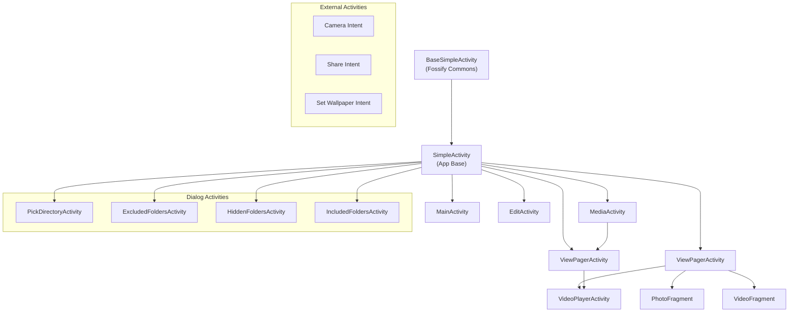
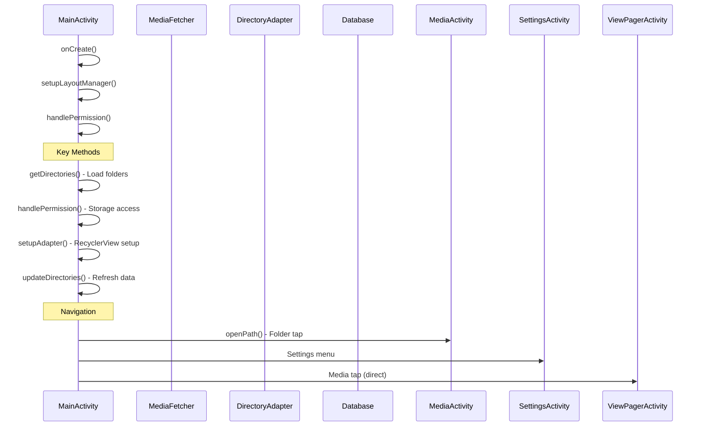
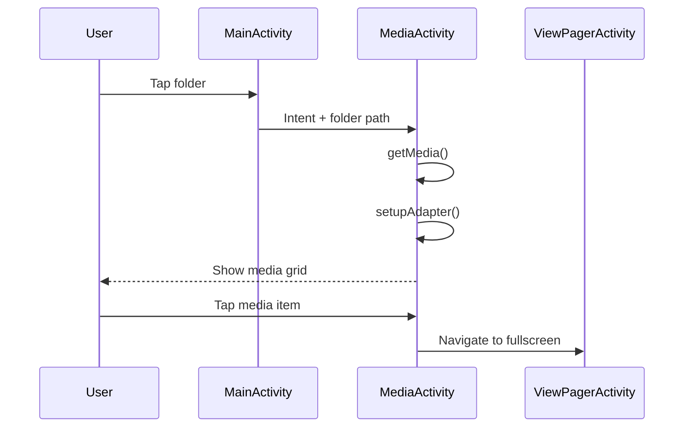
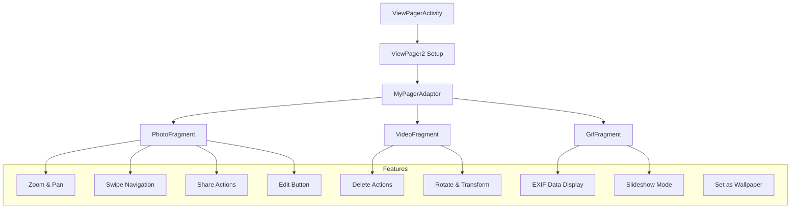
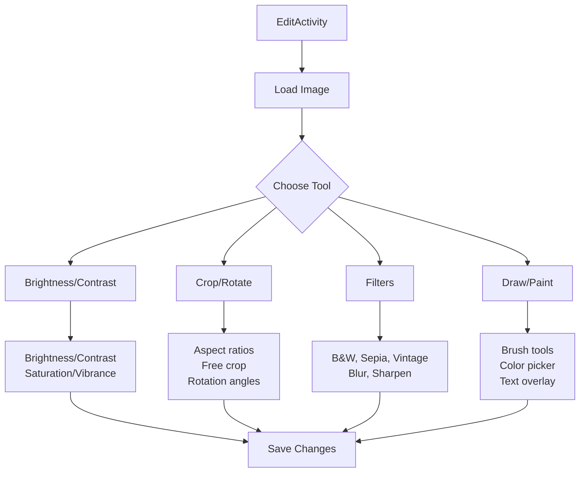
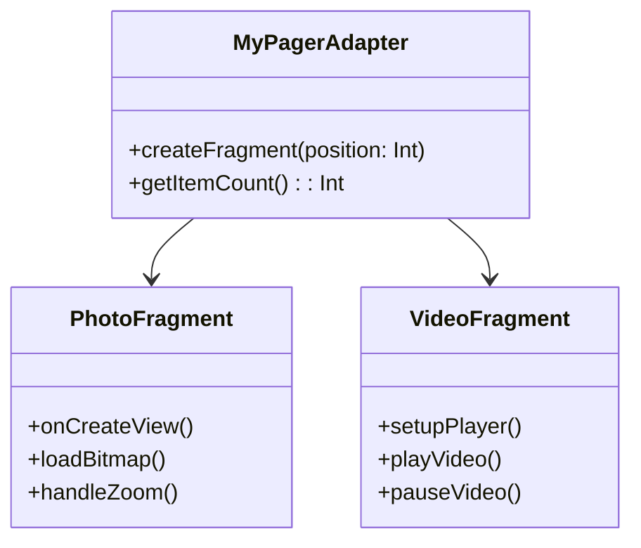

# Activities & Fragments - UI Controllers

## Overview

Fossify Gallery primarily uses **Activity-based architecture** with Fragments used in specific cases. Each Activity has clear responsibility and is designed to handle a specific feature.

## Activity Hierarchy



## Core Activities Detail

### 1. **SplashActivity**
**File**: `activities/SplashActivity.kt` (47 lines) - Minimal launcher

```kotlin
// App initialization and redirect to MainActivity
override fun onCreate(savedInstanceState: Bundle?) {
    super.onCreate(savedInstanceState)
    startActivity(Intent(this, MainActivity::class.java))
    finish()
}
```

**Purpose**:
- Display splash screen briefly
- Initialize basic components
- Redirect to MainActivity

### 2. **MainActivity**
**File**: `activities/MainActivity.kt` (1,768 lines) - Largest Activity



**Key Responsibilities**:
- Display grid of media directories
- Handle permissions (storage access)
- Search and filtering functionality
- Directory management (hide, include, exclude)

**Layout**: `activity_main.xml`
- `CoordinatorLayout` with search menu
- `SwipeRefreshLayout` for pull-to-refresh
- `MyRecyclerView` with `MyGridLayoutManager`

### 3. **MediaActivity**
**File**: `activities/MediaActivity.kt` (1,234 lines) - Core media viewer



**Key Responsibilities**:
- Display media files in specific folder
- Handle media selection and operations
- Multiple selection and bulk operations
- Sort/Filter media in folder

### 4. **ViewPagerActivity**
**File**: `activities/ViewPagerActivity.kt` (1,432 lines) - Most complex Activity



**Key Features**:
- Fullscreen media viewing
- Swipe between media files
- Zoom, pan, rotate gestures
- Share and edit shortcuts

### 5. **EditActivity**
**File**: `activities/EditActivity.kt` (891 lines) - Photo editing



**Editing Features**:
- Basic photo editing (brightness, contrast, etc.)
- Filter gallery with preview
- Crop and rotate tools
- Drawing and painting tools

### 6. **SettingsActivity**
**File**: `activities/SettingsActivity.kt` (456 lines)

Main settings screen with categories:
- **General**: Default folder, filters, sorting
- **Display**: Theme, grid columns, thumbnails
- **Privacy**: App lock, hidden folders
- **Advanced**: Performance, cache management

### Minor Activities

| Activity | Purpose | Size |
|----------|---------|------|
| `IncludedFoldersActivity` | Manage folders to be included | 68 lines |
| `ExcludedFoldersActivity` | Manage folders to be excluded | 72 lines |
| `HiddenFoldersActivity` | Manage hidden folders | 78 lines |
| `VideoPlayerActivity` | Full video playback | 234 lines |

## Fragment Usage

Fossify Gallery uses few Fragments, mainly in ViewPager:

### **Photo/Video Fragments in ViewPager**


## Base Architecture

### **Activity Inheritance**
```kotlin
// BaseSimpleActivity from Fossify Commons
abstract class SimpleActivity : BaseSimpleActivity() {
    // Base class with common functionality
}
```

## Activity Lifecycle Management

### **Common Patterns**
```kotlin
abstract class SimpleActivity : BaseSimpleActivity() {
    // Base class từ Fossify Commons
    // Xử lý theme, permissions, common UI
}

// Typical Activity structure
class ExampleActivity : SimpleActivity() {
    private val binding by viewBinding(ActivityExampleBinding::inflate)
    
    override fun onCreate(savedInstanceState: Bundle?) {
        super.onCreate(savedInstanceState)
        setupUI()
        loadData()
    }
    
    override fun onResume() {
        super.onResume()
        refreshData()
    }
}
```

### **Permission Handling**
```kotlin
// MainActivity pattern
private fun handlePermission(permissionId: Int) {
    when {
        hasPermission(PERMISSION_READ_STORAGE) -> {
            loadDirectories()
        }
        else -> {
            requestPermissions()
        }
    }
}
```

## Navigation Patterns

### **Intent-based Navigation**
```kotlin
// Navigate to MediaActivity
Intent(this, MediaActivity::class.java).apply {
    putExtra(DIRECTORY, directory.path)
    putExtra(GET_IMAGE_INTENT, isGetImageIntent)
    startActivity(this)
}

// Navigate to ViewPager  
Intent(this, ViewPagerActivity::class.java).apply {
    putExtra(PATH, medium.path)
    putExtra(SHOW_ALL, showAll)
    startActivity(this)
}
```

### **Result Handling**
```kotlin
// Activity result contracts
private val editLauncher = registerForActivityResult(
    ActivityResultContracts.StartActivityForResult()
) { result ->
    if (result.resultCode == RESULT_OK) {
        // Handle edit result
        refreshData()
    }
}
```

## ViewBinding Integration

Tất cả Activities sử dụng ViewBinding:

```kotlin
class MainActivity : SimpleActivity() {
    private val binding by viewBinding(ActivityMainBinding::inflate)
    
    override fun onCreate(savedInstanceState: Bundle?) {
        super.onCreate(savedInstanceState)
        
        // Direct access to views
        binding.directoriesGrid.adapter = directoryAdapter
        binding.directoriesRefreshLayout.setOnRefreshListener {
            refreshDirectories()
        }
    }
}
```

## Performance Optimizations

### **Lazy Loading**
- Activities chỉ load data khi cần thiết
- Background threading cho heavy operations
- Caching để tránh reload không cần thiết

### **Memory Management**
- Proper cleanup trong onDestroy()
- Bitmap recycling trong image activities
- ViewHolder recycling trong adapters

--- END FILE: project_documentation/2_APP_MODULE/ui_layer/activities_fragments.md --- 