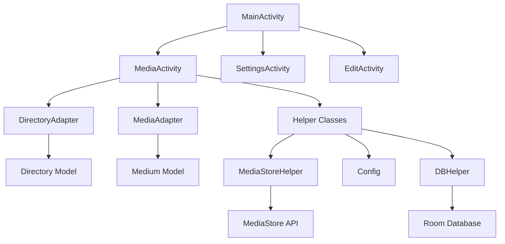
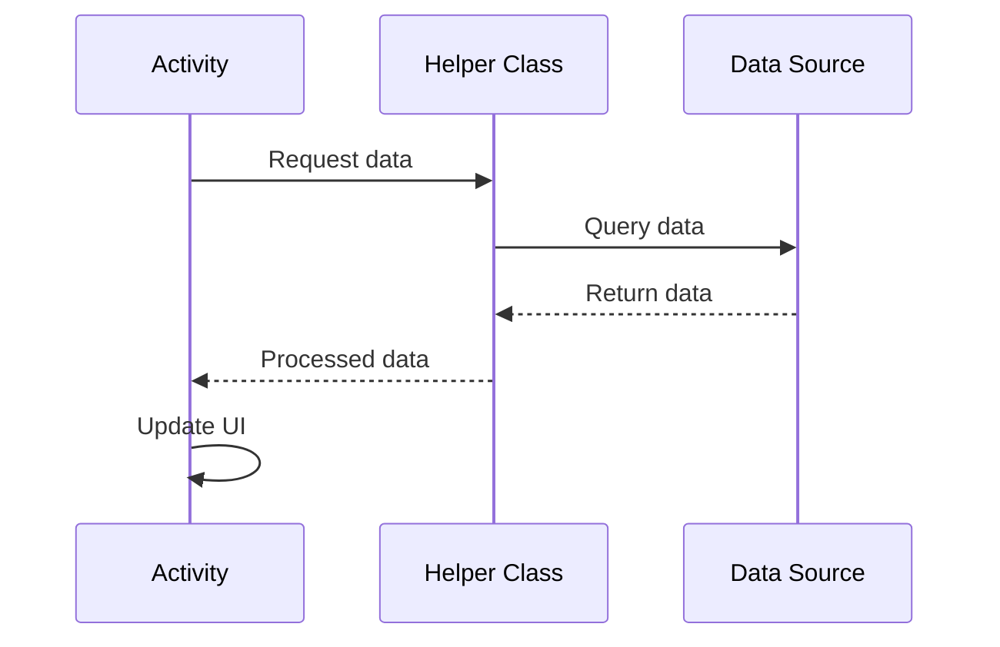

# Architecture Pattern - Activity-Based Architecture

## Overview

Fossify Gallery uses a **traditional Activity-based architecture** rather than the more modern MVVM (Model-View-ViewModel) pattern. This document explains the architectural decisions and patterns used throughout the application.

## Architecture Pattern Used

### Activity-Based Architecture


### Why No ViewModels?

The app deliberately **does not use ViewModels** for several reasons:

1. **Simplicity**: Direct Activity-to-data communication is simpler for gallery apps
2. **Performance**: Fewer abstraction layers for media-heavy operations
3. **Legacy Compatibility**: Maintains compatibility with older Android versions
4. **Direct Media Access**: Gallery apps need direct, efficient access to MediaStore

## Core Components

### 1. Activities
Activities serve as both View and Controller:

```kotlin
// Example: MainActivity handles both UI and business logic
class MainActivity : SimpleActivity(), DirectoriesAdapter.DirOperationsListener {
    private var mIsPickImageIntent = false
    private var mIsPickVideoIntent = false
    private var mIsGetImageContentIntent = false
    private var mIsGetVideoContentIntent = false
    
    // Direct data handling
    private fun getDirectories() {
        getCachedDirectories {
            if (it.isNotEmpty()) {
                runOnUiThread {
                    gotDirectories(addTempFolderIfNeeded(it))
                }
            }
        }
        
        // Direct MediaStore access
        MediaFetcher(applicationContext).getDirectoriesAsync { directories ->
            runOnUiThread {
                gotDirectories(addTempFolderIfNeeded(directories))
            }
        }
    }
}
```

### 2. Helper Classes (Business Logic Layer)
Business logic is separated into helper classes:

- **MediaFetcher**: Media retrieval and caching
- **MediaStoreHelper**: MediaStore API operations
- **Config**: Application configuration and preferences
- **DBHelper**: Database operations

### 3. Data Models
Simple data classes without complex state management:

```kotlin
data class Medium(
    val path: String,
    val name: String,
    val modified: Long,
    val taken: Long,
    val size: Long,
    val type: Int
) : Serializable

data class Directory(
    val path: String,
    val tmb: String,
    val name: String,
    val mediaCnt: Int,
    val modified: Long,
    val taken: Long,
    val size: Long,
    val types: Int
) : Serializable
```

## Data Flow Pattern

### 1. Activity → Helper → Data Source


### 2. Example: Loading Media Files
```kotlin
// In MediaActivity
private fun getMedia() {
    val mediaFetcher = MediaFetcher(applicationContext)
    mediaFetcher.getMediaAsync(mPath, mIsGetVideoIntent, mIsGetImageIntent) { media ->
        runOnUiThread {
            gotMedia(media)
        }
    }
}

private fun gotMedia(media: ArrayList<ThumbnailItem>) {
    // Direct UI update
    mMedia = media
    setupAdapter()
}
```

## State Management

### Without ViewModels
State is managed directly in Activities using:

1. **Instance Variables**: Direct state storage in Activities
2. **SharedPreferences**: Via Config helper class
3. **Database**: Via Room Database and DBHelper
4. **Memory Cache**: Via static variables and application context

```kotlin
class MediaActivity : SimpleActivity() {
    // Direct state management
    private var mMedia = ArrayList<ThumbnailItem>()
    private var mPath = ""
    private var mIsGetImageIntent = false
    private var mIsGetVideoIntent = false
    
    // Configuration state
    private val config: Config by lazy { Config.newInstance(applicationContext) }
    
    // Database state
    private val galleryDB: GalleryDatabase by lazy { GalleryDatabase.getInstance(application) }
}
```

## Communication Patterns

### 1. Activity-to-Activity Communication
```kotlin
// Intent-based communication
private fun openPath(path: String) {
    Intent(this, MediaActivity::class.java).apply {
        putExtra(DIRECTORY, path)
        startActivity(this)
    }
}
```

### 2. Activity-to-Adapter Communication
```kotlin
// Direct callback interfaces
interface DirOperationsListener {
    fun refreshItems()
    fun deleteFolders(folders: ArrayList<File>)
    fun recheckPinnedFolders()
}
```

### 3. Background Processing
```kotlin
// AsyncTask-style background work
private fun getCachedDirectories(callback: (ArrayList<Directory>) -> Unit) {
    Thread {
        val directories = galleryDB.DirectoryDao().getAll() as ArrayList<Directory>
        callback(directories)
    }.start()
}
```

## Advantages of This Architecture

### 1. **Simplicity**
- Fewer abstractions and interfaces
- Direct data access patterns
- Easier to understand for new developers

### 2. **Performance**
- No ViewModel overhead for media-heavy operations
- Direct MediaStore access
- Efficient memory usage for large media collections

### 3. **Maintainability**
- Clear separation of concerns via helper classes
- Consistent patterns across all Activities
- Easy to trace data flow

## Disadvantages and Mitigation

### 1. **Potential Issues**
- **Configuration Changes**: Activities recreated on rotation
- **Memory Leaks**: Direct references in background tasks
- **Testing**: Harder to unit test than ViewModels

### 2. **Mitigation Strategies**
- **Static helpers**: MediaFetcher uses application context
- **Weak references**: In callback interfaces
- **Integration tests**: Focus on UI automation tests

## Comparison with MVVM

| Aspect | Activity-Based | MVVM with ViewModels |
|--------|----------------|---------------------|
| Complexity | Low | Medium |
| Configuration Changes | Manual handling | Automatic survival |
| Memory Usage | Lower | Higher |
| Testing | Integration tests | Unit + Integration |
| Learning Curve | Easier | Steeper |
| Data Binding | Manual | Automatic |

## Best Practices in This Architecture

### 1. **Helper Class Usage**
```kotlin
// Good: Use helper classes for business logic
class MediaFetcher(context: Context) {
    fun getMediaAsync(path: String, callback: (ArrayList<Medium>) -> Unit) {
        // Business logic here
    }
}

// Avoid: Business logic directly in Activity
```

### 2. **Background Processing**
```kotlin
// Good: Use application context for background work
Thread {
    val context = applicationContext
    // Long-running operation
}.start()

// Avoid: Using Activity context in background threads
```

### 3. **State Persistence**
```kotlin
// Good: Save important state
override fun onSaveInstanceState(outState: Bundle) {
    super.onSaveInstanceState(outState)
    outState.putString(PATH, mPath)
    outState.putBoolean(GET_IMAGE_INTENT, mIsGetImageIntent)
}
```

## Conclusion

While modern Android development often favors MVVM with ViewModels, Fossify Gallery's Activity-based architecture serves its needs well. The pattern provides:

- **Simplicity** for a media-focused application
- **Performance** for handling large media collections
- **Maintainability** through clear helper class separation

This architecture choice aligns with the app's goals of being lightweight, efficient, and easy to maintain as an open-source project. 