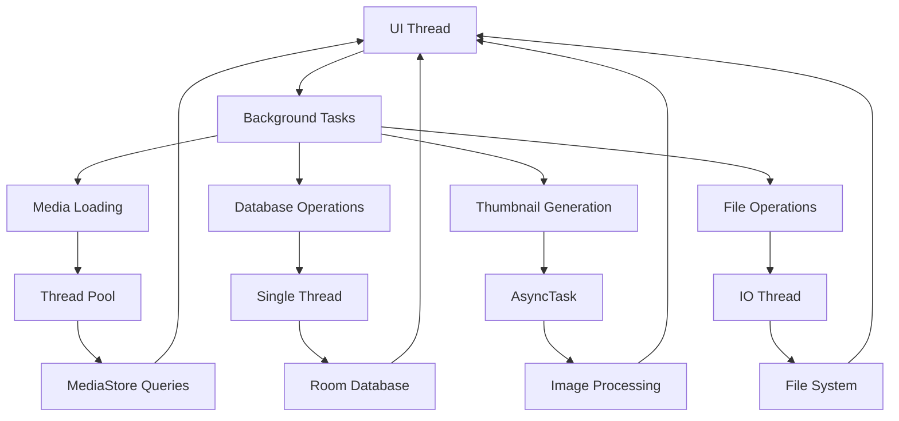
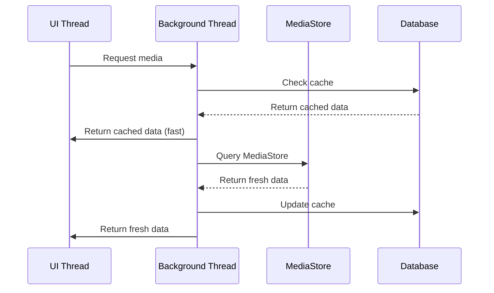

# Background Tasks

## Overview

Fossify Gallery implements various background processing strategies to handle media operations, database updates, and thumbnail generation without blocking the UI thread. This document explains the background task patterns and threading strategies used throughout the application.

## Background Processing Architecture



## Threading Strategies

### 1. Simple Thread Creation
Most common pattern for background operations:

```kotlin
// MediaFetcher.kt - Simple background threading
class MediaFetcher(private val context: Context) {
    
    fun getDirectoriesAsync(callback: (ArrayList<Directory>) -> Unit) {
        Thread {
            try {
                // Background work
                val directories = getDirectoriesFromMediaStore()
                
                // Return to UI thread
                Handler(Looper.getMainLooper()).post {
                    callback(directories)
                }
            } catch (e: Exception) {
                Log.e("MediaFetcher", "Error loading directories", e)
            }
        }.start()
    }
    
    fun getMediaAsync(path: String, callback: (ArrayList<Medium>) -> Unit) {
        Thread {
            try {
                val media = getMediaFromPath(path)
                
                Handler(Looper.getMainLooper()).post {
                    callback(media)
                }
            } catch (e: Exception) {
                Log.e("MediaFetcher", "Error loading media", e)
            }
        }.start()
    }
}
```

### 2. Database Background Operations
```kotlin
// Database operations always run on background threads
abstract class SimpleActivity : AppCompatActivity() {
    protected val galleryDB: GalleryDatabase by lazy { 
        GalleryDatabase.getInstance(application) 
    }
    
    // Helper method for database operations
    protected fun runOnBackgroundThread(block: () -> Unit) {
        Thread {
            try {
                block()
            } catch (e: Exception) {
                Log.e("Database", "Database operation failed", e)
            }
        }.start()
    }
    
    // Cache directories in background
    protected fun getCachedDirectories(callback: (ArrayList<Directory>) -> Unit) {
        runOnBackgroundThread {
            val directories = galleryDB.DirectoryDao().getAll() as ArrayList<Directory>
            runOnUiThread {
                callback(directories)
            }
        }
    }
}
```

### 3. ThreadPoolExecutor for Heavy Operations
```kotlin
// For CPU-intensive operations like image processing
class ImageProcessor {
    companion object {
        private val imageProcessorExecutor = ThreadPoolExecutor(
            2, // Core pool size
            4, // Maximum pool size
            60L, TimeUnit.SECONDS, // Keep alive time
            LinkedBlockingQueue<Runnable>()
        )
    }
    
    fun processImagesAsync(images: List<String>, callback: (List<ProcessedImage>) -> Unit) {
        imageProcessorExecutor.execute {
            try {
                val processedImages = images.map { processImage(it) }
                
                Handler(Looper.getMainLooper()).post {
                    callback(processedImages)
                }
            } catch (e: Exception) {
                Log.e("ImageProcessor", "Image processing failed", e)
            }
        }
    }
    
    private fun processImage(path: String): ProcessedImage {
        // CPU-intensive image processing
        return ProcessedImage(path)
    }
}
```

## Common Background Task Patterns

### 1. Media Loading Pattern


```kotlin
// Implementation of the media loading pattern
class MediaActivity : SimpleActivity() {
    private fun getMedia() {
        val path = intent.getStringExtra(DIRECTORY) ?: return
        
        // Show cached data first for immediate response
        getCachedMedia(path) { cachedMedia ->
            if (cachedMedia.isNotEmpty()) {
                gotMedia(cachedMedia, cached = true)
            }
        }
        
        // Then load fresh data
        MediaFetcher(applicationContext).getMediaAsync(path, isGetVideoIntent, isGetImageIntent) { media ->
            gotMedia(media, cached = false)
        }
    }
    
    private fun getCachedMedia(path: String, callback: (ArrayList<ThumbnailItem>) -> Unit) {
        Thread {
            val media = galleryDB.MediumDao().getMediaFromPath(path)
            runOnUiThread {
                callback(media as ArrayList<ThumbnailItem>)
            }
        }.start()
    }
    
    private fun gotMedia(media: ArrayList<ThumbnailItem>, cached: Boolean) {
        mMedia = media
        
        if (!cached) {
            // Update cache with fresh data
            cacheMedia(media)
        }
        
        setupAdapter()
    }
}
```

### 2. Thumbnail Generation Pattern
```kotlin
// Asynchronous thumbnail generation
class ThumbnailGenerator(private val context: Context) {
    private val thumbnailExecutor = Executors.newFixedThreadPool(3)
    
    fun generateThumbnailAsync(path: String, callback: (Bitmap?) -> Unit) {
        thumbnailExecutor.submit {
            try {
                val bitmap = when {
                    path.isVideoPath() -> generateVideoThumbnail(path)
                    path.isImagePath() -> generateImageThumbnail(path)
                    else -> null
                }
                
                Handler(Looper.getMainLooper()).post {
                    callback(bitmap)
                }
            } catch (e: Exception) {
                Log.e("ThumbnailGenerator", "Thumbnail generation failed for $path", e)
                Handler(Looper.getMainLooper()).post {
                    callback(null)
                }
            }
        }
    }
    
    private fun generateVideoThumbnail(path: String): Bitmap? {
        return if (Build.VERSION.SDK_INT >= Build.VERSION_CODES.Q) {
            try {
                val size = Size(512, 512)
                context.contentResolver.loadThumbnail(Uri.fromFile(File(path)), size, null)
            } catch (e: Exception) {
                ThumbnailUtils.createVideoThumbnail(path, MediaStore.Images.Thumbnails.MICRO_KIND)
            }
        } else {
            ThumbnailUtils.createVideoThumbnail(path, MediaStore.Images.Thumbnails.MICRO_KIND)
        }
    }
    
    private fun generateImageThumbnail(path: String): Bitmap? {
        return try {
            val options = BitmapFactory.Options().apply {
                inSampleSize = 4
                inJustDecodeBounds = false
            }
            BitmapFactory.decodeFile(path, options)
        } catch (e: OutOfMemoryError) {
            // Retry with higher compression
            val options = BitmapFactory.Options().apply {
                inSampleSize = 8
            }
            BitmapFactory.decodeFile(path, options)
        }
    }
}
```

### 3. File Operations Pattern
```kotlin
// Background file operations with progress updates
class FileOperationsManager(private val context: Context) {
    
    fun copyFilesAsync(
        sources: List<String>, 
        destination: String, 
        progressCallback: (Int) -> Unit,
        completionCallback: (Boolean) -> Unit
    ) {
        Thread {
            try {
                var completed = 0
                val total = sources.size
                
                for (source in sources) {
                    val success = copyFile(source, destination)
                    if (!success) {
                        Handler(Looper.getMainLooper()).post {
                            completionCallback(false)
                        }
                        return@Thread
                    }
                    
                    completed++
                    val progress = (completed * 100) / total
                    
                    Handler(Looper.getMainLooper()).post {
                        progressCallback(progress)
                    }
                }
                
                Handler(Looper.getMainLooper()).post {
                    completionCallback(true)
                }
            } catch (e: Exception) {
                Log.e("FileOperations", "Copy operation failed", e)
                Handler(Looper.getMainLooper()).post {
                    completionCallback(false)
                }
            }
        }.start()
    }
    
    private fun copyFile(source: String, destination: String): Boolean {
        return try {
            File(source).copyTo(File(destination, File(source).name), overwrite = false)
            true
        } catch (e: Exception) {
            Log.e("FileOperations", "Failed to copy $source", e)
            false
        }
    }
}
```

## Lifecycle-Aware Background Tasks

### 1. Activity Lifecycle Integration
```kotlin
// Managing background tasks with Activity lifecycle
class MediaActivity : SimpleActivity() {
    private var mediaFetchingTask: Thread? = null
    private var isFetchingMedia = false
    
    private fun loadMediaSafely() {
        if (isFetchingMedia) return
        
        isFetchingMedia = true
        mediaFetchingTask = Thread {
            try {
                val media = MediaFetcher(applicationContext).getMedia(mPath)
                
                // Check if activity is still active
                if (!isFinishing && !isDestroyed) {
                    runOnUiThread {
                        gotMedia(media)
                    }
                }
            } catch (e: Exception) {
                Log.e("MediaActivity", "Media loading failed", e)
            } finally {
                isFetchingMedia = false
            }
        }
        mediaFetchingTask?.start()
    }
    
    override fun onDestroy() {
        super.onDestroy()
        // Cancel background tasks
        mediaFetchingTask?.interrupt()
        isFetchingMedia = false
    }
}
```

### 2. Application State Awareness
```kotlin
// Background tasks that respect app state
class BackgroundTaskManager {
    private var isAppInBackground = false
    
    fun onAppGoesToBackground() {
        isAppInBackground = true
        // Pause non-critical background tasks
        pauseNonCriticalTasks()
    }
    
    fun onAppComesToForeground() {
        isAppInBackground = false
        // Resume background tasks
        resumeBackgroundTasks()
    }
    
    private fun pauseNonCriticalTasks() {
        // Pause thumbnail generation, cache cleanup, etc.
    }
    
    private fun resumeBackgroundTasks() {
        // Resume thumbnail preloading, cache sync, etc.
    }
}
```

## Error Handling in Background Tasks

### 1. Comprehensive Error Handling
```kotlin
// Robust error handling for background operations
class SafeBackgroundTask {
    
    fun executeWithErrorHandling(operation: () -> Unit, errorCallback: (Exception) -> Unit = {}) {
        Thread {
            try {
                operation()
            } catch (e: SecurityException) {
                Log.e("BackgroundTask", "Permission denied", e)
                handlePermissionError()
            } catch (e: OutOfMemoryError) {
                Log.e("BackgroundTask", "Out of memory", e)
                handleMemoryError()
            } catch (e: InterruptedException) {
                Log.d("BackgroundTask", "Task was interrupted")
                // Task cancellation, don't report as error
            } catch (e: Exception) {
                Log.e("BackgroundTask", "Unexpected error", e)
                Handler(Looper.getMainLooper()).post {
                    errorCallback(e)
                }
            }
        }.start()
    }
    
    private fun handlePermissionError() {
        Handler(Looper.getMainLooper()).post {
            // Show permission request dialog
        }
    }
    
    private fun handleMemoryError() {
        System.gc() // Suggest garbage collection
        Handler(Looper.getMainLooper()).post {
            // Show memory warning
        }
    }
}
```

### 2. Retry Mechanisms
```kotlin
// Retry mechanism for failed operations
class RetryableTask {
    private val maxRetries = 3
    private val retryDelay = 1000L // 1 second
    
    fun executeWithRetry(operation: () -> Unit, retryCount: Int = 0) {
        Thread {
            try {
                operation()
            } catch (e: Exception) {
                if (retryCount < maxRetries) {
                    Log.w("RetryableTask", "Operation failed, retrying... (${retryCount + 1}/$maxRetries)")
                    
                    Thread.sleep(retryDelay * (retryCount + 1)) // Exponential backoff
                    executeWithRetry(operation, retryCount + 1)
                } else {
                    Log.e("RetryableTask", "Operation failed after $maxRetries retries", e)
                    // Handle final failure
                }
            }
        }.start()
    }
}
```

## Performance Optimizations

### 1. Task Prioritization
```kotlin
// Priority-based task execution
class PriorityTaskExecutor {
    private val highPriorityQueue = PriorityBlockingQueue<PriorityTask>()
    private val executor = ThreadPoolExecutor(
        2, 4, 60L, TimeUnit.SECONDS,
        highPriorityQueue
    )
    
    enum class Priority(val value: Int) {
        HIGH(1), MEDIUM(2), LOW(3)
    }
    
    data class PriorityTask(
        val priority: Priority,
        private val task: Runnable
    ) : Runnable, Comparable<PriorityTask> {
        
        override fun run() = task.run()
        
        override fun compareTo(other: PriorityTask): Int {
            return priority.value.compareTo(other.priority.value)
        }
    }
    
    fun execute(priority: Priority, task: Runnable) {
        executor.execute(PriorityTask(priority, task))
    }
}
```

### 2. Resource Management
```kotlin
// Efficient resource usage in background tasks
class ResourceAwareTask {
    private val maxConcurrentTasks = Runtime.getRuntime().availableProcessors()
    private val semaphore = Semaphore(maxConcurrentTasks)
    
    fun executeResourceAware(operation: () -> Unit) {
        Thread {
            try {
                semaphore.acquire() // Limit concurrent executions
                operation()
            } catch (e: InterruptedException) {
                Thread.currentThread().interrupt()
            } finally {
                semaphore.release()
            }
        }.start()
    }
}
```

## Testing Background Tasks

### 1. Unit Testing with MockK
```kotlin
@Test
fun testBackgroundMediaLoading() = runBlocking {
    val mockContext = mockk<Context>()
    val mockCallback = mockk<(ArrayList<Directory>) -> Unit>()
    
    val mediaFetcher = MediaFetcher(mockContext)
    
    // Test background operation
    mediaFetcher.getDirectoriesAsync(mockCallback)
    
    // Verify callback was called
    coVerify { mockCallback.invoke(any()) }
}
```

### 2. Integration Testing
```kotlin
@Test
fun testMediaLoadingIntegration() {
    val activity = Robolectric.setupActivity(MainActivity::class.java)
    
    // Trigger background loading
    activity.getDirectories()
    
    // Wait for background task to complete
    ShadowLooper.runUiThreadTasksIncludingDelayedTasks()
    
    // Verify UI was updated
    assertThat(activity.mDirs).isNotEmpty()
}
```

## Best Practices

### 1. **Memory Leak Prevention**
```kotlin
// Use application context for long-running tasks
class SafeMediaFetcher(private val appContext: Context) {
    init {
        require(appContext == appContext.applicationContext) {
            "Must use application context"
        }
    }
    
    // Use weak references for callbacks
    private val callbackRef = WeakReference(callback)
    
    private fun notifyCallback(data: Any) {
        callbackRef.get()?.invoke(data)
    }
}
```

### 2. **Thread Naming**
```kotlin
// Name threads for debugging
Thread {
    // Background work
}.apply {
    name = "MediaLoader-${System.currentTimeMillis()}"
    start()
}
```

### 3. **Graceful Cancellation**
```kotlin
// Support for task cancellation
class CancellableTask {
    @Volatile
    private var isCancelled = false
    
    fun cancel() {
        isCancelled = true
    }
    
    private fun doWork() {
        for (item in items) {
            if (isCancelled) {
                return // Exit gracefully
            }
            processItem(item)
        }
    }
}
```

## Conclusion

Fossify Gallery's background task management provides:

- **Responsiveness**: UI never blocks on long operations
- **Efficiency**: Smart resource usage and task prioritization  
- **Reliability**: Comprehensive error handling and retry mechanisms
- **Performance**: Optimized threading for media-heavy operations

The combination of simple threading patterns with robust error handling ensures smooth user experience while maintaining app stability across different device configurations. 