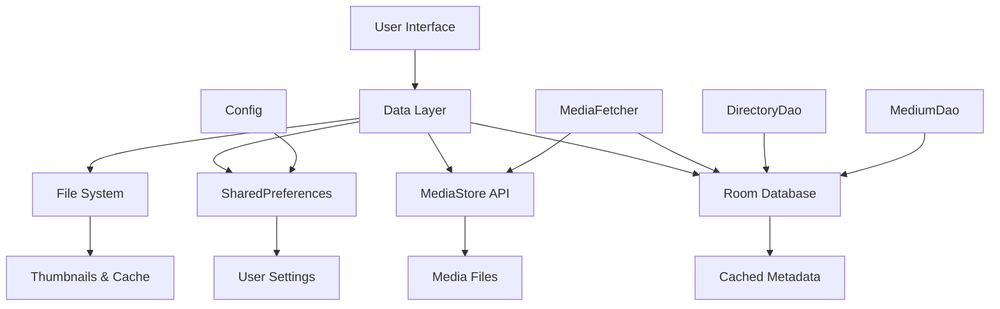
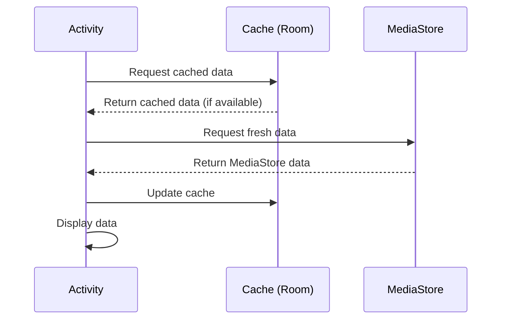

# Data Persistence

## Overview

Fossify Gallery implements a multi-layered data persistence strategy combining Room Database for caching, SharedPreferences for configuration, and direct MediaStore access for media data. This document explains the data persistence architecture and patterns.

## Data Persistence Architecture



## Primary Data Sources

### 1. MediaStore API (Primary Source)
The main source of truth for media files:

```kotlin
// MediaStoreHelper.kt - Direct MediaStore access
object MediaStoreHelper {
    fun getDirectoriesFromMediaStore(context: Context): ArrayList<Directory> {
        val directories = ArrayList<Directory>()
        val uri = MediaStore.Files.getContentUri("external")
        val projection = arrayOf(
            MediaStore.Files.FileColumns.DATA,
            MediaStore.Files.FileColumns.DISPLAY_NAME,
            MediaStore.Files.FileColumns.DATE_MODIFIED,
            MediaStore.Files.FileColumns.SIZE
        )
        
        val cursor = context.contentResolver.query(uri, projection, selection, null, sortOrder)
        cursor?.use { cursor ->
            while (cursor.moveToNext()) {
                // Process media files
                val path = cursor.getString(cursor.getColumnIndexOrThrow(MediaStore.Files.FileColumns.DATA))
                // Create Directory objects
            }
        }
        
        return directories
    }
}
```

### 2. Room Database (Cache Layer)
Local caching for performance optimization:

```kotlin
// GalleryDatabase.kt - Room Database setup
@Database(
    entities = [Directory::class, Medium::class, Widget::class, Favorite::class],
    version = 5,
    exportSchema = false
)
@TypeConverters(Converters::class)
abstract class GalleryDatabase : RoomDatabase() {
    abstract fun DirectoryDao(): DirectoryDao
    abstract fun MediumDao(): MediumDao
    abstract fun WidgetsDao(): WidgetsDao
    abstract fun FavoritesDao(): FavoritesDao
    
    companion object {
        @Volatile
        private var INSTANCE: GalleryDatabase? = null
        
        fun getInstance(context: Context): GalleryDatabase {
            return INSTANCE ?: synchronized(this) {
                val instance = Room.databaseBuilder(
                    context.applicationContext,
                    GalleryDatabase::class.java,
                    "gallery.db"
                )
                .addMigrations(MIGRATION_1_2, MIGRATION_2_3, MIGRATION_3_4, MIGRATION_4_5)
                .build()
                INSTANCE = instance
                instance
            }
        }
    }
}
```

### 3. SharedPreferences (Configuration)
User settings and app configuration:

```kotlin
// Config.kt - SharedPreferences wrapper
class Config(context: Context) {
    private val prefs = context.getSharedPreferences(PREFS_KEY, Context.MODE_PRIVATE)
    
    var viewType: Int
        get() = prefs.getInt(VIEW_TYPE, VIEW_TYPE_GRID)
        set(viewType) = prefs.edit().putInt(VIEW_TYPE, viewType).apply()
        
    var thumbnailSpacing: Int
        get() = prefs.getInt(THUMBNAIL_SPACING, resources.getDimension(R.dimen.small_margin).toInt())
        set(thumbnailSpacing) = prefs.edit().putInt(THUMBNAIL_SPACING, thumbnailSpacing).apply()
}
```

## Data Models

### 1. Directory Entity
```kotlin
@Entity(tableName = "directories", indices = [(Index(value = ["path"], unique = true))])
data class Directory(
    @PrimaryKey var path: String,
    var tmb: String,
    var name: String,
    var mediaCnt: Int,
    var modified: Long,
    var taken: Long,
    var size: Long,
    var types: Int,
    var sortValue: String = ""
) : Serializable {
    
    companion object {
        private const val serialVersionUID = -6553345863555455L
    }
    
    fun addSize(bytes: Long) {
        size += bytes
    }
    
    fun getBubbleText(sorting: Int) = when {
        sorting and SORT_BY_NAME != 0 -> name
        sorting and SORT_BY_SIZE != 0 -> size.formatSize()
        sorting and SORT_BY_DATE_MODIFIED != 0 -> modified.formatDate()
        else -> taken.formatDate()
    }
}
```

### 2. Medium Entity
```kotlin
@Entity(tableName = "media", indices = [(Index(value = ["full_path"], unique = true))])
data class Medium(
    @PrimaryKey var path: String,
    var name: String,
    var modified: Long,
    var taken: Long,
    var size: Long,
    var type: Int,
    var videoDuration: Int = 0,
    var isFavorite: Boolean = false,
    @ColumnInfo(name = "full_path") var fullPath: String = path
) : Serializable, ThumbnailItem() {
    
    companion object {
        private const val serialVersionUID = -6553345863555455L
    }
    
    fun isImage() = type == TYPE_IMAGE
    fun isVideo() = type == TYPE_VIDEO
    fun isGif() = type == TYPE_GIF
    fun isRaw() = type == TYPE_RAW
    fun isSvg() = type == TYPE_SVG
}
```

## Data Access Objects (DAOs)

### 1. DirectoryDao
```kotlin
@Dao
interface DirectoryDao {
    @Query("SELECT * FROM directories")
    fun getAll(): List<Directory>
    
    @Query("SELECT * FROM directories WHERE path = :path COLLATE NOCASE")
    fun getDirectoryWithPath(path: String): Directory?
    
    @Insert(onConflict = OnConflictStrategy.REPLACE)
    fun insert(directory: Directory)
    
    @Insert(onConflict = OnConflictStrategy.REPLACE)
    fun insertAll(directories: List<Directory>)
    
    @Delete
    fun deleteDirectory(directory: Directory)
    
    @Query("DELETE FROM directories WHERE path = :path COLLATE NOCASE")
    fun deleteDirPath(path: String)
    
    @Query("UPDATE directories SET mediaCnt = :count, modified = :modified, taken = :taken WHERE path = :path COLLATE NOCASE")
    fun updateDirectory(path: String, count: Int, modified: Long, taken: Long)
}
```

### 2. MediumDao
```kotlin
@Dao
interface MediumDao {
    @Query("SELECT * FROM media WHERE full_path LIKE :path || '%'")
    fun getMediaFromPath(path: String): List<Medium>
    
    @Query("SELECT * FROM media WHERE is_favorite = 1")
    fun getFavorites(): List<Medium>
    
    @Insert(onConflict = OnConflictStrategy.REPLACE)
    fun insert(medium: Medium)
    
    @Insert(onConflict = OnConflictStrategy.REPLACE)
    fun insertAll(media: List<Medium>)
    
    @Query("UPDATE media SET is_favorite = :isFavorite WHERE full_path = :path COLLATE NOCASE")
    fun updateFavorite(path: String, isFavorite: Boolean)
    
    @Delete
    fun deleteMedium(medium: Medium)
    
    @Query("DELETE FROM media WHERE full_path = :path COLLATE NOCASE")
    fun deleteMediumPath(path: String)
}
```

## Caching Strategy

### 1. Two-Tier Caching


### 2. MediaFetcher Caching Implementation
```kotlin
class MediaFetcher(private val context: Context) {
    private val galleryDB = GalleryDatabase.getInstance(context)
    
    fun getDirectoriesAsync(callback: (ArrayList<Directory>) -> Unit) {
        Thread {
            // First, try to get cached data
            val cachedDirectories = galleryDB.DirectoryDao().getAll() as ArrayList<Directory>
            
            if (cachedDirectories.isNotEmpty()) {
                // Return cached data immediately
                callback(cachedDirectories)
            }
            
            // Then fetch fresh data from MediaStore
            val freshDirectories = getDirectoriesFromMediaStore()
            
            // Update cache
            galleryDB.DirectoryDao().insertAll(freshDirectories)
            
            // Return fresh data
            callback(freshDirectories)
        }.start()
    }
    
    private fun getDirectoriesFromMediaStore(): ArrayList<Directory> {
        // Implementation to fetch from MediaStore
        return MediaStoreHelper.getDirectoriesFromMediaStore(context)
    }
}
```

### 3. Cache Invalidation
```kotlin
// Cache invalidation strategies
class CacheManager(private val context: Context) {
    private val galleryDB = GalleryDatabase.getInstance(context)
    
    fun invalidateCache() {
        Thread {
            galleryDB.DirectoryDao().deleteAll()
            galleryDB.MediumDao().deleteAll()
        }.start()
    }
    
    fun invalidateDirectory(path: String) {
        Thread {
            galleryDB.DirectoryDao().deleteDirPath(path)
            // Delete associated media
            galleryDB.MediumDao().deleteMediaFromPath(path)
        }.start()
    }
    
    // Called when media files change
    fun onMediaChanged(paths: List<String>) {
        Thread {
            paths.forEach { path ->
                galleryDB.MediumDao().deleteMediumPath(path)
            }
        }.start()
    }
}
```

## Configuration Persistence

### 1. App Settings
```kotlin
class Config(context: Context) {
    private val prefs = context.getSharedPreferences(PREFS_KEY, Context.MODE_PRIVATE)
    
    // View preferences
    var viewType: Int
        get() = prefs.getInt(VIEW_TYPE, VIEW_TYPE_GRID)
        set(viewType) = prefs.edit().putInt(VIEW_TYPE, viewType).apply()
        
    var sortOrder: Int
        get() = prefs.getInt(SORT_ORDER, SORT_BY_DATE_MODIFIED or SORT_DESCENDING)
        set(sortOrder) = prefs.edit().putInt(SORT_ORDER, sortOrder).apply()
        
    // App behavior
    var autoplayVideos: Boolean
        get() = prefs.getBoolean(AUTOPLAY_VIDEOS, false)
        set(autoplayVideos) = prefs.edit().putBoolean(AUTOPLAY_VIDEOS, autoplayVideos).apply()
        
    var loopVideos: Boolean
        get() = prefs.getBoolean(LOOP_VIDEOS, false)
        set(loopVideos) = prefs.edit().putBoolean(LOOP_VIDEOS, loopVideos).apply()
}
```

### 2. Hidden Folders Management
```kotlin
// Managing hidden folders in SharedPreferences
class HiddenFoldersManager(private val config: Config) {
    fun addHiddenFolder(path: String) {
        val hiddenFolders = getHiddenFolders().toMutableSet()
        hiddenFolders.add(path)
        config.hiddenFolders = hiddenFolders.joinToString(DIVIDER)
    }
    
    fun removeHiddenFolder(path: String) {
        val hiddenFolders = getHiddenFolders().toMutableSet()
        hiddenFolders.remove(path)
        config.hiddenFolders = hiddenFolders.joinToString(DIVIDER)
    }
    
    private fun getHiddenFolders(): Set<String> {
        return config.hiddenFolders.split(DIVIDER).filter { it.isNotEmpty() }.toSet()
    }
}
```

## File System Caching

### 1. Thumbnail Cache
```kotlin
object ThumbnailCache {
    private const val THUMBNAILS_FOLDER = "thumbnails"
    
    fun getCachedThumbnail(context: Context, path: String): Bitmap? {
        val thumbnailFile = getThumbnailFile(context, path)
        return if (thumbnailFile.exists()) {
            BitmapFactory.decodeFile(thumbnailFile.absolutePath)
        } else {
            null
        }
    }
    
    fun cacheThumbnail(context: Context, path: String, bitmap: Bitmap) {
        val thumbnailFile = getThumbnailFile(context, path)
        thumbnailFile.parentFile?.mkdirs()
        
        try {
            FileOutputStream(thumbnailFile).use { out ->
                bitmap.compress(Bitmap.CompressFormat.JPEG, 80, out)
            }
        } catch (e: Exception) {
            // Handle caching error
        }
    }
    
    private fun getThumbnailFile(context: Context, path: String): File {
        val cacheDir = File(context.cacheDir, THUMBNAILS_FOLDER)
        val fileName = path.hashCode().toString() + ".jpg"
        return File(cacheDir, fileName)
    }
}
```

### 2. Video Thumbnail Cache
```kotlin
class VideoThumbnailCache(private val context: Context) {
    private val cacheDir = File(context.cacheDir, "video_thumbnails")
    
    init {
        cacheDir.mkdirs()
    }
    
    fun getVideoThumbnail(videoPath: String): Bitmap? {
        val cacheFile = getCacheFile(videoPath)
        
        return if (cacheFile.exists()) {
            BitmapFactory.decodeFile(cacheFile.absolutePath)
        } else {
            generateAndCacheThumbnail(videoPath)
        }
    }
    
    private fun generateAndCacheThumbnail(videoPath: String): Bitmap? {
        val bitmap = ThumbnailUtils.createVideoThumbnail(videoPath, MediaStore.Images.Thumbnails.MICRO_KIND)
        bitmap?.let {
            cacheBitmap(videoPath, it)
        }
        return bitmap
    }
    
    private fun cacheBitmap(videoPath: String, bitmap: Bitmap) {
        val cacheFile = getCacheFile(videoPath)
        try {
            FileOutputStream(cacheFile).use { out ->
                bitmap.compress(Bitmap.CompressFormat.JPEG, 80, out)
            }
        } catch (e: Exception) {
            // Handle error
        }
    }
    
    private fun getCacheFile(videoPath: String): File {
        val fileName = "${videoPath.hashCode()}.jpg"
        return File(cacheDir, fileName)
    }
}
```

## Database Migrations

### 1. Migration Strategy
```kotlin
// Database migrations for schema changes
val MIGRATION_1_2 = object : Migration(1, 2) {
    override fun migrate(database: SupportSQLiteDatabase) {
        database.execSQL("ALTER TABLE directories ADD COLUMN sort_value TEXT NOT NULL DEFAULT ''")
    }
}

val MIGRATION_2_3 = object : Migration(2, 3) {
    override fun migrate(database: SupportSQLiteDatabase) {
        database.execSQL("CREATE TABLE IF NOT EXISTS `favorites` (`path` TEXT NOT NULL, PRIMARY KEY(`path`))")
    }
}

val MIGRATION_3_4 = object : Migration(3, 4) {
    override fun migrate(database: SupportSQLiteDatabase) {
        database.execSQL("ALTER TABLE media ADD COLUMN is_favorite INTEGER NOT NULL DEFAULT 0")
    }
}

val MIGRATION_4_5 = object : Migration(4, 5) {
    override fun migrate(database: SupportSQLiteDatabase) {
        database.execSQL("ALTER TABLE media ADD COLUMN full_path TEXT NOT NULL DEFAULT ''")
        database.execSQL("UPDATE media SET full_path = path")
    }
}
```

### 2. Migration Testing
```kotlin
@RunWith(AndroidJUnit4::class)
class MigrationTest {
    private val TEST_DB = "migration-test"
    
    @get:Rule
    val helper: MigrationTestHelper = MigrationTestHelper(
        InstrumentationRegistry.getInstrumentation(),
        GalleryDatabase::class.java.canonicalName,
        FrameworkSQLiteOpenHelperFactory()
    )
    
    @Test
    fun migrate1To2() {
        var db = helper.createDatabase(TEST_DB, 1).apply {
            // Create data in version 1
            execSQL("INSERT INTO directories (path, name) VALUES ('test', 'Test')")
            close()
        }
        
        // Re-open the database with version 2 and provide MIGRATION_1_2 as the migration process
        db = helper.runMigrationsAndValidate(TEST_DB, 2, true, MIGRATION_1_2)
        
        // Validate that the data is correct
        val cursor = db.query("SELECT * FROM directories")
        assert(cursor.count == 1)
        cursor.close()
    }
}
```

## Performance Optimizations

### 1. Lazy Loading
```kotlin
// Lazy loading for large directories
class LazyMediaLoader(private val context: Context) {
    private val pageSize = 50
    
    fun loadMediaPage(path: String, page: Int, callback: (List<Medium>) -> Unit) {
        Thread {
            val offset = page * pageSize
            val media = galleryDB.MediumDao().getMediaFromPathPaged(path, pageSize, offset)
            callback(media)
        }.start()
    }
}
```

### 2. Background Preloading
```kotlin
// Preload thumbnails in background
class ThumbnailPreloader(private val context: Context) {
    private val executor = Executors.newFixedThreadPool(2)
    
    fun preloadThumbnails(media: List<Medium>) {
        media.take(10).forEach { medium ->
            executor.submit {
                loadThumbnail(medium.path)
            }
        }
    }
    
    private fun loadThumbnail(path: String) {
        // Load and cache thumbnail
        ThumbnailCache.getCachedThumbnail(context, path) 
            ?: generateThumbnail(path)
    }
}
```

## Best Practices

### 1. **Data Consistency**
```kotlin
// Ensure data consistency between cache and MediaStore
class DataSyncManager(private val context: Context) {
    fun syncData() {
        Thread {
            val mediaStoreData = getFromMediaStore()
            val cachedData = getFromCache()
            
            // Find differences
            val toDelete = cachedData - mediaStoreData
            val toAdd = mediaStoreData - cachedData
            
            // Update cache
            deleteFromCache(toDelete)
            addToCache(toAdd)
        }.start()
    }
}
```

### 2. **Error Handling**
```kotlin
// Robust error handling for database operations
fun safeDbOperation(operation: () -> Unit) {
    try {
        operation()
    } catch (e: SQLiteException) {
        // Handle database errors
        Log.e("DB", "Database operation failed", e)
        // Possibly recreate database
    } catch (e: Exception) {
        Log.e("DB", "Unexpected error", e)
    }
}
```

### 3. **Memory Management**
```kotlin
// Efficient memory usage for large datasets
class MemoryEfficientMediaLoader {
    private val cache = LruCache<String, Medium>(100)
    
    fun getMedium(path: String): Medium? {
        return cache.get(path) ?: loadFromDatabase(path)?.also {
            cache.put(path, it)
        }
    }
}
```

## Conclusion

Fossify Gallery's data persistence strategy provides:

- **Performance**: Multi-tier caching reduces MediaStore queries
- **Reliability**: Room Database ensures data consistency
- **Flexibility**: Multiple data sources for different needs
- **Efficiency**: Smart caching and preloading strategies

This approach balances performance with data freshness, ensuring users see up-to-date media while maintaining smooth app performance. 