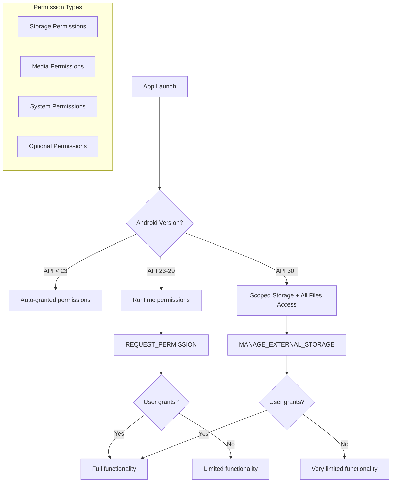
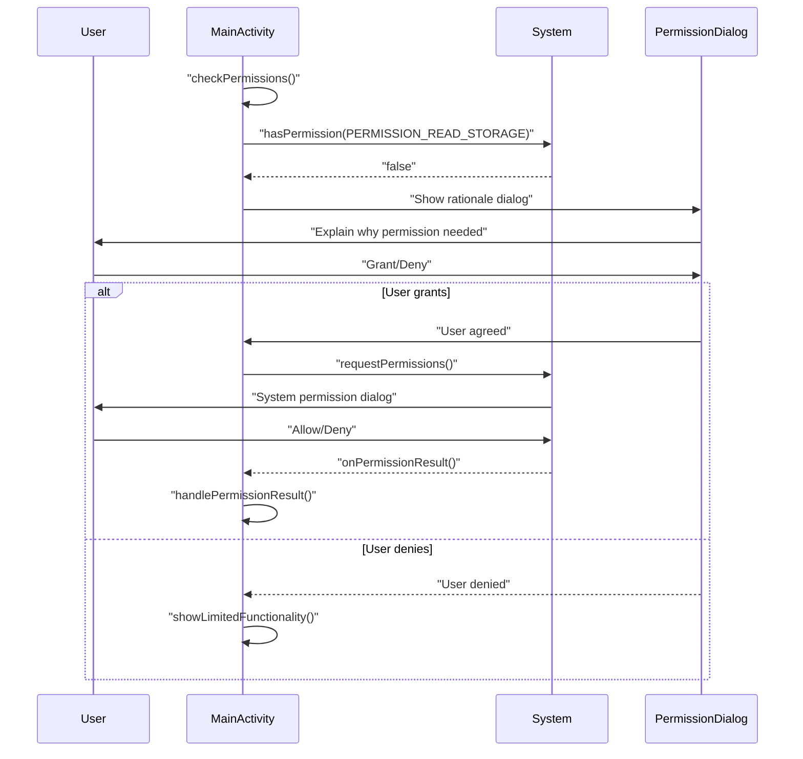
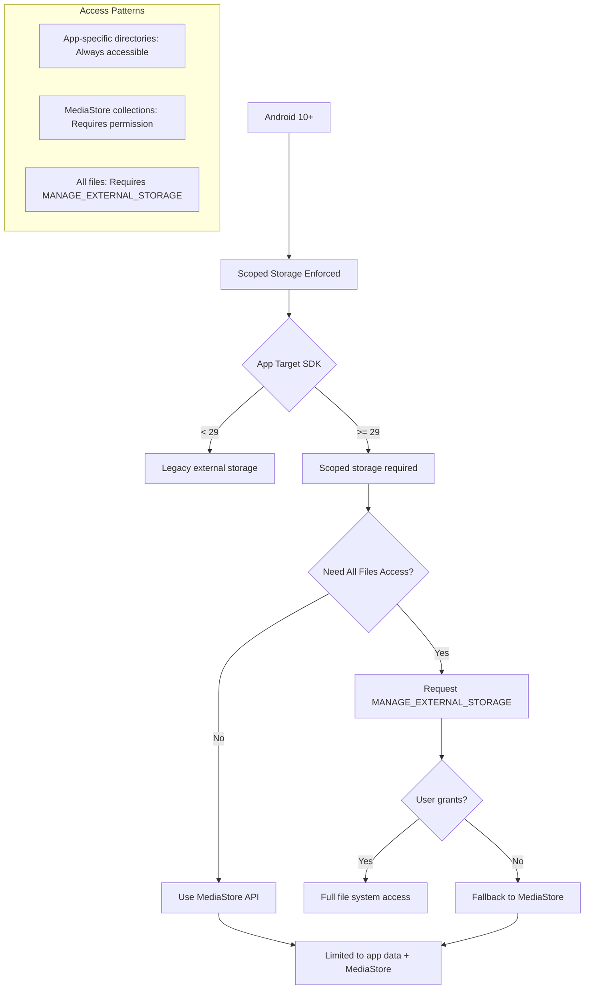
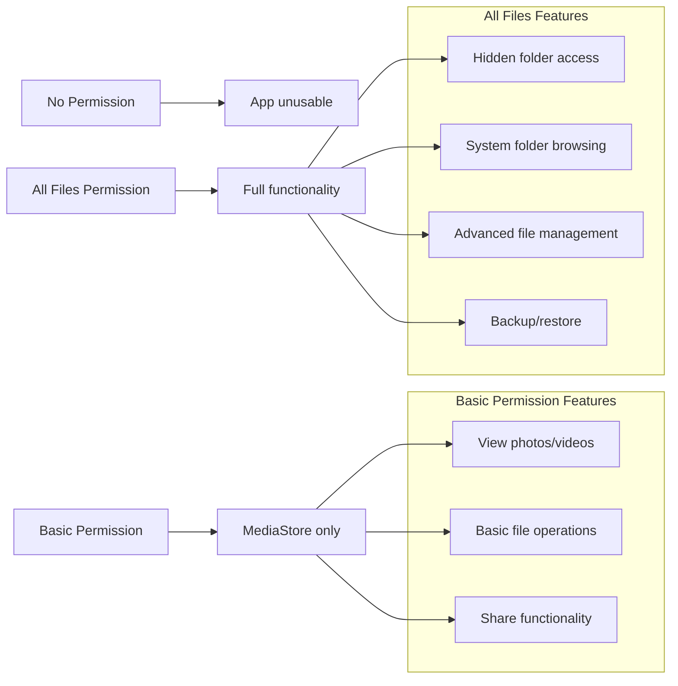

# Permissions Handling - Xử Lý Quyền

## Tổng Quan
Fossify Gallery cần nhiều quyền để truy cập storage, camera, và các tính năng khác. Việc xử lý permissions được thiết kế để tuân thủ các yêu cầu bảo mật của Android từ các phiên bản khác nhau.

## Permission Architecture



## Required Permissions

### **AndroidManifest.xml Declarations**

```xml
<!-- Storage permissions with version handling -->
<uses-permission 
    android:name="android.permission.WRITE_EXTERNAL_STORAGE"
    android:maxSdkVersion="40"
    tools:replace="android:maxSdkVersion" />

<!-- Media permissions for Android 13+ -->
<uses-permission android:name="android.permission.READ_MEDIA_IMAGES" />
<uses-permission android:name="android.permission.READ_MEDIA_VIDEO" />
<uses-permission android:name="android.permission.READ_MEDIA_VISUAL_USER_SELECTED" />

<!-- Special permissions -->
<uses-permission android:name="android.permission.MANAGE_EXTERNAL_STORAGE" 
    tools:ignore="ScopedStorage" />
<uses-permission android:name="android.permission.MANAGE_MEDIA" 
    tools:ignore="ProtectedPermissions" />

<!-- Feature permissions -->
<uses-permission android:name="android.permission.SET_WALLPAPER" />
<uses-permission android:name="android.permission.ACCESS_MEDIA_LOCATION" />
<uses-permission android:name="android.permission.POST_NOTIFICATIONS" />
```

### **Permission Categorization**

| Category | Permission | Android Version | Purpose |
|----------|------------|-----------------|---------|
| **Storage** | `WRITE_EXTERNAL_STORAGE` | < 29 | Full file access |
| **Storage** | `MANAGE_EXTERNAL_STORAGE` | 30+ | All files access |
| **Media** | `READ_MEDIA_IMAGES` | 33+ | Image access |
| **Media** | `READ_MEDIA_VIDEO` | 33+ | Video access |
| **Media** | `READ_MEDIA_VISUAL_USER_SELECTED` | 34+ | Partial access |
| **System** | `SET_WALLPAPER` | All | Wallpaper setting |
| **Location** | `ACCESS_MEDIA_LOCATION` | 29+ | EXIF GPS data |

## Permission Request Flow

### **Runtime Permission Flow**



### **Permission Helper Functions**

```kotlin
// Extension function trong helpers
fun Context.hasAllPermissions(permissions: Array<String>): Boolean {
    return permissions.all { permission ->
        ContextCompat.checkSelfPermission(this, permission) == 
            PackageManager.PERMISSION_GRANTED
    }
}

fun getPermissionsToRequest(): Array<String> {
    val permissions = mutableListOf<String>()
    
    when {
        isTiramisuPlus() -> {
            permissions.add(Manifest.permission.READ_MEDIA_IMAGES)
            permissions.add(Manifest.permission.READ_MEDIA_VIDEO)
            if (isUpsideDownCakePlus()) {
                permissions.add(Manifest.permission.READ_MEDIA_VISUAL_USER_SELECTED)
            }
        }
        else -> {
            permissions.add(Manifest.permission.WRITE_EXTERNAL_STORAGE)
        }
    }
    
    return permissions.toTypedArray()
}
```

## Scoped Storage Handling

### **Android 10+ Storage Changes**



### **All Files Access Dialog**

```kotlin
// GrantAllFilesDialog.kt pattern
class GrantAllFilesDialog : AlertDialog.Builder(context) {
    init {
        setTitle(R.string.grant_all_files_permission)
        setMessage(R.string.all_files_permission_text)
        
        setPositiveButton(R.string.go_to_settings) { _, _ ->
            // Open system settings
            Intent(Settings.ACTION_MANAGE_APP_ALL_FILES_ACCESS_PERMISSION).apply {
                data = Uri.parse("package:${context.packageName}")
                context.startActivity(this)
            }
        }
        
        setNegativeButton(R.string.cancel, null)
    }
}
```

## Permission-Specific Features

### **Storage Permission Levels**



### **Feature Degradation Strategy**

```kotlin
// MainActivity permission handling
private fun handlePermissionResult(granted: Boolean) {
    when {
        granted -> {
            // Full functionality
            loadDirectories()
            showAllFeatures()
        }
        else -> {
            // Graceful degradation
            showLimitedModeDialog()
            loadLimitedDirectories()
            hideAdvancedFeatures()
        }
    }
}

private fun showLimitedModeDialog() {
    AlertDialog.Builder(this)
        .setTitle(R.string.limited_functionality)
        .setMessage(R.string.limited_functionality_description)
        .setPositiveButton(R.string.grant_permission) {
            requestStoragePermission()
        }
        .setNegativeButton(R.string.continue_limited) {
            // Continue with limited features
        }
        .show()
}
```

## Special Permissions

### **Media Location Access**
```kotlin
// For EXIF GPS data (Android 10+)
private fun requestMediaLocationPermission() {
    if (Build.VERSION.SDK_INT >= Build.VERSION_CODES.Q) {
        if (!hasPermission(Manifest.permission.ACCESS_MEDIA_LOCATION)) {
            ActivityCompat.requestPermissions(
                this,
                arrayOf(Manifest.permission.ACCESS_MEDIA_LOCATION),
                PERMISSION_REQUEST_MEDIA_LOCATION
            )
        }
    }
}
```

### **Notification Permission (Android 13+)**
```kotlin
private fun requestNotificationPermission() {
    if (Build.VERSION.SDK_INT >= Build.VERSION_CODES.TIRAMISU) {
        if (!hasPermission(Manifest.permission.POST_NOTIFICATIONS)) {
            ActivityCompat.requestPermissions(
                this,
                arrayOf(Manifest.permission.POST_NOTIFICATIONS),
                PERMISSION_REQUEST_NOTIFICATIONS
            )
        }
    }
}
```

## Testing Permissions

### **Permission Testing Scenarios**

| Scenario | Test Case | Expected Behavior |
|----------|-----------|-------------------|
| **First Launch** | No permissions granted | Show permission request dialog |
| **Partial Grant** | Some permissions denied | Limited functionality mode |
| **Full Grant** | All permissions granted | Full app functionality |
| **Permission Revoked** | User revokes in settings | Graceful degradation |
| **Upgrade Scenario** | App updates with new permissions | Request additional permissions |

### **Permission Testing Code**
```kotlin
// Test helper for permissions
class PermissionTestHelper {
    fun simulatePermissionState(permissions: Map<String, Boolean>) {
        permissions.forEach { (permission, granted) ->
            if (granted) {
                grantPermission(permission)
            } else {
                revokePermission(permission)
            }
        }
    }
    
    fun testPermissionFlow() {
        // Test various permission combinations
        val scenarios = listOf(
            mapOf(PERMISSION_READ_STORAGE to true),
            mapOf(PERMISSION_READ_STORAGE to false),
            mapOf(
                PERMISSION_READ_MEDIA_IMAGES to true,
                PERMISSION_READ_MEDIA_VIDEO to false
            )
        )
        
        scenarios.forEach { scenario ->
            simulatePermissionState(scenario)
            verifyAppBehavior()
        }
    }
}
```

## Best Practices

### **User Experience Guidelines**
1. **Clear explanation**: Giải thích tại sao cần permission
2. **Graceful degradation**: App vẫn hoạt động với permissions hạn chế
3. **Easy re-request**: Cho phép user dễ dàng grant permission sau
4. **Settings shortcut**: Link trực tiếp đến app settings

### **Implementation Tips**
```kotlin
// Best practice pattern
class PermissionManager(private val activity: Activity) {
    
    fun checkAndRequestPermissions(
        permissions: Array<String>,
        onGranted: () -> Unit,
        onDenied: (deniedPermissions: Array<String>) -> Unit
    ) {
        val deniedPermissions = permissions.filter { permission ->
            !activity.hasPermission(permission)
        }.toTypedArray()
        
        when {
            deniedPermissions.isEmpty() -> onGranted()
            else -> {
                showRationaleDialog(deniedPermissions) {
                    ActivityCompat.requestPermissions(activity, deniedPermissions, REQUEST_CODE)
                }
            }
        }
    }
    
    private fun showRationaleDialog(permissions: Array<String>, onAccept: () -> Unit) {
        val message = buildPermissionRationale(permissions)
        AlertDialog.Builder(activity)
            .setTitle(R.string.permission_required)
            .setMessage(message)
            .setPositiveButton(R.string.grant) { _, _ -> onAccept() }
            .setNegativeButton(R.string.cancel, null)
            .show()
    }
}
```

--- END FILE: project_documentation/3_CORE_CONCEPTS/permissions_handling.md --- 