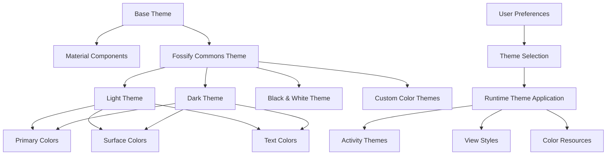

# Theming and Styles

## Overview

Fossify Gallery implements a comprehensive theming system supporting multiple color schemes, Material Design principles, and extensive customization options. This document explains the theming architecture, style inheritance, and customization patterns used throughout the application.

## Theming Architecture



## Base Theme Structure

### 1. Material Design Foundation
```xml
<!-- Base theme inheriting from Material Components -->
<style name="AppTheme" parent="Theme.MaterialComponents.DayNight.NoActionBar">
    <!-- Material Design components -->
    <item name="materialCardViewStyle">@style/CustomCardViewStyle</item>
    <item name="textInputStyle">@style/CustomTextInputStyle</item>
    <item name="materialButtonStyle">@style/CustomButtonStyle</item>
    
    <!-- App-specific attributes -->
    <item name="android:windowBackground">@color/default_background_color</item>
    <item name="android:statusBarColor">@color/default_status_bar_color</item>
    <item name="android:navigationBarColor">@color/default_navigation_bar_color</item>
</style>
```

### 2. Fossify Commons Integration
```xml
<!-- Integration with Fossify Commons theming -->
<style name="AppTheme.Base" parent="AppTheme">
    <!-- Commons library attributes -->
    <item name="divider_color">@color/divider_color</item>
    <item name="default_background_color">@color/default_background_color</item>
    <item name="default_text_color">@color/default_text_color</item>
    
    <!-- Gallery-specific attributes -->
    <item name="thumbnail_background">@color/thumbnail_background</item>
    <item name="media_selection_color">@color/media_selection_color</item>
</style>
```

## Color System

### 1. Primary Color Palette
```xml
<!-- colors.xml - Primary color definitions -->
<resources>
    <!-- Material Design color palette -->
    <color name="color_primary">#FF6200EE</color>
    <color name="color_primary_dark">#FF3700B3</color>
    <color name="color_accent">#FF03DAC5</color>
    
    <!-- Surface colors -->
    <color name="default_background_color">#FFFFFFFF</color>
    <color name="card_background_color">#FFFFFFFF</color>
    <color name="divider_color">#FFE0E0E0</color>
    
    <!-- Text colors -->
    <color name="default_text_color">#FF000000</color>
    <color name="secondary_text_color">#FF757575</color>
    <color name="hint_text_color">#FFBDBDBD</color>
</resources>
```

### 2. Dark Theme Colors
```xml
<!-- colors-night.xml - Dark theme color variants -->
<resources>
    <!-- Dark theme surface colors -->
    <color name="default_background_color">#FF121212</color>
    <color name="card_background_color">#FF1E1E1E</color>
    <color name="divider_color">#FF2C2C2C</color>
    
    <!-- Dark theme text colors -->
    <color name="default_text_color">#FFFFFFFF</color>
    <color name="secondary_text_color">#FFBDBDBD</color>
    <color name="hint_text_color">#FF757575</color>
</resources>
```

### 3. Custom Color Themes
```kotlin
// Config.kt - Custom color theme management
class Config(context: Context) {
    var primaryColor: Int
        get() = prefs.getInt(PRIMARY_COLOR, context.resources.getColor(R.color.color_primary))
        set(primaryColor) = prefs.edit().putInt(PRIMARY_COLOR, primaryColor).apply()
        
    var accentColor: Int
        get() = prefs.getInt(ACCENT_COLOR, context.resources.getColor(R.color.color_accent))
        set(accentColor) = prefs.edit().putInt(ACCENT_COLOR, accentColor).apply()
        
    var backgroundColor: Int
        get() = prefs.getInt(BACKGROUND_COLOR, context.resources.getColor(R.color.default_background_color))
        set(backgroundColor) = prefs.edit().putInt(BACKGROUND_COLOR, backgroundColor).apply()
}
```

## Dynamic Theming

### 1. Runtime Theme Application
```kotlin
// BaseActivity.kt - Dynamic theme application
abstract class SimpleActivity : AppCompatActivity() {
    protected val config: Config by lazy { Config.newInstance(applicationContext) }
    
    override fun onCreate(savedInstanceState: Bundle?) {
        applyTheme()
        super.onCreate(savedInstanceState)
    }
    
    private fun applyTheme() {
        // Apply user-selected theme
        when (config.theme) {
            THEME_LIGHT -> setTheme(R.style.AppTheme_Light)
            THEME_DARK -> setTheme(R.style.AppTheme_Dark)
            THEME_BLACK_WHITE -> setTheme(R.style.AppTheme_BlackWhite)
            THEME_CUSTOM -> applyCustomTheme()
            else -> setTheme(R.style.AppTheme) // System default
        }
        
        // Apply custom colors
        applyCustomColors()
    }
    
    private fun applyCustomTheme() {
        setTheme(R.style.AppTheme_Custom)
        
        // Apply custom primary color
        val primaryColor = config.primaryColor
        window.statusBarColor = primaryColor.darkenColor()
        
        // Apply to action bar if present
        supportActionBar?.setBackgroundDrawable(ColorDrawable(primaryColor))
    }
    
    private fun applyCustomColors() {
        // Apply background color
        window.decorView.setBackgroundColor(config.backgroundColor)
        
        // Apply navigation bar color
        if (Build.VERSION.SDK_INT >= Build.VERSION_CODES.O) {
            window.navigationBarColor = config.backgroundColor
            
            // Adjust navigation bar icon color
            val flags = window.decorView.systemUiVisibility
            window.decorView.systemUiVisibility = if (config.backgroundColor.isColorLight()) {
                flags or View.SYSTEM_UI_FLAG_LIGHT_NAVIGATION_BAR
            } else {
                flags and View.SYSTEM_UI_FLAG_LIGHT_NAVIGATION_BAR.inv()
            }
        }
    }
}
```

### 2. Color Utility Functions
```kotlin
// ColorUtils.kt - Color manipulation utilities
fun Int.darkenColor(factor: Float = 0.8f): Int {
    val a = Color.alpha(this)
    val r = (Color.red(this) * factor).roundToInt()
    val g = (Color.green(this) * factor).roundToInt() 
    val b = (Color.blue(this) * factor).roundToInt()
    return Color.argb(a, r, g, b)
}

fun Int.lightenColor(factor: Float = 1.2f): Int {
    val a = Color.alpha(this)
    val r = ((Color.red(this) * factor).roundToInt()).coerceAtMost(255)
    val g = ((Color.green(this) * factor).roundToInt()).coerceAtMost(255)
    val b = ((Color.blue(this) * factor).roundToInt()).coerceAtMost(255)
    return Color.argb(a, r, g, b)
}

fun Int.isColorLight(): Boolean {
    val darkness = 1 - (0.299 * Color.red(this) + 0.587 * Color.green(this) + 0.114 * Color.blue(this)) / 255
    return darkness < 0.5
}

fun Int.contrastColor(): Int {
    return if (isColorLight()) Color.BLACK else Color.WHITE
}
```

## View Styling

### 1. RecyclerView Styling
```xml
<!-- RecyclerView styles for different view types -->
<style name="GridRecyclerViewStyle">
    <item name="android:layout_width">match_parent</item>
    <item name="android:layout_height">match_parent</item>
    <item name="android:clipToPadding">false</item>
    <item name="android:scrollbars">none</item>
    <item name="android:background">@color/default_background_color</item>
</style>

<style name="ListRecyclerViewStyle" parent="GridRecyclerViewStyle">
    <item name="android:paddingTop">@dimen/small_margin</item>
    <item name="android:paddingBottom">@dimen/small_margin</item>
</style>
```

### 2. Thumbnail Styling
```xml
<!-- Thumbnail view styles -->
<style name="ThumbnailImageStyle">
    <item name="android:layout_width">match_parent</item>
    <item name="android:layout_height">match_parent</item>
    <item name="android:scaleType">centerCrop</item>
    <item name="android:background">@color/thumbnail_background</item>
</style>

<style name="ThumbnailOverlayStyle">
    <item name="android:layout_width">match_parent</item>
    <item name="android:layout_height">match_parent</item>
    <item name="android:background">@drawable/thumbnail_overlay_selector</item>
</style>
```

### 3. Media Item Styling
```kotlin
// Dynamic styling for media items
class MediaAdapter(
    activity: SimpleActivity,
    var media: ArrayList<ThumbnailItem>
) : MyRecyclerViewAdapter(activity, recyclerView) {
    
    private val config = activity.config
    
    override fun onCreateViewHolder(parent: ViewGroup, viewType: Int): ViewHolder {
        val binding = when (config.viewType) {
            VIEW_TYPE_GRID -> {
                // Grid view styling
                DirectoryItemGridBinding.inflate(layoutInflater, parent, false).apply {
                    root.layoutParams.width = itemWidth
                    root.layoutParams.height = itemWidth
                }
            }
            VIEW_TYPE_LIST -> {
                // List view styling  
                DirectoryItemListBinding.inflate(layoutInflater, parent, false)
            }
            else -> throw IllegalArgumentException("Invalid view type")
        }
        
        // Apply theme colors
        applyItemStyling(binding)
        
        return ViewHolder(binding)
    }
    
    private fun applyItemStyling(binding: ViewDataBinding) {
        when (binding) {
            is DirectoryItemGridBinding -> {
                binding.dirName.setTextColor(config.textColor)
                binding.photoCount.setTextColor(config.secondaryTextColor)
                binding.root.setBackgroundColor(config.backgroundColor)
            }
            is DirectoryItemListBinding -> {
                binding.dirName.setTextColor(config.textColor)
                binding.photoCount.setTextColor(config.secondaryTextColor)
                binding.dirPath.setTextColor(config.hintTextColor)
            }
        }
    }
}
```

## Custom Drawables and Selectors

### 1. State-Based Drawables
```xml
<!-- Drawable selectors for interactive elements -->
<selector xmlns:android="http://schemas.android.com/apk/res/android">
    <!-- Pressed state -->
    <item android:state_pressed="true">
        <shape android:shape="rectangle">
            <solid android:color="@color/pressed_overlay_color"/>
            <corners android:radius="@dimen/card_corner_radius"/>
        </shape>
    </item>
    
    <!-- Selected state -->
    <item android:state_selected="true">
        <shape android:shape="rectangle">
            <solid android:color="@color/selected_overlay_color"/>
            <corners android:radius="@dimen/card_corner_radius"/>
            <stroke android:width="2dp" android:color="@color/color_accent"/>
        </shape>
    </item>
    
    <!-- Default state -->
    <item>
        <shape android:shape="rectangle">
            <solid android:color="@android:color/transparent"/>
            <corners android:radius="@dimen/card_corner_radius"/>
        </shape>
    </item>
</selector>
```

### 2. Dynamic Drawable Generation
```kotlin
// Programmatic drawable creation
class DrawableGenerator(private val context: Context) {
    private val config = Config.newInstance(context)
    
    fun createSelectionDrawable(): StateListDrawable {
        val drawable = StateListDrawable()
        
        // Selected state
        val selectedDrawable = GradientDrawable().apply {
            shape = GradientDrawable.RECTANGLE
            setColor(config.accentColor)
            alpha = 128
            cornerRadius = context.resources.getDimension(R.dimen.card_corner_radius)
        }
        drawable.addState(intArrayOf(android.R.attr.state_selected), selectedDrawable)
        
        // Default state
        val defaultDrawable = GradientDrawable().apply {
            shape = GradientDrawable.RECTANGLE
            setColor(Color.TRANSPARENT)
            cornerRadius = context.resources.getDimension(R.dimen.card_corner_radius)
        }
        drawable.addState(intArrayOf(), defaultDrawable)
        
        return drawable
    }
    
    fun createRippleDrawable(): RippleDrawable {
        val mask = GradientDrawable().apply {
            shape = GradientDrawable.RECTANGLE
            setColor(Color.WHITE)
            cornerRadius = context.resources.getDimension(R.dimen.card_corner_radius)
        }
        
        return RippleDrawable(
            ColorStateList.valueOf(config.accentColor),
            null,
            mask
        )
    }
}
```

## Responsive Design

### 1. Dimension Resources
```xml
<!-- dimens.xml - Base dimensions -->
<resources>
    <!-- Margins -->
    <dimen name="tiny_margin">2dp</dimen>
    <dimen name="small_margin">4dp</dimen>
    <dimen name="normal_margin">8dp</dimen>
    <dimen name="medium_margin">16dp</dimen>
    <dimen name="big_margin">24dp</dimen>
    
    <!-- Text sizes -->
    <dimen name="small_text_size">12sp</dimen>
    <dimen name="normal_text_size">14sp</dimen>
    <dimen name="medium_text_size">16sp</dimen>
    <dimen name="big_text_size">18sp</dimen>
    
    <!-- Thumbnail sizes -->
    <dimen name="grid_thumbnail_size">120dp</dimen>
    <dimen name="list_thumbnail_size">80dp</dimen>
</resources>
```

### 2. Screen Size Adaptations
```xml
<!-- dimens-sw600dp.xml - Tablet dimensions -->
<resources>
    <dimen name="grid_thumbnail_size">150dp</dimen>
    <dimen name="medium_margin">24dp</dimen>
    <dimen name="big_margin">32dp</dimen>
</resources>

<!-- dimens-sw720dp.xml - Large tablet dimensions -->
<resources>
    <dimen name="grid_thumbnail_size">180dp</dimen>
    <dimen name="medium_margin">32dp</dimen>
    <dimen name="big_margin">48dp</dimen>
</resources>
```

### 3. Dynamic Sizing
```kotlin
// Dynamic sizing based on screen characteristics
class LayoutManager(private val context: Context) {
    private val config = Config.newInstance(context)
    
    fun calculateOptimalColumns(): Int {
        val screenWidth = context.resources.displayMetrics.widthPixels
        val thumbnailSize = context.resources.getDimensionPixelSize(R.dimen.grid_thumbnail_size)
        val spacing = config.thumbnailSpacing
        
        val availableWidth = screenWidth - (2 * spacing)
        val itemWidth = thumbnailSize + spacing
        
        return (availableWidth / itemWidth).coerceAtLeast(2)
    }
    
    fun calculateItemSize(columns: Int): Int {
        val screenWidth = context.resources.displayMetrics.widthPixels
        val spacing = config.thumbnailSpacing
        
        val totalSpacing = spacing * (columns + 1)
        val availableWidth = screenWidth - totalSpacing
        
        return availableWidth / columns
    }
}
```

## Accessibility and Theming

### 1. High Contrast Support
```kotlin
// Accessibility-aware theming
class AccessibilityThemeHelper(private val context: Context) {
    
    fun applyAccessibilityTheme(): Boolean {
        val accessibilityManager = context.getSystemService(Context.ACCESSIBILITY_SERVICE) as AccessibilityManager
        
        return if (accessibilityManager.isEnabled && isHighContrastEnabled()) {
            applyHighContrastColors()
            true
        } else {
            false
        }
    }
    
    private fun isHighContrastEnabled(): Boolean {
        // Check for high contrast settings
        return Settings.Secure.getInt(
            context.contentResolver,
            "high_text_contrast_enabled",
            0
        ) == 1
    }
    
    private fun applyHighContrastColors() {
        val config = Config.newInstance(context)
        
        // Apply high contrast colors
        config.textColor = Color.BLACK
        config.backgroundColor = Color.WHITE
        config.accentColor = Color.BLUE
    }
}
```

### 2. Large Text Support
```xml
<!-- Large text font sizes -->
<resources>
    <dimen name="accessibility_text_size">@dimen/normal_text_size</dimen>
</resources>

<!-- Large text variant -->
<resources xmlns:tools="http://schemas.android.com/tools" tools:ignore="UnusedResources">
    <dimen name="accessibility_text_size">18sp</dimen>
</resources>
```

## Theme Persistence and Migration

### 1. Theme Settings Persistence
```kotlin
// ThemeManager.kt - Centralized theme management
class ThemeManager(private val context: Context) {
    private val config = Config.newInstance(context)
    
    data class ThemeSettings(
        val primaryColor: Int,
        val accentColor: Int,
        val backgroundColor: Int,
        val textColor: Int,
        val isDarkTheme: Boolean
    )
    
    fun saveThemeSettings(settings: ThemeSettings) {
        config.apply {
            primaryColor = settings.primaryColor
            accentColor = settings.accentColor
            backgroundColor = settings.backgroundColor
            textColor = settings.textColor
            theme = if (settings.isDarkTheme) THEME_DARK else THEME_LIGHT
        }
    }
    
    fun loadThemeSettings(): ThemeSettings {
        return ThemeSettings(
            primaryColor = config.primaryColor,
            accentColor = config.accentColor,
            backgroundColor = config.backgroundColor,
            textColor = config.textColor,
            isDarkTheme = config.theme == THEME_DARK
        )
    }
    
    fun applyTheme(activity: Activity) {
        val settings = loadThemeSettings()
        
        // Apply to window
        activity.window.statusBarColor = settings.primaryColor.darkenColor()
        activity.window.decorView.setBackgroundColor(settings.backgroundColor)
        
        // Apply to action bar
        (activity as? AppCompatActivity)?.supportActionBar?.setBackgroundDrawable(
            ColorDrawable(settings.primaryColor)
        )
    }
}
```

### 2. Theme Migration
```kotlin
// Handle theme migrations between app versions
class ThemeMigrationManager(private val context: Context) {
    private val config = Config.newInstance(context)
    
    fun migrateThemeIfNeeded() {
        val currentVersion = config.themeVersion
        val targetVersion = CURRENT_THEME_VERSION
        
        if (currentVersion < targetVersion) {
            performMigration(currentVersion, targetVersion)
            config.themeVersion = targetVersion
        }
    }
    
    private fun performMigration(fromVersion: Int, toVersion: Int) {
        when {
            fromVersion < 2 -> migrateToVersion2()
            fromVersion < 3 -> migrateToVersion3()
        }
    }
    
    private fun migrateToVersion2() {
        // Migration logic for version 2
        // e.g., convert old color format to new format
    }
    
    private fun migrateToVersion3() {
        // Migration logic for version 3
        // e.g., add new theme attributes
    }
}
```

## Best Practices

### 1. **Consistent Color Usage**
```kotlin
// Centralized color management
object AppColors {
    fun getPrimaryColor(context: Context): Int {
        val config = Config.newInstance(context)
        return config.primaryColor
    }
    
    fun getAccentColor(context: Context): Int {
        val config = Config.newInstance(context)
        return config.accentColor
    }
    
    fun getTextColor(context: Context): Int {
        val config = Config.newInstance(context)
        return config.textColor
    }
}
```

### 2. **Theme Testing**
```kotlin
// Theme testing utilities
class ThemeTestHelper {
    fun testAllThemes(activity: Activity) {
        val themes = listOf(
            THEME_LIGHT,
            THEME_DARK,
            THEME_BLACK_WHITE,
            THEME_CUSTOM
        )
        
        themes.forEach { theme ->
            applyThemeForTesting(activity, theme)
            // Verify UI elements are properly styled
        }
    }
    
    private fun applyThemeForTesting(activity: Activity, theme: Int) {
        val config = Config.newInstance(activity)
        config.theme = theme
        activity.recreate()
    }
}
```

### 3. **Performance Optimization**
```kotlin
// Efficient theme application
class ThemeCache {
    private var cachedTheme: ThemeSettings? = null
    private var lastModified: Long = 0
    
    fun getTheme(context: Context): ThemeSettings {
        val config = Config.newInstance(context)
        val currentModified = config.lastThemeModified
        
        return if (cachedTheme != null && lastModified >= currentModified) {
            cachedTheme!!
        } else {
            val theme = loadThemeFromConfig(config)
            cachedTheme = theme
            lastModified = currentModified
            theme
        }
    }
}
```

## Conclusion

Fossify Gallery's theming system provides:

- **Flexibility**: Multiple theme options and custom color support
- **Consistency**: Centralized theme management and color usage
- **Accessibility**: High contrast and large text support
- **Performance**: Efficient theme application and caching

The comprehensive theming architecture ensures a cohesive visual experience while allowing extensive user customization and maintaining accessibility standards. 