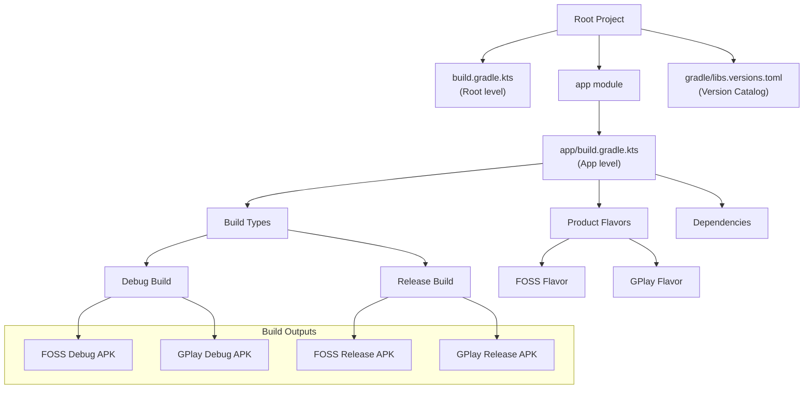
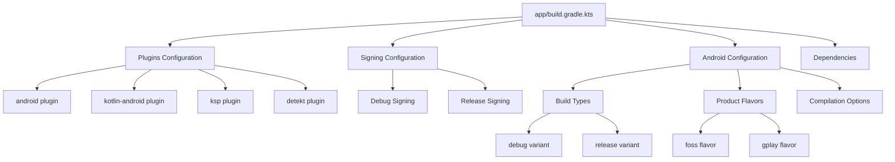
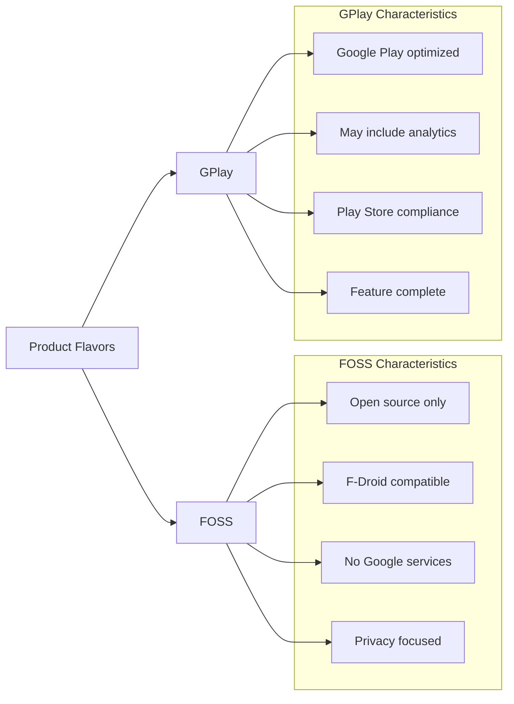
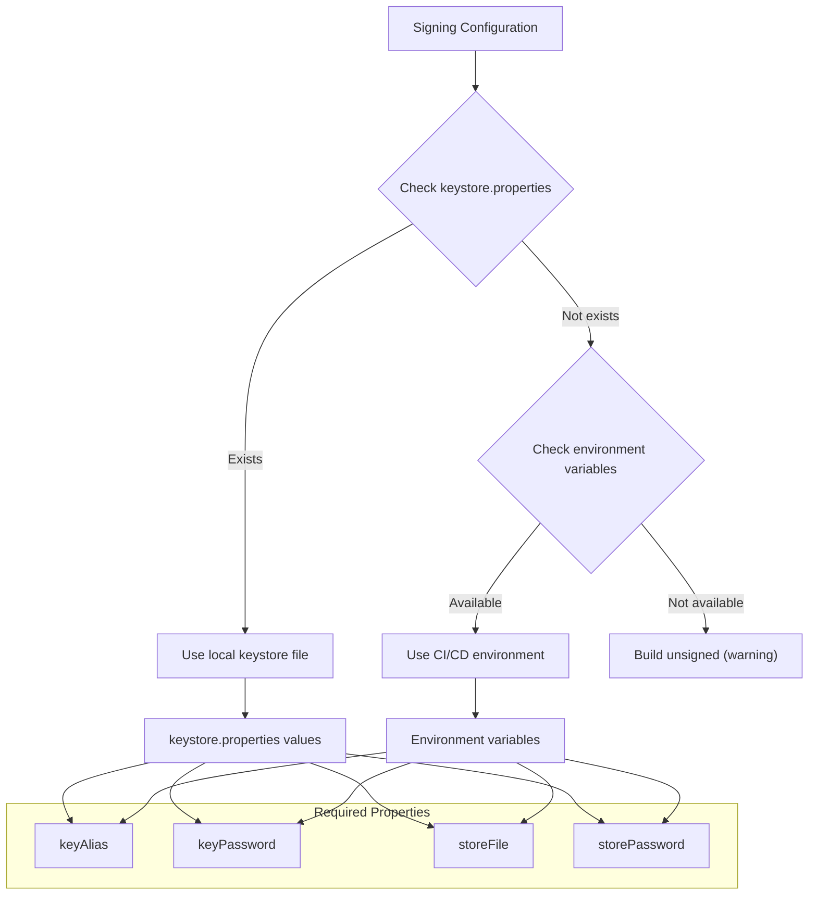
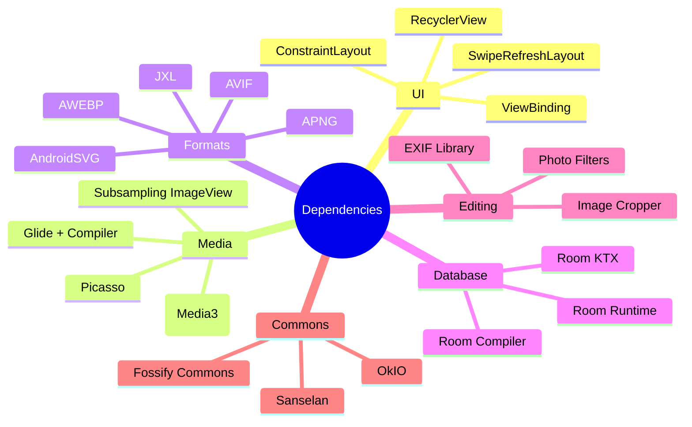

--- FILE: project_documentation/4_BUILD_AND_TEST/build_logic.md ---

# Build Logic - Cấu Hình Build

## Tổng Quan
Fossify Gallery sử dụng Gradle build system với Kotlin DSL, Version Catalog, và build variants để hỗ trợ nhiều môi trường phát triển và phân phối khác nhau.

## Build Architecture



## Project Structure

### **Root Level Configuration**
**File**: `build.gradle.kts` (7 lines)

```kotlin
plugins {
    alias(libs.plugins.android).apply(false)
    alias(libs.plugins.kotlinAndroid).apply(false)
    alias(libs.plugins.ksp).apply(false)
    alias(libs.plugins.detekt).apply(false)
}
```

### **Version Catalog**
**File**: `gradle/libs.versions.toml` (82 lines)

```toml
[versions]
# Core
kotlin = "2.1.21"
ksp = "2.1.21-2.0.2"
detekt = "1.23.8"

# Android
app-build-compileSDKVersion = "34"
app-build-targetSDK = "34"
app-build-minimumSDK = "26"
app-build-javaVersion = "VERSION_17"
app-build-kotlinJVMTarget = "17"

# Dependencies
fossify-commons = "3.0.5"
room = "2.7.1"
androidx-media3-exoplayer = "1.4.1"
glide = "4.16.0"

[libraries]
# Fossify
fossify-commons = { module = "org.fossify:commons", version.ref = "commons" }

# Room Database
androidx-room-runtime = { module = "androidx.room:room-runtime", version.ref = "room" }
androidx-room-ktx = { module = "androidx.room:room-ktx", version.ref = "room" }
androidx-room-compiler = { module = "androidx.room:room-compiler", version.ref = "room" }

# Media
androidx-media3-exoplayer = { module = "androidx.media3:media3-exoplayer", version.ref = "media3Exoplayer" }
glide-compiler = { module = "com.github.bumptech.glide:ksp", version.ref = "glideCompiler" }

[bundles]
room = [
    "androidx-room-ktx",
    "androidx-room-runtime",
]

[plugins]
android = { id = "com.android.application", version.ref = "gradlePlugins-agp" }
kotlinAndroid = { id = "org.jetbrains.kotlin.android", version.ref = "kotlin" }
ksp = { id = "com.google.devtools.ksp", version.ref = "ksp" }
detekt = { id = "io.gitlab.arturbosch.detekt", version.ref = "detekt" }
```

## App Level Configuration

### **Build Script Analysis**
**File**: `app/build.gradle.kts` (159 lines)



### **Android Configuration Block**

```kotlin
android {
    compileSdk = project.libs.versions.app.build.compileSDKVersion.get().toInt()

    defaultConfig {
        applicationId = project.property("APP_ID").toString()
        minSdk = project.libs.versions.app.build.minimumSDK.get().toInt()
        targetSdk = project.libs.versions.app.build.targetSDK.get().toInt()
        versionName = project.property("VERSION_NAME").toString()
        versionCode = project.property("VERSION_CODE").toString().toInt()
        setProperty("archivesBaseName", "gallery-$versionCode")
    }

    buildFeatures {
        viewBinding = true
        buildConfig = true
    }

    compileOptions {
        val currentJavaVersionFromLibs = 
            JavaVersion.valueOf(libs.versions.app.build.javaVersion.get())
        sourceCompatibility = currentJavaVersionFromLibs
        targetCompatibility = currentJavaVersionFromLibs
    }
}
```

## Build Variants

### **Product Flavors**



**Configuration**:
```kotlin
flavorDimensions.add("licensing")
productFlavors {
    register("foss") {
        dimension = "licensing"
    }
    register("gplay") {
        dimension = "licensing"
    }
}
```

### **Build Types**

| Build Type | Configuration | Use Case |
|------------|---------------|----------|
| **Debug** | `debuggable = true`<br/>`minifyEnabled = false`<br/>`applicationIdSuffix = ".debug"` | Development, testing |
| **Release** | `debuggable = false`<br/>`minifyEnabled = true`<br/>`shrinkResources = true`<br/>ProGuard enabled | Production deployment |

```kotlin
buildTypes {
    debug {
        applicationIdSuffix = ".debug"
    }
    release {
        isMinifyEnabled = true
        isShrinkResources = true
        proguardFiles(
            getDefaultProguardFile("proguard-android-optimize.txt"),
            "proguard-rules.pro"
        )
        if (keystorePropertiesFile.exists() || hasSigningVars()) {
            signingConfig = signingConfigs.getByName("release")
        }
    }
}
```

## Signing Configuration

### **Multiple Signing Methods**



**Implementation**:
```kotlin
val keystorePropertiesFile: File = rootProject.file("keystore.properties")
val keystoreProperties = Properties()
if (keystorePropertiesFile.exists()) {
    keystoreProperties.load(FileInputStream(keystorePropertiesFile))
}

fun hasSigningVars(): Boolean {
    return providers.environmentVariable("SIGNING_KEY_ALIAS").orNull != null
            && providers.environmentVariable("SIGNING_KEY_PASSWORD").orNull != null
            && providers.environmentVariable("SIGNING_STORE_FILE").orNull != null
            && providers.environmentVariable("SIGNING_STORE_PASSWORD").orNull != null
}

signingConfigs {
    if (keystorePropertiesFile.exists()) {
        register("release") {
            keyAlias = keystoreProperties.getProperty("keyAlias")
            keyPassword = keystoreProperties.getProperty("keyPassword")
            storeFile = file(keystoreProperties.getProperty("storeFile"))
            storePassword = keystoreProperties.getProperty("storePassword")
        }
    } else if (hasSigningVars()) {
        register("release") {
            keyAlias = providers.environmentVariable("SIGNING_KEY_ALIAS").get()
            keyPassword = providers.environmentVariable("SIGNING_KEY_PASSWORD").get()
            storeFile = file(providers.environmentVariable("SIGNING_STORE_FILE").get())
            storePassword = providers.environmentVariable("SIGNING_STORE_PASSWORD").get()
        }
    }
}
```

## Dependencies Management

### **Dependency Categories**



**Implementation**:
```kotlin
dependencies {
    // Core
    implementation(libs.fossify.commons)
    
    // UI
    implementation(libs.androidx.constraintlayout)
    implementation(libs.androidx.swiperefreshlayout)
    
    // Media
    implementation(libs.androidx.media3.exoplayer)
    implementation(libs.picasso) {
        exclude(group = "com.squareup.okhttp3", module = "okhttp")
    }
    ksp(libs.glide.compiler)
    
    // Database
    implementation(libs.bundles.room)
    ksp(libs.androidx.room.compiler)
    
    // Image formats
    implementation(libs.awebp)
    implementation(libs.apng)
    implementation(libs.avif.integration)
    implementation(libs.jxl.integration)
}
```

## Code Quality Tools

### **Detekt Configuration**
**Static code analysis cho Kotlin**

```kotlin
detekt {
    baseline = file("detekt-baseline.xml")
}
```

### **Lint Configuration**
```kotlin
lint {
    checkReleaseBuilds = false
    abortOnError = true
    warningsAsErrors = true
    baseline = file("lint-baseline.xml")
}
```

### **ProGuard Rules**
**File**: `proguard-rules.pro`

```proguard
# Keep Fossify Commons classes
-keep class org.fossify.commons.** { *; }

# Keep Room database entities
-keep class org.fossify.gallery.models.** { *; }

# Keep EXIF classes
-keep class it.sephiroth.android.exif.** { *; }

# Keep Glide generated API
-keep public class * extends com.bumptech.glide.module.AppGlideModule

# Picasso rules
-dontwarn com.squareup.okhttp.**
```

## Build Performance

### **Optimization Settings**

```kotlin
// Compilation optimization
tasks.withType<KotlinCompile> {
    kotlinOptions.jvmTarget = project.libs.versions.app.build.kotlinJVMTarget.get()
}

// Packaging optimization
packaging {
    resources {
        excludes += "META-INF/library_release.kotlin_module"
    }
}

// Dependencies info
dependenciesInfo {
    includeInApk = false
}
```

### **Build Speed Improvements**

| Technique | Implementation | Benefit |
|-----------|----------------|---------|
| **Version Catalog** | Centralized dependency management | Faster sync, better caching |
| **KSP** | Kotlin Symbol Processing | Faster annotation processing |
| **Parallel builds** | `org.gradle.parallel=true` | Multi-module parallelization |
| **Build cache** | `org.gradle.caching=true` | Reuse compiled outputs |

## CI/CD Integration

### **GitHub Actions Workflow**
```yaml
name: Build APK
on: [push, pull_request]

jobs:
  build:
    runs-on: ubuntu-latest
    steps:
      - uses: actions/checkout@v3
      
      - name: Set up JDK 17
        uses: actions/setup-java@v3
        with:
          java-version: '17'
          distribution: 'temurin'
          
      - name: Build with Gradle
        run: ./gradlew assembleFossRelease
        env:
          SIGNING_KEY_ALIAS: ${{ secrets.SIGNING_KEY_ALIAS }}
          SIGNING_KEY_PASSWORD: ${{ secrets.SIGNING_KEY_PASSWORD }}
          SIGNING_STORE_FILE: ${{ secrets.SIGNING_STORE_FILE }}
          SIGNING_STORE_PASSWORD: ${{ secrets.SIGNING_STORE_PASSWORD }}
```

### **Fastlane Integration**
**File**: `fastlane/Fastfile`

```ruby
default_platform(:android)

platform :android do
  desc "Build FOSS release APK"
  lane :build_foss do
    gradle(
      task: "assembleFossRelease",
      project_dir: "."
    )
  end
  
  desc "Deploy to F-Droid"
  lane :fdroid do
    build_foss
    # Additional F-Droid specific steps
  end
end
```

## Troubleshooting

### **Common Build Issues**

| Issue | Cause | Solution |
|-------|-------|----------|
| **Out of memory** | Large image resources | Increase heap size: `org.gradle.jvmargs=-Xmx4g` |
| **Signing failure** | Missing keystore | Check keystore.properties or env vars |
| **KSP errors** | Annotation processing | Clean build: `./gradlew clean` |
| **Lint failures** | Code quality issues | Fix issues or update baseline |

### **Debug Build Commands**
```bash
# Clean build
./gradlew clean

# Build debug variants
./gradlew assembleFossDebug
./gradlew assembleGplayDebug

# Build release variants  
./gradlew assembleFossRelease
./gradlew assembleGplayRelease

# Run tests
./gradlew test

# Generate signed APK
./gradlew assembleFossRelease -Pandroid.injected.signing.store.file=<keystore>
```

--- END FILE: project_documentation/4_BUILD_AND_TEST/build_logic.md --- 