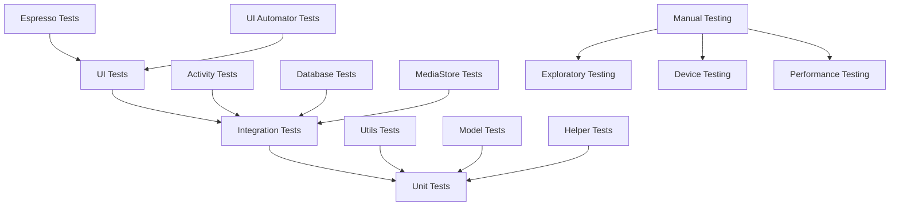

# Testing Strategy

## Overview

Fossify Gallery employs a comprehensive testing strategy that emphasizes integration testing and UI automation while maintaining focused unit tests for critical business logic. This document outlines the testing approach, tools, and best practices used in the project.

## Testing Pyramid



## Testing Architecture

### 1. Test Module Structure
```
app/
├── src/
│   ├── test/               # Unit Tests (JVM)
│   │   ├── java/
│   │   │   └── org/fossify/gallery/
│   │   │       ├── helpers/
│   │   │       ├── models/
│   │   │       └── utils/
│   │   └── resources/
│   │
│   ├── androidTest/        # Integration & UI Tests
│   │   ├── java/
│   │   │   └── org/fossify/gallery/
│   │   │       ├── activities/
│   │   │       ├── database/
│   │   │       ├── helpers/
│   │   │       └── ui/
│   │   └── assets/
│   │
│   └── sharedTest/         # Shared test utilities
│       └── java/
│           └── org/fossify/gallery/
│               ├── testdata/
│               └── testutils/
```

### 2. Testing Dependencies
```kotlin
// build.gradle.kts - Testing dependencies
dependencies {
    // Unit Testing
    testImplementation("junit:junit:4.13.2")
    testImplementation("org.mockito:mockito-core:4.8.0")
    testImplementation("org.mockito.kotlin:mockito-kotlin:4.0.0")
    testImplementation("org.robolectric:robolectric:4.9")
    testImplementation("androidx.test:core:1.5.0")
    testImplementation("androidx.test.ext:junit:1.1.5")
    testImplementation("org.jetbrains.kotlinx:kotlinx-coroutines-test:1.6.4")
    
    // Integration Testing
    androidTestImplementation("androidx.test:runner:1.5.2")
    androidTestImplementation("androidx.test:rules:1.5.0")
    androidTestImplementation("androidx.test.ext:junit:1.1.5")
    androidTestImplementation("androidx.test.espresso:espresso-core:3.5.1")
    androidTestImplementation("androidx.test.espresso:espresso-intents:3.5.1")
    androidTestImplementation("androidx.test.uiautomator:uiautomator:2.2.0")
    androidTestImplementation("androidx.room:room-testing:2.4.3")
    
    // Shared Test Utilities
    testImplementation("androidx.arch.core:core-testing:2.1.0")
    androidTestImplementation("androidx.arch.core:core-testing:2.1.0")
}
```

## Unit Testing

### 1. Helper Class Testing
```kotlin
// ConfigTest.kt - Testing configuration helper
@RunWith(RobolectricTestRunner::class)
class ConfigTest {
    
    private lateinit var context: Context
    private lateinit var config: Config
    
    @Before
    fun setup() {
        context = ApplicationProvider.getApplicationContext()
        config = Config.newInstance(context)
    }
    
    @Test
    fun `should save and retrieve view type`() {
        // Given
        val expectedViewType = VIEW_TYPE_LIST
        
        // When
        config.viewType = expectedViewType
        
        // Then
        assertThat(config.viewType).isEqualTo(expectedViewType)
    }
    
    @Test
    fun `should use default view type when not set`() {
        // Given - fresh config
        val freshConfig = Config.newInstance(context)
        
        // Then
        assertThat(freshConfig.viewType).isEqualTo(VIEW_TYPE_GRID)
    }
    
    @Test
    fun `should save and retrieve sort order`() {
        // Given
        val expectedSortOrder = SORT_BY_NAME or SORT_ASCENDING
        
        // When
        config.sortOrder = expectedSortOrder
        
        // Then
        assertThat(config.sortOrder).isEqualTo(expectedSortOrder)
    }
}
```

### 2. Utility Function Testing
```kotlin
// ExtensionsTest.kt - Testing extension functions
class ExtensionsTest {
    
    @Test
    fun `should format file size correctly`() {
        assertThat(1024L.formatSize()).isEqualTo("1 KB")
        assertThat(1048576L.formatSize()).isEqualTo("1 MB")
        assertThat(1073741824L.formatSize()).isEqualTo("1 GB")
    }
    
    @Test
    fun `should detect image files correctly`() {
        assertThat("image.jpg".isImageFile()).isTrue()
        assertThat("image.png".isImageFile()).isTrue()
        assertThat("image.gif".isImageFile()).isTrue()
        assertThat("video.mp4".isImageFile()).isFalse()
        assertThat("document.pdf".isImageFile()).isFalse()
    }
    
    @Test
    fun `should detect video files correctly`() {
        assertThat("video.mp4".isVideoFile()).isTrue()
        assertThat("video.avi".isVideoFile()).isTrue()
        assertThat("video.mkv".isVideoFile()).isTrue()
        assertThat("image.jpg".isVideoFile()).isFalse()
        assertThat("audio.mp3".isVideoFile()).isFalse()
    }
    
    @Test
    fun `should darken color correctly`() {
        val originalColor = Color.rgb(255, 255, 255) // White
        val darkenedColor = originalColor.darkenColor(0.5f)
        
        assertThat(Color.red(darkenedColor)).isEqualTo(127)
        assertThat(Color.green(darkenedColor)).isEqualTo(127)
        assertThat(Color.blue(darkenedColor)).isEqualTo(127)
    }
}
```

### 3. Model Testing
```kotlin
// DirectoryTest.kt - Testing data models
class DirectoryTest {
    
    @Test
    fun `should create directory with correct properties`() {
        // Given
        val path = "/storage/emulated/0/Pictures"
        val name = "Pictures"
        val mediaCount = 10
        
        // When
        val directory = Directory(
            path = path,
            tmb = "",
            name = name,
            mediaCnt = mediaCount,
            modified = System.currentTimeMillis(),
            taken = System.currentTimeMillis(),
            size = 0L,
            types = TYPE_IMAGE
        )
        
        // Then
        assertThat(directory.path).isEqualTo(path)
        assertThat(directory.name).isEqualTo(name)
        assertThat(directory.mediaCnt).isEqualTo(mediaCount)
    }
    
    @Test
    fun `should generate correct bubble text for sorting`() {
        // Given
        val directory = Directory(
            path = "/test",
            tmb = "",
            name = "TestDir",
            mediaCnt = 5,
            modified = 1640995200000L, // 2022-01-01
            taken = 1640995200000L,
            size = 1048576L, // 1 MB
            types = TYPE_IMAGE
        )
        
        // When & Then
        assertThat(directory.getBubbleText(SORT_BY_NAME)).isEqualTo("TestDir")
        assertThat(directory.getBubbleText(SORT_BY_SIZE)).isEqualTo("1 MB")
        assertThat(directory.getBubbleText(SORT_BY_DATE_MODIFIED)).contains("2022")
    }
}
```

## Integration Testing

### 1. Database Testing
```kotlin
// DatabaseTest.kt - Testing Room database operations
@RunWith(AndroidJUnit4::class)
class DatabaseTest {
    
    private lateinit var database: GalleryDatabase
    private lateinit var directoryDao: DirectoryDao
    
    @Before
    fun setup() {
        val context = ApplicationProvider.getApplicationContext<Context>()
        database = Room.inMemoryDatabaseBuilder(context, GalleryDatabase::class.java)
            .allowMainThreadQueries()
            .build()
        directoryDao = database.DirectoryDao()
    }
    
    @After
    fun teardown() {
        database.close()
    }
    
    @Test
    fun `should insert and retrieve directory`() = runBlocking {
        // Given
        val directory = Directory(
            path = "/test/path",
            tmb = "",
            name = "Test",
            mediaCnt = 5,
            modified = System.currentTimeMillis(),
            taken = System.currentTimeMillis(),
            size = 1000L,
            types = TYPE_IMAGE
        )
        
        // When
        directoryDao.insert(directory)
        val retrieved = directoryDao.getDirectoryWithPath("/test/path")
        
        // Then
        assertThat(retrieved).isNotNull()
        assertThat(retrieved?.name).isEqualTo("Test")
        assertThat(retrieved?.mediaCnt).isEqualTo(5)
    }
    
    @Test
    fun `should update directory media count`() = runBlocking {
        // Given
        val directory = Directory(
            path = "/test/path",
            tmb = "",
            name = "Test",
            mediaCnt = 5,
            modified = 1000L,
            taken = 2000L,
            size = 1000L,
            types = TYPE_IMAGE
        )
        directoryDao.insert(directory)
        
        // When
        directoryDao.updateDirectory("/test/path", 10, 3000L, 4000L)
        val updated = directoryDao.getDirectoryWithPath("/test/path")
        
        // Then
        assertThat(updated?.mediaCnt).isEqualTo(10)
        assertThat(updated?.modified).isEqualTo(3000L)
        assertThat(updated?.taken).isEqualTo(4000L)
    }
    
    @Test
    fun `should delete directory by path`() = runBlocking {
        // Given
        val directory = Directory(
            path = "/test/path",
            tmb = "",
            name = "Test",
            mediaCnt = 5,
            modified = System.currentTimeMillis(),
            taken = System.currentTimeMillis(),
            size = 1000L,
            types = TYPE_IMAGE
        )
        directoryDao.insert(directory)
        
        // When
        directoryDao.deleteDirPath("/test/path")
        val retrieved = directoryDao.getDirectoryWithPath("/test/path")
        
        // Then
        assertThat(retrieved).isNull()
    }
}
```

### 2. MediaFetcher Integration Testing
```kotlin
// MediaFetcherTest.kt - Testing media loading integration
@RunWith(AndroidJUnit4::class)
class MediaFetcherTest {
    
    private lateinit var context: Context
    private lateinit var mediaFetcher: MediaFetcher
    
    @Before
    fun setup() {
        context = ApplicationProvider.getApplicationContext()
        mediaFetcher = MediaFetcher(context)
    }
    
    @Test
    fun `should load directories asynchronously`() {
        // Given
        val latch = CountDownLatch(1)
        var result: ArrayList<Directory>? = null
        
        // When
        mediaFetcher.getDirectoriesAsync { directories ->
            result = directories
            latch.countDown()
        }
        
        // Then
        latch.await(5, TimeUnit.SECONDS)
        assertThat(result).isNotNull()
        // Note: Actual content depends on test device media
    }
    
    @Test
    fun `should handle empty directory path`() {
        // Given
        val latch = CountDownLatch(1)
        var result: ArrayList<Medium>? = null
        
        // When
        mediaFetcher.getMediaAsync("", false, false) { media ->
            result = media
            latch.countDown()
        }
        
        // Then
        latch.await(5, TimeUnit.SECONDS)
        assertThat(result).isNotNull()
        assertThat(result).isEmpty()
    }
}
```

## UI Testing

### 1. Activity Testing with Espresso
```kotlin
// MainActivityTest.kt - Testing main activity UI
@RunWith(AndroidJUnit4::class)
@LargeTest
class MainActivityTest {
    
    @get:Rule
    val activityRule = ActivityScenarioRule(MainActivity::class.java)
    
    @Before
    fun setup() {
        // Grant necessary permissions
        UiAutomation.getInstance().grantRuntimePermission(
            InstrumentationRegistry.getTargetContext().packageName,
            Manifest.permission.READ_EXTERNAL_STORAGE
        )
    }
    
    @Test
    fun `should display directories in grid view`() {
        // Wait for data to load
        onView(withId(R.id.directories_grid))
            .check(matches(isDisplayed()))
        
        // Check that RecyclerView has items
        onView(withId(R.id.directories_grid))
            .check(matches(hasMinimumChildCount(1)))
    }
    
    @Test
    fun `should switch between grid and list view`() {
        // Open options menu
        onView(withId(R.id.action_view_type))
            .perform(click())
        
        // Switch to list view
        onView(withText(R.string.list_view))
            .perform(click())
        
        // Verify list view is displayed
        onView(withId(R.id.directories_grid))
            .check(matches(isDisplayed()))
        
        // Items should now have different layout
        onView(withId(R.id.directories_grid))
            .check(matches(hasDescendant(withId(R.id.dir_path))))
    }
    
    @Test
    fun `should open directory when clicked`() {
        // Wait for directories to load
        onView(withId(R.id.directories_grid))
            .check(matches(isDisplayed()))
        
        // Click on first directory
        onView(withId(R.id.directories_grid))
            .perform(RecyclerViewActions.actionOnItemAtPosition<RecyclerView.ViewHolder>(0, click()))
        
        // Verify media activity is opened
        intended(hasComponent(MediaActivity::class.java.name))
    }
}
```

### 2. Media Activity Testing
```kotlin
// MediaActivityTest.kt - Testing media viewing
@RunWith(AndroidJUnit4::class)
@LargeTest
class MediaActivityTest {
    
    @get:Rule
    val intentsTestRule = IntentsTestRule(MediaActivity::class.java, false, false)
    
    @Test
    fun `should display media files in directory`() {
        // Given
        val intent = Intent().apply {
            putExtra(DIRECTORY, "/storage/emulated/0/Pictures")
        }
        
        // When
        intentsTestRule.launchActivity(intent)
        
        // Then
        onView(withId(R.id.media_grid))
            .check(matches(isDisplayed()))
    }
    
    @Test
    fun `should open photo viewer when media clicked`() {
        // Given
        val intent = Intent().apply {
            putExtra(DIRECTORY, "/storage/emulated/0/Pictures")
        }
        intentsTestRule.launchActivity(intent)
        
        // When
        onView(withId(R.id.media_grid))
            .perform(RecyclerViewActions.actionOnItemAtPosition<RecyclerView.ViewHolder>(0, click()))
        
        // Then
        intended(hasComponent(PhotoVideoActivity::class.java.name))
    }
    
    @Test
    fun `should select multiple items in selection mode`() {
        // Given
        val intent = Intent().apply {
            putExtra(DIRECTORY, "/storage/emulated/0/Pictures")
        }
        intentsTestRule.launchActivity(intent)
        
        // When - Long click to enter selection mode
        onView(withId(R.id.media_grid))
            .perform(RecyclerViewActions.actionOnItemAtPosition<RecyclerView.ViewHolder>(0, longClick()))
        
        // Then - Selection mode should be active
        onView(withId(R.id.cab_copy))
            .check(matches(isDisplayed()))
        
        // When - Click another item to select it
        onView(withId(R.id.media_grid))
            .perform(RecyclerViewActions.actionOnItemAtPosition<RecyclerView.ViewHolder>(1, click()))
        
        // Then - Multiple items should be selected
        // Verify by checking action bar title shows count
    }
}
```

### 3. Settings Testing
```kotlin
// SettingsActivityTest.kt - Testing settings functionality
@RunWith(AndroidJUnit4::class)
class SettingsActivityTest {
    
    @get:Rule
    val activityRule = ActivityScenarioRule(SettingsActivity::class.java)
    
    @Test
    fun `should change theme when selected`() {
        // When
        onView(withText(R.string.theme))
            .perform(click())
        
        // Select dark theme
        onView(withText(R.string.dark_theme))
            .perform(click())
        
        // Then
        // Verify theme change is applied
        onView(withId(android.R.id.content))
            .check(matches(isDisplayed()))
    }
    
    @Test
    fun `should toggle autoplay videos setting`() {
        // Given
        val initialState = Config.newInstance(ApplicationProvider.getApplicationContext()).autoplayVideos
        
        // When
        onView(withText(R.string.autoplay_videos))
            .perform(click())
        
        // Then
        val newState = Config.newInstance(ApplicationProvider.getApplicationContext()).autoplayVideos
        assertThat(newState).isNotEqualTo(initialState)
    }
}
```

## Performance Testing

### 1. Memory Usage Testing
```kotlin
// MemoryTest.kt - Testing memory efficiency
@RunWith(AndroidJUnit4::class)
class MemoryTest {
    
    @Test
    fun `should not leak memory when loading large directories`() {
        val activityScenario = ActivityScenario.launch(MainActivity::class.java)
        
        // Get initial memory usage
        val initialMemory = getUsedMemory()
        
        // Simulate loading multiple large directories
        repeat(10) {
            activityScenario.onActivity { activity ->
                // Simulate directory loading
                activity.getDirectories()
            }
            
            // Wait for operations to complete
            Thread.sleep(1000)
        }
        
        // Force garbage collection
        System.gc()
        Thread.sleep(1000)
        
        // Check final memory usage
        val finalMemory = getUsedMemory()
        val memoryIncrease = finalMemory - initialMemory
        
        // Memory increase should be reasonable (less than 50MB)
        assertThat(memoryIncrease).isLessThan(50 * 1024 * 1024L)
        
        activityScenario.close()
    }
    
    private fun getUsedMemory(): Long {
        val runtime = Runtime.getRuntime()
        return runtime.totalMemory() - runtime.freeMemory()
    }
}
```

### 2. Loading Performance Testing
```kotlin
// PerformanceTest.kt - Testing loading times
@RunWith(AndroidJUnit4::class)
class PerformanceTest {
    
    @Test
    fun `should load directories within reasonable time`() {
        val context = ApplicationProvider.getApplicationContext<Context>()
        val mediaFetcher = MediaFetcher(context)
        
        val startTime = System.currentTimeMillis()
        val latch = CountDownLatch(1)
        
        mediaFetcher.getDirectoriesAsync { directories ->
            val endTime = System.currentTimeMillis()
            val loadTime = endTime - startTime
            
            // Should load within 5 seconds
            assertThat(loadTime).isLessThan(5000L)
            
            latch.countDown()
        }
        
        latch.await(10, TimeUnit.SECONDS)
    }
    
    @Test
    fun `should render thumbnails efficiently`() {
        val context = ApplicationProvider.getApplicationContext<Context>()
        val startTime = System.currentTimeMillis()
        
        // Generate thumbnails for test images
        val thumbnailGenerator = ThumbnailGenerator(context)
        val latch = CountDownLatch(10)
        
        repeat(10) { index ->
            thumbnailGenerator.generateThumbnailAsync("test_image_$index.jpg") { bitmap ->
                latch.countDown()
            }
        }
        
        latch.await(15, TimeUnit.SECONDS)
        val endTime = System.currentTimeMillis()
        val totalTime = endTime - startTime
        
        // Should generate 10 thumbnails within 15 seconds
        assertThat(totalTime).isLessThan(15000L)
    }
}
```

## Test Utilities and Helpers

### 1. Test Data Factory
```kotlin
// TestDataFactory.kt - Creating test data
object TestDataFactory {
    
    fun createTestDirectory(
        path: String = "/test/path",
        name: String = "TestDir",
        mediaCount: Int = 5
    ): Directory {
        return Directory(
            path = path,
            tmb = "",
            name = name,
            mediaCnt = mediaCount,
            modified = System.currentTimeMillis(),
            taken = System.currentTimeMillis(),
            size = 1000L,
            types = TYPE_IMAGE
        )
    }
    
    fun createTestMedium(
        path: String = "/test/image.jpg",
        name: String = "image.jpg",
        type: Int = TYPE_IMAGE
    ): Medium {
        return Medium(
            path = path,
            name = name,
            modified = System.currentTimeMillis(),
            taken = System.currentTimeMillis(),
            size = 1000L,
            type = type
        )
    }
    
    fun createTestDirectories(count: Int): List<Directory> {
        return (1..count).map { index ->
            createTestDirectory(
                path = "/test/dir$index",
                name = "TestDir$index",
                mediaCount = index * 2
            )
        }
    }
}
```

### 2. Custom Matchers
```kotlin
// CustomMatchers.kt - Custom Espresso matchers
object CustomMatchers {
    
    fun hasItemCount(count: Int): Matcher<View> {
        return object : BoundedMatcher<View, RecyclerView>(RecyclerView::class.java) {
            override fun describeTo(description: Description) {
                description.appendText("has $count items")
            }
            
            override fun matchesSafely(recyclerView: RecyclerView): Boolean {
                return recyclerView.adapter?.itemCount == count
            }
        }
    }
    
    fun isInSelectionMode(): Matcher<View> {
        return object : BoundedMatcher<View, RecyclerView>(RecyclerView::class.java) {
            override fun describeTo(description: Description) {
                description.appendText("is in selection mode")
            }
            
            override fun matchesSafely(recyclerView: RecyclerView): Boolean {
                val adapter = recyclerView.adapter as? MyRecyclerViewAdapter
                return adapter?.selectedKeys?.isNotEmpty() == true
            }
        }
    }
}
```

## Continuous Integration Testing

### 1. GitHub Actions Configuration
```yaml
# .github/workflows/test.yml
name: Run Tests

on: [push, pull_request]

jobs:
  test:
    runs-on: ubuntu-latest
    
    steps:
    - uses: actions/checkout@v3
    
    - name: Set up JDK 17
      uses: actions/setup-java@v3
      with:
        java-version: '17'
        distribution: 'temurin'
        
    - name: Cache Gradle packages
      uses: actions/cache@v3
      with:
        path: |
          ~/.gradle/caches
          ~/.gradle/wrapper
        key: ${{ runner.os }}-gradle-${{ hashFiles('**/*.gradle*', '**/gradle-wrapper.properties') }}
        restore-keys: |
          ${{ runner.os }}-gradle-
          
    - name: Grant execute permission for gradlew
      run: chmod +x gradlew
      
    - name: Run unit tests
      run: ./gradlew testDebugUnitTest
      
    - name: Generate test report
      run: ./gradlew jacocoTestReport
      
    - name: Upload test results
      uses: actions/upload-artifact@v3
      if: always()
      with:
        name: test-results
        path: app/build/reports/tests/
```

### 2. Test Coverage Configuration
```kotlin
// build.gradle.kts - Jacoco coverage configuration
jacoco {
    toolVersion = "0.8.8"
}

tasks.jacocoTestReport {
    dependsOn(tasks.testDebugUnitTest)
    
    reports {
        xml.required.set(true)
        html.required.set(true)
    }
    
    val fileFilter = listOf(
        "**/R.class",
        "**/R\$*.class",
        "**/BuildConfig.*",
        "**/Manifest*.*",
        "**/*Test*.*",
        "android/**/*.*"
    )
    
    val debugTree = fileTree("${buildDir}/intermediates/javac/debug") {
        exclude(fileFilter)
    }
    
    val mainSrc = "${project.projectDir}/src/main/java"
    
    sourceDirectories.setFrom(files([mainSrc]))
    classDirectories.setFrom(files([debugTree]))
    executionData.setFrom(fileTree(buildDir) {
        include("**/*.exec", "**/*.ec")
    })
}
```

## Best Practices

### 1. **Test Naming Conventions**
```kotlin
// Good test naming - describes what is being tested and expected outcome
@Test
fun `should return empty list when directory does not exist`()

@Test
fun `should sort directories by name in ascending order when sort type is name ascending`()

@Test
fun `should display error message when storage permission is denied`()
```

### 2. **Test Structure (AAA Pattern)**
```kotlin
@Test
fun `should update media count when directory content changes`() {
    // Arrange
    val directory = TestDataFactory.createTestDirectory(mediaCount = 5)
    directoryDao.insert(directory)
    
    // Act
    directoryDao.updateDirectory(directory.path, 10, System.currentTimeMillis(), System.currentTimeMillis())
    val updated = directoryDao.getDirectoryWithPath(directory.path)
    
    // Assert
    assertThat(updated?.mediaCnt).isEqualTo(10)
}
```

### 3. **Test Isolation**
```kotlin
// Each test should be independent
@Before
fun setup() {
    // Clean state for each test
    database.clearAllTables()
    config.resetToDefaults()
}

@After
fun teardown() {
    // Clean up after each test
    database.close()
}
```

## Conclusion

Fossify Gallery's testing strategy provides:

- **Reliability**: Comprehensive test coverage across all layers
- **Maintainability**: Clear test structure and naming conventions
- **Performance**: Automated performance and memory testing
- **Quality**: Continuous integration with automated testing

The emphasis on integration testing and UI automation ensures that the app works correctly in real-world scenarios while maintaining code quality through unit tests for critical business logic. 