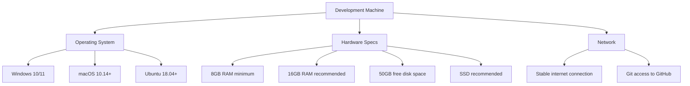
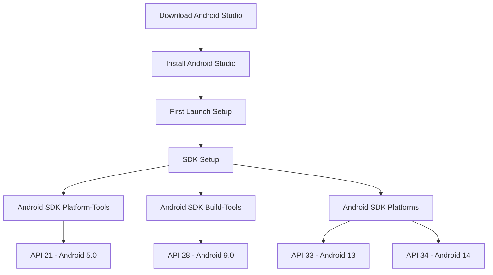
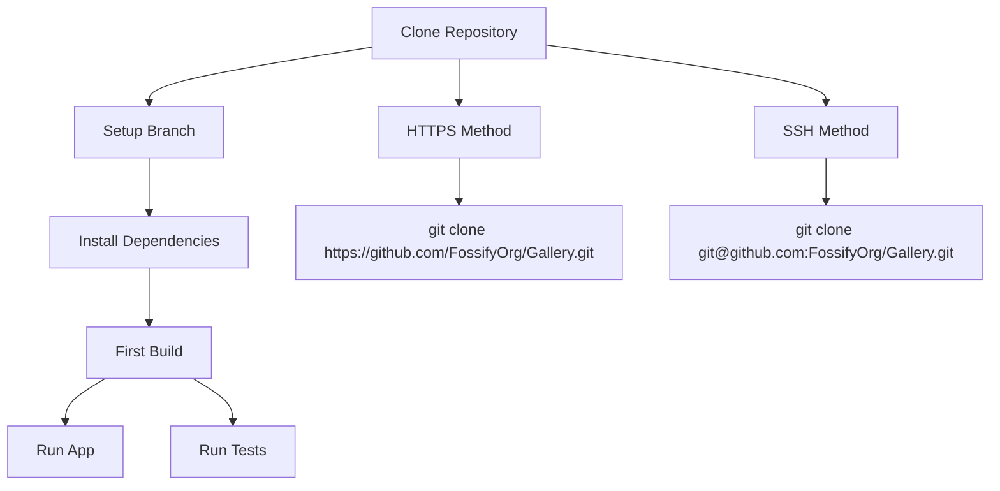
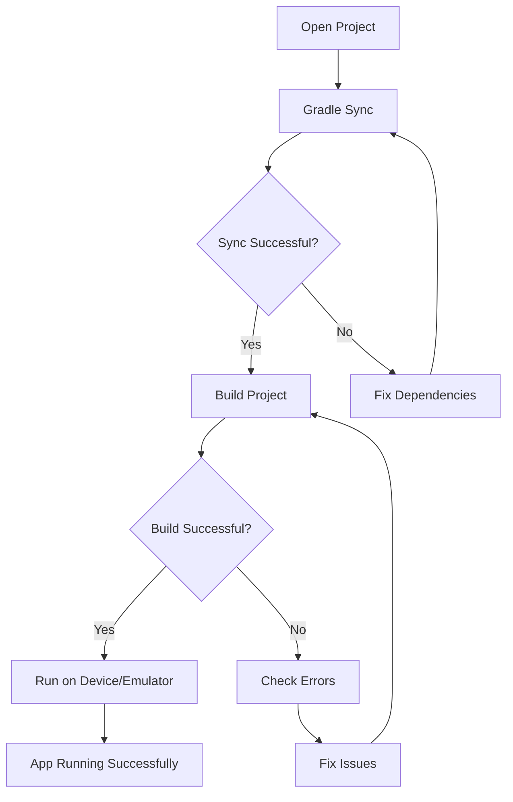
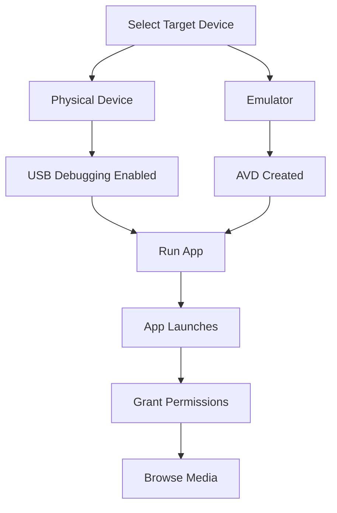
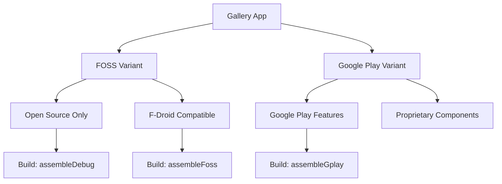

--- FILE: project_documentation/5_SYSTEM_INFO/setup_guide.md ---

# Development Environment Setup Guide

## Overview

This guide will help you set up a complete development environment for Fossify Gallery. Follow these steps to get from zero to first successful build.

## Prerequisites

### System Requirements



### Required Software

| Software | Version | Purpose |
|----------|---------|---------|
| **JDK** | 17 or higher | Java compilation |
| **Android Studio** | 2023.1.1+ (Hedgehog) | IDE and Android SDK |
| **Git** | Latest | Version control |
| **Android SDK** | API 21-34 | Android development |

## Step 1: Install JDK

### Windows
```bash
# Download and install JDK 17 from Oracle or adopt OpenJDK
# Add to PATH environment variable
# Verify installation
java -version
javac -version
```

### macOS
```bash
# Using Homebrew
brew install openjdk@17

# Add to shell profile (.zshrc or .bash_profile)
export JAVA_HOME=$(/usr/libexec/java_home -v 17)
export PATH=$JAVA_HOME/bin:$PATH

# Verify installation
java -version
```

### Linux (Ubuntu/Debian)
```bash
# Install OpenJDK 17
sudo apt update
sudo apt install openjdk-17-jdk

# Set JAVA_HOME
echo 'export JAVA_HOME=/usr/lib/jvm/java-17-openjdk-amd64' >> ~/.bashrc
echo 'export PATH=$PATH:$JAVA_HOME/bin' >> ~/.bashrc
source ~/.bashrc

# Verify
java -version
```

## Step 2: Android Studio Setup

### Download and Installation



1. **Download**: Get Android Studio from [developer.android.com](https://developer.android.com/studio)
2. **Install**: Follow platform-specific installation instructions
3. **First Launch**: Complete the setup wizard
4. **SDK Setup**: Install required SDK components

### SDK Configuration

Open Android Studio → Settings/Preferences → Appearance & Behavior → System Settings → Android SDK

**SDK Platforms** (install these):
- Android 14 (API 34)
- Android 13 (API 33) 
- Android 9 (API 28)
- Android 5.0 (API 21)

**SDK Tools** (ensure installed):
- Android SDK Build-Tools
- Android SDK Platform-Tools
- Android Emulator
- Intel x86 Emulator Accelerator (if using Intel)

## Step 3: Git Configuration

### Install Git
```bash
# Windows: Download from git-scm.com
# macOS: brew install git
# Linux: sudo apt install git

# Configure Git
git config --global user.name "Your Name"
git config --global user.email "your.email@example.com"

# Verify installation
git --version
```

### SSH Setup (Recommended)
```bash
# Generate SSH key
ssh-keygen -t ed25519 -C "your.email@example.com"

# Add to SSH agent
eval "$(ssh-agent -s)"
ssh-add ~/.ssh/id_ed25519

# Copy public key to clipboard
# Windows: type ~/.ssh/id_ed25519.pub | clip
# macOS: pbcopy < ~/.ssh/id_ed25519.pub
# Linux: cat ~/.ssh/id_ed25519.pub | xclip -selection clipboard

# Add SSH key to your GitHub account
```

## Step 4: Clone and Setup Project

### Clone Repository



```bash
# Clone the repository
git clone https://github.com/FossifyOrg/Gallery.git
cd Gallery

# Create development branch
git checkout -b feature/your-feature-name

# Open project in Android Studio
# File → Open → Select Gallery folder
```

### Project Structure Overview
```
Gallery/
├── app/                    # Main application module
│   ├── src/main/          # Main source code
│   ├── src/test/          # Unit tests
│   └── build.gradle.kts   # App-level build configuration
├── gradle/
│   └── libs.versions.toml # Version catalog
├── build.gradle.kts       # Project-level build configuration
└── settings.gradle.kts    # Project settings
```

## Step 5: First Build

### Gradle Sync and Build



**In Android Studio:**
1. Open the Gallery project
2. Wait for Gradle sync to complete
3. Click "Build" → "Make Project" (Ctrl+F9)
4. Wait for build to complete

### Common Build Issues

| Issue | Solution |
|-------|----------|
| **SDK not found** | Check SDK path in File → Project Structure |
| **Gradle version mismatch** | Update gradle-wrapper.properties |
| **Build tools missing** | Install missing build tools via SDK Manager |
| **Memory issues** | Increase Gradle heap size in gradle.properties |

## Step 6: Running the App

### Setup Virtual Device (AVD)

```bash
# In Android Studio:
# Tools → AVD Manager → Create Virtual Device
# Choose device: Pixel 4 or newer
# System Image: API 28+ (Google Play Store version)
# AVD Name: Gallery_Test_Device
```

### Run on Physical Device

**Enable Developer Options:**
1. Settings → About Phone → Tap "Build Number" 7 times
2. Settings → Developer Options → Enable "USB Debugging"
3. Connect device via USB
4. Accept debugging authorization

### Launch Application



**Run Configuration:**
- Target: `app`
- Run/Debug Configuration: Choose device
- Click Run button (▶️) or use Shift+F10

## Step 7: Development Tools Setup

### Useful Plugins

Install these Android Studio plugins:

| Plugin | Purpose |
|--------|---------|
| **Kotlin** | Kotlin language support (usually pre-installed) |
| **Android Drawable Importer** | Import vector drawables |
| **ADB Idea** | ADB commands from IDE |
| **Material Theme UI** | Better IDE theming |

### Code Style

```bash
# Import code style settings
# File → Settings → Editor → Code Style → Kotlin
# Import settings from Fossify Commons if available
```

### Git Hooks (Optional)

```bash
# Set up pre-commit hooks for code formatting
cd Gallery
git config core.hooksPath .githooks

# Make hooks executable (Linux/macOS)
chmod +x .githooks/pre-commit
```

## Step 8: Build Variants and Testing

### Understanding Build Variants



**Build Commands:**
```bash
# Debug build (FOSS)
./gradlew assembleDebug

# Release build (FOSS)
./gradlew assembleFossRelease

# Google Play release
./gradlew assembleGplayRelease

# Run tests
./gradlew test
./gradlew connectedAndroidTest
```

### Testing Your Setup

**Quick verification checklist:**
- [ ] App builds without errors
- [ ] App runs on device/emulator
- [ ] Can browse media files
- [ ] Can view photos in fullscreen
- [ ] Can edit photos (basic edits)
- [ ] Settings open and work
- [ ] No obvious crashes

## Step 9: Contributing Workflow

### Before Making Changes

```bash
# Always start with latest main
git checkout main
git pull origin main

# Create feature branch
git checkout -b feature/your-improvement

# Make your changes
# ...

# Test thoroughly
./gradlew test
./gradlew connectedAndroidTest

# Commit and push
git add .
git commit -m "feat: add awesome feature"
git push origin feature/your-improvement

# Create Pull Request on GitHub
```

### Coding Standards

Follow these guidelines:
- **Kotlin style**: Follow official Kotlin coding conventions
- **Comments**: Document complex logic
- **Testing**: Add tests for new features
- **Performance**: Consider impact on large media libraries

## Troubleshooting

### Common Setup Issues

| Problem | Solution |
|---------|----------|
| **Gradle sync fails** | Check internet connection, clear Gradle cache |
| **SDK license not accepted** | Run `sdkmanager --licenses` and accept all |
| **Emulator doesn't start** | Enable virtualization in BIOS, check HAXM |
| **App crashes on startup** | Check logcat, verify permissions |
| **Build very slow** | Increase Gradle heap size, use --parallel flag |

### Performance Optimization

```properties
# Add to gradle.properties for faster builds
org.gradle.jvmargs=-Xmx4096m -XX:MaxPermSize=512m -XX:+HeapDumpOnOutOfMemoryError -Dfile.encoding=UTF-8
org.gradle.parallel=true
org.gradle.configureondemand=true
org.gradle.daemon=true
android.useAndroidX=true
android.enableJetifier=true
```

## Getting Help

If you encounter issues:

1. **Check documentation**: Read this guide thoroughly
2. **Search issues**: Look at [GitHub Issues](https://github.com/FossifyOrg/Gallery/issues)
3. **Ask community**: Use [GitHub Discussions](https://github.com/FossifyOrg/Gallery/discussions)
4. **Debugging**: Use Android Studio debugger and logcat

---
**You're now ready to contribute to Fossify Gallery! 🚀**

--- END FILE: project_documentation/5_SYSTEM_INFO/setup_guide.md --- 