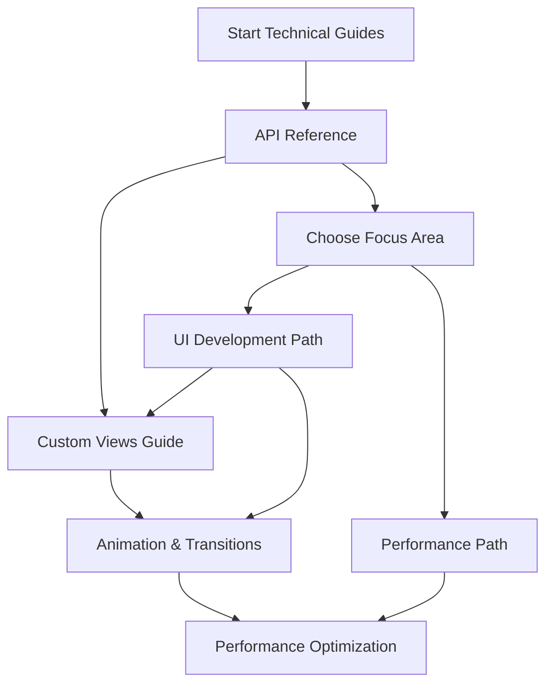

# 🔧 Technical Guides - Advanced Development

## Overview

This section contains detailed technical guides for advanced Fossify Gallery development. These guides are designed for experienced developers who want to understand the deep technical implementation details.

## Available Guides

### 📚 **API Reference**
| File | Description | Target Audience |
|------|-------------|-----------------|
| [**api_reference.md**](api_reference.md) | Complete API reference for core classes and methods | All developers |

### 🎨 **Custom Views & UI**
| File | Description | Target Audience |
|------|-------------|-----------------|
| [**custom_views_guide.md**](custom_views_guide.md) | Creating and extending custom views | UI developers |

### ⚡ **Performance & Animation**
| File | Description | Target Audience |
|------|-------------|-----------------|
| [**animation_transitions.md**](animation_transitions.md) | Animation systems and smooth transitions | UI/UX developers |
| [**performance_optimization.md**](performance_optimization.md) | Advanced performance optimization techniques | Senior developers |

## Learning Path

### **For UI Developers**
1. [API Reference](api_reference.md) - Understand core classes
2. [Custom Views Guide](custom_views_guide.md) - Master custom views
3. [Animation & Transitions](animation_transitions.md) - Smooth animations

### **For Performance Engineers**  
1. [API Reference](api_reference.md) - Core class understanding
2. [Performance Optimization](performance_optimization.md) - Advanced optimizations

## Prerequisites

Before diving into these guides, ensure you have:
- Completed [Setup Guide](../5_SYSTEM_INFO/setup_guide.md)
- Understanding of [App Architecture](../1_OVERVIEW/app_architecture.md)
- Experience with Kotlin and Android development

## Quick Reference

### **Most Important Classes**
- `MediaFetcher` - Core media data fetching
- `Config` - App configuration management
- `GalleryDatabase` - Database operations
- `SimpleActivity` - Base activity class

### **Key Interfaces**
- `DirectoriesAdapter.DirOperationsListener` - Directory operations
- `MediaAdapter.MediaOperationsListener` - Media operations
- `MyRecyclerViewAdapter` - Base adapter interface

### **Performance Hotspots**
- Media loading and caching
- RecyclerView scrolling optimization
- Database query performance
- Image/video processing

---
**Ready to dive deep into Fossify Gallery's technical implementation! 🚀** 