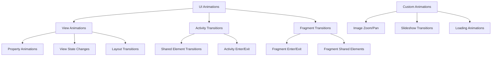

# Animation & Transitions - Smooth UI Experiences

## Overview

This guide covers the animation and transition systems used in Fossify Gallery to create smooth, engaging user experiences. From subtle micro-interactions to complex scene transitions, animations enhance usability and provide visual feedback.

## Animation Architecture



## Core Animation Types

### Property Animations
The foundation of smooth animations using ViewPropertyAnimator

```kotlin
// Basic fade animation
view.animate()
    .alpha(0f)
    .setDuration(300)
    .setInterpolator(AccelerateDecelerateInterpolator())
    .start()

// Scale animation with callback
view.animate()
    .scaleX(1.2f)
    .scaleY(1.2f)
    .setDuration(200)
    .withEndAction {
        // Animation completed
        onScaleComplete()
    }
    .start()

// Translation animation
view.animate()
    .translationY(-100f)
    .setDuration(250)
    .setInterpolator(OvershootInterpolator())
    .start()
```

### Interpolators & Timing
```kotlin
// Built-in interpolators for different effects
val fastOutSlowIn = FastOutSlowInInterpolator()  // Material Design
val anticipate = AnticipateInterpolator()         // Pull back before action
val overshoot = OvershootInterpolator()          // Overshoot target
val bounce = BounceInterpolator()                // Bounce at end

// Custom cubic bezier interpolator
val customInterpolator = PathInterpolator(0.25f, 0.1f, 0.25f, 1f)
```

---

## Activity Transitions

### Shared Element Transitions
Enable smooth transitions between activities by sharing common elements

#### Setup in Source Activity
```kotlin
class MainActivity : SimpleActivity() {
    
    private fun openMediaViewer(medium: Medium, imageView: ImageView) {
        val intent = Intent(this, ViewPagerActivity::class.java).apply {
            putExtra(MEDIUM, medium)
        }
        
        // Create shared element transition
        val options = ActivityOptionsCompat.makeSceneTransitionAnimation(
            this,
            imageView,
            "shared_media_element"
        )
        
        startActivity(intent, options.toBundle())
    }
}
```

#### Setup in Target Activity
```kotlin
class ViewPagerActivity : SimpleActivity() {
    
    override fun onCreate(savedInstanceState: Bundle?) {
        super.onCreate(savedInstanceState)
        
        // Enable shared element transitions
        window.requestFeature(Window.FEATURE_ACTIVITY_TRANSITIONS)
        
        // Set transition animations
        setupTransitions()
        
        setContentView(R.layout.activity_viewpager)
        
        // Postpone transition until image is loaded
        postponeEnterTransition()
        
        setupImageView()
    }
    
    private fun setupTransitions() {
        // Shared element transition
        val sharedTransition = TransitionInflater.from(this)
            .inflateTransition(R.transition.shared_image_transition)
        window.sharedElementEnterTransition = sharedTransition
        window.sharedElementExitTransition = sharedTransition
        
        // Activity enter/exit transitions
        val slideTransition = Slide(Gravity.BOTTOM).apply {
            duration = 300
            interpolator = FastOutSlowInInterpolator()
        }
        window.enterTransition = slideTransition
        window.exitTransition = slideTransition
    }
    
    private fun setupImageView() {
        val imageView = findViewById<ImageView>(R.id.photo_view)
        imageView.transitionName = "shared_media_element"
        
        // Load image and start transition when ready
        Glide.with(this)
            .load(mediumPath)
            .listener(object : RequestListener<Drawable> {
                override fun onResourceReady(
                    resource: Drawable?,
                    model: Any?,
                    target: Target<Drawable>?,
                    dataSource: DataSource?,
                    isFirstResource: Boolean
                ): Boolean {
                    // Start postponed transition
                    startPostponedEnterTransition()
                    return false
                }
                
                override fun onLoadFailed(
                    e: GlideException?,
                    model: Any?,
                    target: Target<Drawable>?,
                    isFirstResource: Boolean
                ): Boolean {
                    startPostponedEnterTransition()
                    return false
                }
            })
            .into(imageView)
    }
}
```

#### Custom Shared Element Transition
```xml
<!-- res/transition/shared_image_transition.xml -->
<transitionSet xmlns:android="http://schemas.android.com/apk/res/android">
    <changeTransform />
    <changeBounds />
    <changeClipBounds />
    <changeImageTransform />
</transitionSet>
```

---

## Fragment Transitions

### Navigation Component Animations
Using Navigation Component with custom animations

```xml
<!-- res/navigation/nav_graph.xml -->
<navigation xmlns:android="http://schemas.android.com/apk/res/android"
    xmlns:app="http://schemas.android.com/apk/res-auto">
    
    <fragment
        android:id="@+id/mainFragment"
        android:name="org.fossify.gallery.fragments.PhotoFragment">
        
        <action
            android:id="@+id/action_main_to_viewer"
            app:destination="@id/viewerFragment"
            app:enterAnim="@anim/slide_in_right"
            app:exitAnim="@anim/slide_out_left"
            app:popEnterAnim="@anim/slide_in_left"
            app:popExitAnim="@anim/slide_out_right" />
    </fragment>
    
</navigation>
```

### Fragment Shared Elements
```kotlin
class PhotoFragment : Fragment() {
    
    private fun navigateToViewer(medium: Medium, imageView: ImageView) {
        val extras = FragmentNavigatorExtras(
            imageView to "shared_image_${medium.path}"
        )
        
        findNavController().navigate(
            R.id.action_main_to_viewer,
            bundleOf("medium" to medium),
            null,
            extras
        )
    }
}

class ViewerFragment : Fragment() {
    
    override fun onCreate(savedInstanceState: Bundle?) {
        super.onCreate(savedInstanceState)
        
        // Set up shared element transition
        sharedElementEnterTransition = TransitionInflater.from(context)
            .inflateTransition(R.transition.shared_image_transition)
    }
}
```

---

## Custom Animations

### Image Zoom Animation
Smooth zoom-in/zoom-out with gesture support

```kotlin
class ZoomableImageView : AppCompatImageView {
    
    private var currentScale = 1f
    private val scaleGestureDetector = ScaleGestureDetector(context, ScaleListener())
    
    fun animateZoom(targetScale: Float, pivotX: Float, pivotY: Float) {
        val startScale = currentScale
        
        ValueAnimator.ofFloat(0f, 1f).apply {
            duration = 200
            interpolator = FastOutSlowInInterpolator()
            
            addUpdateListener { animator ->
                val progress = animator.animatedValue as Float
                val scale = startScale + (targetScale - startScale) * progress
                
                scaleX = scale
                scaleY = scale
                currentScale = scale
                
                // Adjust pivot point
                this@ZoomableImageView.pivotX = pivotX
                this@ZoomableImageView.pivotY = pivotY
            }
            
            start()
        }
    }
    
    private inner class ScaleListener : ScaleGestureDetector.SimpleOnScaleGestureListener() {
        override fun onScale(detector: ScaleGestureDetector): Boolean {
            val scaleFactor = detector.scaleFactor
            val newScale = (currentScale * scaleFactor).coerceIn(0.1f, 5f)
            
            scaleX = newScale
            scaleY = newScale
            currentScale = newScale
            
            return true
        }
    }
}
```

### Slideshow Transitions
Smooth transitions between slideshow images

```kotlin
class SlideshowActivity : SimpleActivity() {
    
    private enum class TransitionType {
        FADE, SLIDE_LEFT, SLIDE_RIGHT, ZOOM_IN, ZOOM_OUT
    }
    
    private fun transitionToNextImage(nextImageView: ImageView, currentImageView: ImageView) {
        when (config.slideshowTransition) {
            TransitionType.FADE -> fadeTransition(nextImageView, currentImageView)
            TransitionType.SLIDE_LEFT -> slideTransition(nextImageView, currentImageView, -1f)
            TransitionType.SLIDE_RIGHT -> slideTransition(nextImageView, currentImageView, 1f)
            TransitionType.ZOOM_IN -> zoomTransition(nextImageView, currentImageView, true)
            TransitionType.ZOOM_OUT -> zoomTransition(nextImageView, currentImageView, false)
        }
    }
    
    private fun fadeTransition(nextView: ImageView, currentView: ImageView) {
        nextView.alpha = 0f
        nextView.visible()
        
        val fadeOut = currentView.animate().alpha(0f).setDuration(300)
        val fadeIn = nextView.animate().alpha(1f).setDuration(300)
        
        fadeOut.withEndAction {
            currentView.gone()
            onTransitionComplete()
        }
        
        fadeIn.start()
        fadeOut.start()
    }
    
    private fun slideTransition(nextView: ImageView, currentView: ImageView, direction: Float) {
        val width = currentView.width.toFloat()
        
        nextView.translationX = width * direction
        nextView.visible()
        
        currentView.animate()
            .translationX(-width * direction)
            .setDuration(300)
            .setInterpolator(FastOutSlowInInterpolator())
            .withEndAction { currentView.gone() }
            .start()
        
        nextView.animate()
            .translationX(0f)
            .setDuration(300)
            .setInterpolator(FastOutSlowInInterpolator())
            .withEndAction { onTransitionComplete() }
            .start()
    }
    
    private fun zoomTransition(nextView: ImageView, currentView: ImageView, zoomIn: Boolean) {
        val startScale = if (zoomIn) 0.8f else 1.2f
        val endScale = 1f
        
        nextView.scaleX = startScale
        nextView.scaleY = startScale
        nextView.alpha = 0f
        nextView.visible()
        
        // Fade out current image
        currentView.animate()
            .alpha(0f)
            .scaleX(if (zoomIn) 1.2f else 0.8f)
            .scaleY(if (zoomIn) 1.2f else 0.8f)
            .setDuration(300)
            .withEndAction { currentView.gone() }
            .start()
        
        // Fade in and scale new image
        nextView.animate()
            .alpha(1f)
            .scaleX(endScale)
            .scaleY(endScale)
            .setDuration(300)
            .setInterpolator(FastOutSlowInInterpolator())
            .withEndAction { onTransitionComplete() }
            .start()
    }
}
```

---

## Loading Animations

### Progress Indicators
Custom loading animations for better user feedback

```kotlin
class LoadingView @JvmOverloads constructor(
    context: Context,
    attrs: AttributeSet? = null
) : FrameLayout(context, attrs) {
    
    private val progressBar: ProgressBar
    private val loadingText: TextView
    
    init {
        inflate(context, R.layout.loading_view, this)
        progressBar = findViewById(R.id.progress_bar)
        loadingText = findViewById(R.id.loading_text)
    }
    
    fun show(message: String = "Loading...") {
        loadingText.text = message
        
        // Animate appearance
        alpha = 0f
        visible()
        animate()
            .alpha(1f)
            .setDuration(200)
            .setInterpolator(FastOutSlowInInterpolator())
            .start()
        
        // Start progress animation
        startProgressAnimation()
    }
    
    fun hide() {
        animate()
            .alpha(0f)
            .setDuration(200)
            .withEndAction { gone() }
            .start()
    }
    
    private fun startProgressAnimation() {
        progressBar.animate()
            .rotationBy(360f)
            .setDuration(1000)
            .setInterpolator(LinearInterpolator())
            .withEndAction {
                if (visibility == View.VISIBLE) {
                    startProgressAnimation() // Loop
                }
            }
            .start()
    }
}
```

### Skeleton Loading
Placeholder animations while content loads

```kotlin
class SkeletonView @JvmOverloads constructor(
    context: Context,
    attrs: AttributeSet? = null
) : View(context, attrs) {
    
    private val paint = Paint().apply {
        isAntiAlias = true
    }
    
    private val shimmerPaint = Paint().apply {
        isAntiAlias = true
        shader = LinearGradient(
            0f, 0f, 200f, 0f,
            intArrayOf(
                Color.TRANSPARENT,
                Color.argb(60, 255, 255, 255),
                Color.TRANSPARENT
            ),
            floatArrayOf(0f, 0.5f, 1f),
            Shader.TileMode.CLAMP
        )
    }
    
    private var shimmerOffset = 0f
    private val shimmerAnimator = ValueAnimator.ofFloat(0f, 1f).apply {
        duration = 1500
        repeatCount = ValueAnimator.INFINITE
        interpolator = LinearInterpolator()
        addUpdateListener {
            shimmerOffset = it.animatedValue as Float
            invalidate()
        }
    }
    
    override fun onDraw(canvas: Canvas) {
        super.onDraw(canvas)
        
        // Draw skeleton background
        paint.color = Color.argb(20, 0, 0, 0)
        canvas.drawRoundRect(
            0f, 0f, width.toFloat(), height.toFloat(),
            8f, 8f, paint
        )
        
        // Draw shimmer effect
        canvas.save()
        canvas.translate(shimmerOffset * width - 200f, 0f)
        canvas.drawRoundRect(
            0f, 0f, width.toFloat(), height.toFloat(),
            8f, 8f, shimmerPaint
        )
        canvas.restore()
    }
    
    override fun onAttachedToWindow() {
        super.onAttachedToWindow()
        shimmerAnimator.start()
    }
    
    override fun onDetachedFromWindow() {
        shimmerAnimator.cancel()
        super.onDetachedFromWindow()
    }
}
```

---

## Layout Transitions

### Auto Layout Transitions
Automatic animations when layout changes

```kotlin
class AdaptiveGridLayout : ViewGroup {
    
    init {
        // Enable automatic layout transitions
        layoutTransition = LayoutTransition().apply {
            enableTransitionType(LayoutTransition.CHANGING)
            enableTransitionType(LayoutTransition.APPEARING)
            enableTransitionType(LayoutTransition.DISAPPEARING)
            
            setDuration(LayoutTransition.CHANGING, 300)
            setInterpolator(LayoutTransition.CHANGING, FastOutSlowInInterpolator())
        }
    }
    
    fun addItemWithAnimation(view: View, index: Int = -1) {
        // Layout transition will automatically animate the addition
        if (index >= 0) {
            addView(view, index)
        } else {
            addView(view)
        }
    }
    
    fun removeItemWithAnimation(view: View) {
        // Layout transition will automatically animate the removal
        removeView(view)
    }
}
```

### Custom Layout Animations
```kotlin
class StaggeredGridLayoutManager : RecyclerView.LayoutManager() {
    
    override fun onItemsAdded(recyclerView: RecyclerView, positionStart: Int, itemCount: Int) {
        super.onItemsAdded(recyclerView, positionStart, itemCount)
        
        // Animate new items with staggered delay
        for (i in 0 until itemCount) {
            val position = positionStart + i
            val viewHolder = recyclerView.findViewHolderForAdapterPosition(position)
            
            viewHolder?.itemView?.let { view ->
                view.alpha = 0f
                view.translationY = 100f
                
                view.animate()
                    .alpha(1f)
                    .translationY(0f)
                    .setStartDelay(i * 50L)
                    .setDuration(300)
                    .setInterpolator(FastOutSlowInInterpolator())
                    .start()
            }
        }
    }
}
```

---

## Gesture Animations

### Swipe to Delete
Animated swipe-to-delete implementation

```kotlin
class SwipeToDeleteCallback(
    private val onSwipeToDelete: (position: Int) -> Unit
) : ItemTouchHelper.SimpleCallback(0, ItemTouchHelper.LEFT or ItemTouchHelper.RIGHT) {
    
    override fun onMove(
        recyclerView: RecyclerView,
        viewHolder: RecyclerView.ViewHolder,
        target: RecyclerView.ViewHolder
    ): Boolean = false
    
    override fun onSwiped(viewHolder: RecyclerView.ViewHolder, direction: Int) {
        onSwipeToDelete(viewHolder.adapterPosition)
    }
    
    override fun onChildDraw(
        c: Canvas,
        recyclerView: RecyclerView,
        viewHolder: RecyclerView.ViewHolder,
        dX: Float,
        dY: Float,
        actionState: Int,
        isCurrentlyActive: Boolean
    ) {
        val itemView = viewHolder.itemView
        
        // Background color animation
        val alpha = (Math.abs(dX) / itemView.width).coerceAtMost(1f)
        val backgroundColor = Color.argb(
            (alpha * 255).toInt(),
            255, 0, 0  // Red background
        )
        
        // Draw background
        val background = ColorDrawable(backgroundColor)
        if (dX > 0) {
            background.setBounds(itemView.left, itemView.top, (itemView.left + dX).toInt(), itemView.bottom)
        } else {
            background.setBounds((itemView.right + dX).toInt(), itemView.top, itemView.right, itemView.bottom)
        }
        background.draw(c)
        
        // Scale the item view
        val scale = 1f - Math.abs(dX) / itemView.width * 0.1f
        itemView.scaleX = scale
        itemView.scaleY = scale
        
        super.onChildDraw(c, recyclerView, viewHolder, dX, dY, actionState, isCurrentlyActive)
    }
    
    override fun clearView(recyclerView: RecyclerView, viewHolder: RecyclerView.ViewHolder) {
        super.clearView(recyclerView, viewHolder)
        
        // Reset scale when swipe is cancelled
        viewHolder.itemView.animate()
            .scaleX(1f)
            .scaleY(1f)
            .setDuration(150)
            .start()
    }
}
```

---

## Performance Optimization

### Animation Best Practices

#### 1. Use Hardware Acceleration
```kotlin
// Enable hardware layers during animation
view.setLayerType(View.LAYER_TYPE_HARDWARE, null)
view.animate()
    .alpha(0f)
    .withEndAction {
        view.setLayerType(View.LAYER_TYPE_NONE, null)
    }
    .start()
```

#### 2. Optimize Animation Properties
```kotlin
// Prefer these properties for smooth animations:
// - translationX/Y/Z
// - scaleX/Y
// - rotation/rotationX/Y
// - alpha

// Avoid these (cause layout passes):
// - width/height
// - margins
// - padding
```

#### 3. Reduce Animation Overhead
```kotlin
class OptimizedAnimationView : View {
    
    private var isAnimating = false
    
    fun animateWithOptimization() {
        if (isAnimating) return
        
        isAnimating = true
        
        // Use ViewPropertyAnimator for chained animations
        animate()
            .scaleX(1.2f)
            .scaleY(1.2f)
            .setDuration(150)
            .withEndAction {
                animate()
                    .scaleX(1f)
                    .scaleY(1f)
                    .setDuration(150)
                    .withEndAction {
                        isAnimating = false
                    }
                    .start()
            }
            .start()
    }
}
```

#### 4. Memory Management
```kotlin
class MemoryEfficientAnimator {
    
    private var currentAnimator: Animator? = null
    
    fun startAnimation(view: View) {
        // Cancel previous animation to prevent memory leaks
        currentAnimator?.cancel()
        
        currentAnimator = view.animate()
            .alpha(0f)
            .setDuration(300)
            .withEndAction {
                currentAnimator = null
            }
        
        currentAnimator?.start()
    }
    
    fun cleanup() {
        currentAnimator?.cancel()
        currentAnimator = null
    }
}
```

---

## Testing Animations

### Animation Testing Framework
```kotlin
@RunWith(AndroidJUnit4::class)
class AnimationTests {
    
    @Test
    fun testFadeAnimation() {
        val context = InstrumentationRegistry.getInstrumentation().targetContext
        val view = View(context)
        
        // Test initial state
        assertThat(view.alpha).isEqualTo(1f)
        
        // Start animation
        view.animate().alpha(0f).setDuration(100).start()
        
        // Wait for animation to complete
        Thread.sleep(150)
        
        // Verify final state
        assertThat(view.alpha).isEqualTo(0f)
    }
    
    @Test
    fun testSharedElementTransition() {
        // Use ActivityScenario for testing transitions
        val scenario = ActivityScenario.launch(MainActivity::class.java)
        
        scenario.onActivity { activity ->
            val imageView = activity.findViewById<ImageView>(R.id.thumbnail)
            
            // Verify shared element transition name
            assertThat(imageView.transitionName).isNotNull()
        }
    }
}
```

---

This comprehensive guide covers all aspects of animations and transitions in Fossify Gallery. The key is balancing smooth visual feedback with performance optimization to create engaging user experiences. 