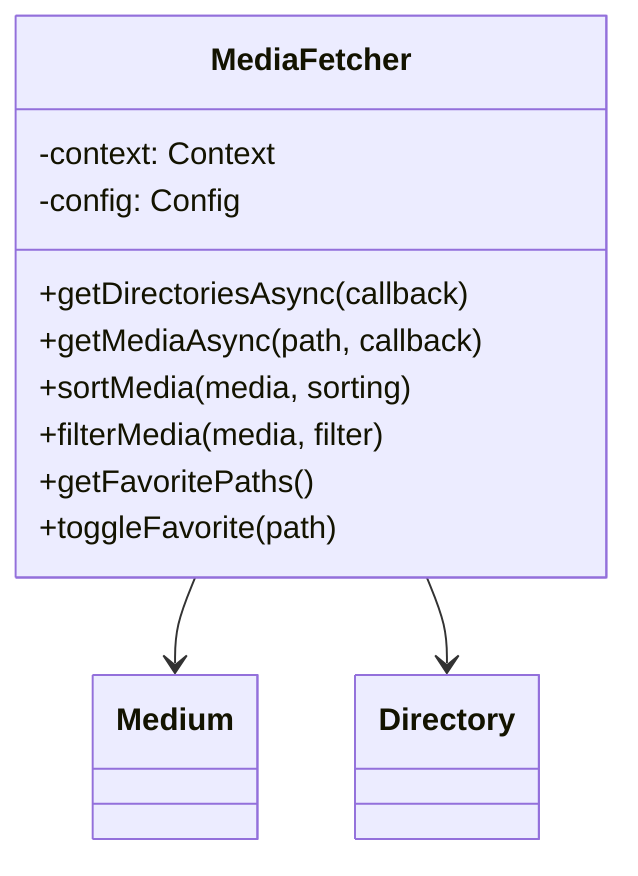

# API Reference - Core Classes & Methods

## Overview

Complete API reference for Fossify Gallery's core classes, methods, and interfaces. This reference covers the most important components developers will interact with.

## Core Architecture Classes

### MediaFetcher
**File**: `helpers/MediaFetcher.kt`  
**Purpose**: Primary class for fetching and managing media data from MediaStore



#### Constructor
```kotlin
class MediaFetcher(private val context: Context)
```

#### Key Methods

**Directory Operations**
```kotlin
// Asynchronously load all directories
fun getDirectoriesAsync(callback: (ArrayList<Directory>) -> Unit)

// Get directories synchronously (background thread only)
fun getDirectoriesSync(): ArrayList<Directory>

// Refresh specific directory
fun refreshDirectory(path: String)
```

**Media Operations**
```kotlin
// Load media files from specific path
fun getMediaAsync(
    path: String,
    isPickVideo: Boolean = false,
    isPickImage: Boolean = false,
    callback: (ArrayList<ThumbnailItem>) -> Unit
)

// Sort media by various criteria
fun sortMedia(media: ArrayList<Medium>, sorting: Int): ArrayList<Medium>

// Filter media by type
fun filterMedia(media: ArrayList<Medium>, filterMedia: Int): ArrayList<Medium>
```

**Favorites Management**
```kotlin
// Get all favorite file paths
fun getFavoritePaths(): HashSet<String>

// Toggle favorite status
fun toggleFavorite(path: String, isFavorite: Boolean)

// Check if path is favorite
fun isFavorite(path: String): Boolean
```

---

### Config
**File**: `helpers/Config.kt`  
**Purpose**: Manages app configuration and SharedPreferences

```kotlin
class Config(context: Context) {
    companion object {
        fun newInstance(context: Context) = Config(context)
    }
}
```

#### View Configuration
```kotlin
// Grid/List view type
var viewType: Int
    get() = prefs.getInt(VIEW_TYPE, VIEW_TYPE_GRID)
    set(viewType) = prefs.edit().putInt(VIEW_TYPE, viewType).apply()

// Number of grid columns
var directoryColumns: Int
    get() = prefs.getInt(DIRECTORY_COLUMNS, getDefaultDirectoryColumnCount())
    set(columns) = prefs.edit().putInt(DIRECTORY_COLUMNS, columns).apply()

// Thumbnail spacing
var thumbnailSpacing: Int
    get() = prefs.getInt(THUMBNAIL_SPACING, resources.getDimension(R.dimen.small_margin).toInt())
    set(spacing) = prefs.edit().putInt(THUMBNAIL_SPACING, spacing).apply()
```

#### Sorting & Filtering  
```kotlin
// Directory sorting
var directorySorting: Int
    get() = prefs.getInt(DIRECTORY_SORT_ORDER, SORT_BY_DATE_MODIFIED or SORT_DESCENDING)
    set(order) = prefs.edit().putInt(DIRECTORY_SORT_ORDER, order).apply()

// File filtering
var filterMedia: Int
    get() = prefs.getInt(FILTER_MEDIA, getDefaultFileFilter())
    set(filterMedia) = prefs.edit().putInt(FILTER_MEDIA, filterMedia).apply()
```

#### Security & Privacy
```kotlin
// App protection
var isAppPasswordProtected: Boolean
    get() = prefs.getBoolean(APP_PASSWORD_PROTECTED, false)
    set(protected) = prefs.edit().putBoolean(APP_PASSWORD_PROTECTED, protected).apply()

// Hidden folder protection  
var isHiddenPasswordProtected: Boolean
    get() = prefs.getBoolean(HIDDEN_PASSWORD_PROTECTED, false)
    set(protected) = prefs.edit().putBoolean(HIDDEN_PASSWORD_PROTECTED, protected).apply()
```

---

### GalleryDatabase
**File**: `databases/GalleryDatabase.kt`  
**Purpose**: Room database for caching media metadata

```kotlin
@Database(
    entities = [Directory::class, Medium::class, Widget::class, Favorite::class],
    version = 5,
    exportSchema = false
)
abstract class GalleryDatabase : RoomDatabase() {
    abstract fun DirectoryDao(): DirectoryDao
    abstract fun MediumDao(): MediumDao
    abstract fun WidgetsDao(): WidgetsDao
    abstract fun FavoritesDao(): FavoritesDao
}
```

#### Singleton Instance
```kotlin
companion object {
    @Volatile
    private var INSTANCE: GalleryDatabase? = null
    
    fun getInstance(context: Context): GalleryDatabase {
        return INSTANCE ?: synchronized(this) {
            val instance = Room.databaseBuilder(
                context.applicationContext,
                GalleryDatabase::class.java,
                "gallery.db"
            ).build()
            INSTANCE = instance
            instance
        }
    }
}
```

---

## Data Models

### Medium
**File**: `models/Medium.kt`  
**Purpose**: Represents a media file (photo/video)

```kotlin
@Entity(tableName = "media")
data class Medium(
    @PrimaryKey var path: String,
    var name: String,
    var modified: Long,
    var taken: Long,
    var size: Long,
    var type: Int,
    var videoDuration: Int = 0,
    var isFavorite: Boolean = false
) : Serializable, ThumbnailItem()
```

#### Type Checking Methods
```kotlin
fun isImage() = type == TYPE_IMAGE
fun isVideo() = type == TYPE_VIDEO  
fun isGif() = type == TYPE_GIF
fun isRaw() = type == TYPE_RAW
fun isSvg() = type == TYPE_SVG
```

#### Utility Methods
```kotlin
// Get file extension
fun getExtension() = path.getFilenameExtension()

// Get parent directory path
fun getParentPath() = path.getParentPath()

// Format file size
fun getFormattedSize() = size.formatSize()

// Get display name without extension
fun getNameWithoutExtension() = name.getFilenameWithoutExtension()
```

---

### Directory  
**File**: `models/Directory.kt`  
**Purpose**: Represents a media directory

```kotlin
@Entity(tableName = "directories")
data class Directory(
    @PrimaryKey var path: String,
    var tmb: String,
    var name: String,
    var mediaCnt: Int,
    var modified: Long,
    var taken: Long,
    var size: Long,
    var types: Int,
    var sortValue: String = ""
) : Serializable
```

#### Utility Methods
```kotlin
// Add to total size
fun addSize(bytes: Long) {
    size += bytes
}

// Get bubble text for fast scroller
fun getBubbleText(sorting: Int) = when {
    sorting and SORT_BY_NAME != 0 -> name
    sorting and SORT_BY_SIZE != 0 -> size.formatSize()
    sorting and SORT_BY_DATE_MODIFIED != 0 -> modified.formatDate()
    else -> taken.formatDate()
}

// Check if directory contains specific media types
fun containsImages() = types and TYPE_IMAGES != 0
fun containsVideos() = types and TYPE_VIDEOS != 0
fun containsGifs() = types and TYPE_GIFS != 0
```

---

## Data Access Objects (DAOs)

### DirectoryDao
```kotlin
@Dao
interface DirectoryDao {
    @Query("SELECT * FROM directories")
    fun getAll(): List<Directory>
    
    @Query("SELECT * FROM directories WHERE path = :path COLLATE NOCASE")
    fun getDirectoryWithPath(path: String): Directory?
    
    @Insert(onConflict = OnConflictStrategy.REPLACE)
    fun insert(directory: Directory)
    
    @Insert(onConflict = OnConflictStrategy.REPLACE)
    fun insertAll(directories: List<Directory>)
    
    @Delete
    fun deleteDirectory(directory: Directory)
    
    @Query("DELETE FROM directories WHERE path = :path COLLATE NOCASE")
    fun deleteDirectoryPath(path: String)
    
    @Query("UPDATE directories SET media_count = :mediaCnt, modified = :modified WHERE path = :path COLLATE NOCASE")
    fun updateDirectory(path: String, mediaCnt: Int, modified: Long)
}
```

### MediumDao
```kotlin
@Dao
interface MediumDao {
    @Query("SELECT * FROM media WHERE parent_path = :path COLLATE NOCASE")
    fun getMediaFromPath(path: String): List<Medium>
    
    @Query("SELECT * FROM media WHERE is_favorite = 1")
    fun getFavorites(): List<Medium>
    
    @Insert(onConflict = OnConflictStrategy.REPLACE)
    fun insert(medium: Medium)
    
    @Insert(onConflict = OnConflictStrategy.REPLACE)
    fun insertAll(media: List<Medium>)
    
    @Query("DELETE FROM media WHERE full_path = :path COLLATE NOCASE")
    fun deleteMedium(path: String)
    
    @Query("UPDATE media SET is_favorite = :isFavorite WHERE full_path = :path COLLATE NOCASE")
    fun updateFavorite(path: String, isFavorite: Boolean)
}
```

---

## Activity Base Classes

### SimpleActivity  
**File**: Base activity from Fossify Commons
**Purpose**: Provides common functionality for all activities

```kotlin
abstract class SimpleActivity : BaseSimpleActivity() {
    // Core properties
    val applicationContext: Context
    protected val config: Config by lazy { Config.newInstance(applicationContext) }
    protected val galleryDB: GalleryDatabase by lazy { GalleryDatabase.getInstance(application) }
}
```

#### Common Methods
```kotlin
// Background thread execution
protected fun ensureBackgroundThread(callback: () -> Unit)

// UI thread execution  
protected fun runOnUiThread(callback: () -> Unit)

// Permission checking
protected fun hasPermission(permId: Int): Boolean

// Storage permission
protected fun hasProperStoredFirstItem(): Boolean
```

---

## Adapter Classes

### DirectoriesAdapter
**File**: `adapters/DirectoriesAdapter.kt`  
**Purpose**: RecyclerView adapter for directory grid

```kotlin
class DirectoriesAdapter(
    activity: SimpleActivity,
    var dirs: ArrayList<Directory>,
    val listener: DirOperationsListener,
    recyclerView: MyRecyclerView
) : MyRecyclerViewAdapter(activity, recyclerView) {

    interface DirOperationsListener {
        fun refreshItems()
        fun deleteFolders(folders: ArrayList<File>)
        fun recheckPinnedFolders()
    }
}
```

### MediaAdapter
**File**: `adapters/MediaAdapter.kt`  
**Purpose**: RecyclerView adapter for media grid

```kotlin
class MediaAdapter(
    activity: SimpleActivity,
    var media: ArrayList<ThumbnailItem>,
    val listener: MediaOperationsListener,
    val isAGetIntent: Boolean,
    recyclerView: MyRecyclerView
) : MyRecyclerViewAdapter(activity, recyclerView) {

    interface MediaOperationsListener {
        fun refreshItems()
        fun tryDeleteFiles(filePaths: ArrayList<String>)
        fun selectedPaths(): HashSet<String>
    }
}
```

---

## Extension Functions

### Context Extensions
```kotlin
// Storage access
fun Context.hasProperStoredFirstItem(): Boolean

// Config access
val Context.config: Config get() = Config.newInstance(applicationContext)

// Database access  
val Context.galleryDB: GalleryDatabase get() = GalleryDatabase.getInstance(applicationContext)

// Media scanning
fun Context.rescanPaths(paths: ArrayList<String>)
```

### String Extensions
```kotlin
// File operations
fun String.getFilenameFromPath(): String
fun String.getFilenameExtension(): String  
fun String.getParentPath(): String
fun String.getBasePath(context: Context): String

// Media type checking
fun String.isImageFile(): Boolean
fun String.isVideoFile(): Boolean
fun String.isGifFile(): Boolean
fun String.isRawFile(): Boolean
fun String.isSvgFile(): Boolean
```

### Long Extensions
```kotlin
// Size formatting
fun Long.formatSize(): String

// Date formatting  
fun Long.formatDate(context: Context): String
fun Long.formatLastModified(): String
```

---

## Constants Reference

### Media Types
```kotlin
const val TYPE_IMAGES = 1
const val TYPE_VIDEOS = 2
const val TYPE_GIFS = 4  
const val TYPE_RAWS = 8
const val TYPE_SVGS = 16
const val TYPE_PORTRAITS = 32
```

### Sort Orders
```kotlin
const val SORT_BY_NAME = 1
const val SORT_BY_DATE_MODIFIED = 2
const val SORT_BY_SIZE = 4
const val SORT_BY_DATE_TAKEN = 8
const val SORT_BY_EXTENSION = 16
const val SORT_BY_PATH = 32

const val SORT_ASCENDING = 1024
const val SORT_DESCENDING = 2048
```

### View Types
```kotlin
const val VIEW_TYPE_GRID = 1
const val VIEW_TYPE_LIST = 2
```

---

This API reference covers the core classes and methods you'll work with when developing Fossify Gallery. For specific implementation details, refer to the actual source code files. 