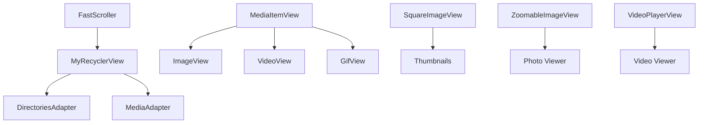

# Custom Views Guide - Building Gallery UI Components

## Overview

This guide covers the custom view components used in Fossify Gallery and how to create, extend, and customize them. The gallery uses several specialized views for optimal media display and user interaction.

## Architecture Overview



## Core Custom Views

### MyRecyclerView
**File**: `views/MyRecyclerView.kt` (from Fossify Commons)  
**Purpose**: Enhanced RecyclerView with fast scrolling and selection features

```kotlin
class MyRecyclerView @JvmOverloads constructor(
    context: Context,
    attrs: AttributeSet? = null,
    defStyleAttr: Int = 0
) : RecyclerView(context, attrs, defStyleAttr) {
    
    private var fastScroller: FastScroller? = null
    private var isZoomingEnabled = false
}
```

#### Key Features
- **Fast Scrolling**: Alphabet/date bubble scroller
- **Multi-selection**: Handle multi-select mode
- **Zoom Support**: Pinch-to-zoom grid items
- **Performance**: Optimized for large datasets

#### Implementation Example
```kotlin
class MainActivity : SimpleActivity() {
    private fun setupRecyclerView() {
        val recyclerView = findViewById<MyRecyclerView>(R.id.directories_grid)
        
        // Configure layout manager
        recyclerView.layoutManager = when (config.viewType) {
            VIEW_TYPE_GRID -> {
                val manager = GridLayoutManager(this, config.directoryColumns)
                manager.orientation = RecyclerView.VERTICAL
                manager
            }
            VIEW_TYPE_LIST -> LinearLayoutManager(this)
            else -> GridLayoutManager(this, config.directoryColumns)
        }
        
        // Set adapter
        val adapter = DirectoriesAdapter(this, directories, this, recyclerView)
        recyclerView.adapter = adapter
        
        // Enable fast scroller
        recyclerView.setupFastScroller()
    }
}
```

---

### SquareImageView  
**File**: `views/SquareImageView.kt`  
**Purpose**: ImageView that maintains square aspect ratio for thumbnails

```kotlin
class SquareImageView @JvmOverloads constructor(
    context: Context,
    attrs: AttributeSet? = null,
    defStyleAttr: Int = 0
) : androidx.appcompat.widget.AppCompatImageView(context, attrs, defStyleAttr) {

    override fun onMeasure(widthMeasureSpec: Int, heightMeasureSpec: Int) {
        val width = MeasureSpec.getSize(widthMeasureSpec)
        setMeasuredDimension(width, width)
    }
}
```

#### Usage in Layouts
```xml
<org.fossify.gallery.views.SquareImageView
    android:id="@+id/dir_thumbnail"
    android:layout_width="match_parent"
    android:layout_height="wrap_content"
    android:scaleType="centerCrop"
    android:background="@drawable/rounded_corners" />
```

#### Programmatic Usage
```kotlin
private fun setupThumbnail(imageView: SquareImageView, path: String) {
    Glide.with(context)
        .load(path)
        .placeholder(R.drawable.placeholder)
        .error(R.drawable.error_placeholder)
        .centerCrop()
        .into(imageView)
}
```

---

### ZoomableImageView
**File**: `views/ZoomableImageView.kt`  
**Purpose**: ImageView with pinch-zoom, pan, and rotation support

```kotlin
class ZoomableImageView @JvmOverloads constructor(
    context: Context,
    attrs: AttributeSet? = null,
    defStyleAttr: Int = 0
) : androidx.appcompat.widget.AppCompatImageView(context, attrs, defStyleAttr) {
    
    private var scaleDetector: ScaleGestureDetector
    private var gestureDetector: GestureDetector
    private var currentScale = 1f
    private var minScale = 0.1f
    private var maxScale = 5f
}
```

#### Gesture Handling
```kotlin
private inner class ScaleListener : ScaleGestureDetector.SimpleOnScaleGestureListener() {
    override fun onScale(detector: ScaleGestureDetector): Boolean {
        val scaleFactor = detector.scaleFactor
        currentScale *= scaleFactor
        
        // Clamp scale between min and max
        currentScale = currentScale.coerceIn(minScale, maxScale)
        
        scaleX = currentScale
        scaleY = currentScale
        
        return true
    }
}

private inner class GestureListener : GestureDetector.SimpleOnGestureListener() {
    override fun onDoubleTap(e: MotionEvent): Boolean {
        // Toggle between fit and fill scale
        val targetScale = if (currentScale > 1f) 1f else 2f
        animateScale(targetScale)
        return true
    }
    
    override fun onScroll(
        e1: MotionEvent?,
        e2: MotionEvent,
        distanceX: Float,
        distanceY: Float
    ): Boolean {
        if (currentScale > 1f) {
            translationX -= distanceX
            translationY -= distanceY
            return true
        }
        return false
    }
}
```

#### Integration Example
```kotlin
class PhotoViewerActivity : SimpleActivity() {
    private fun setupImageView() {
        val imageView = findViewById<ZoomableImageView>(R.id.photo_view)
        
        imageView.setOnTouchListener { _, event ->
            imageView.onTouchEvent(event)
        }
        
        // Load image with Glide
        Glide.with(this)
            .load(imagePath)
            .into(imageView)
    }
}
```

---

### FastScroller  
**File**: `views/FastScroller.kt` (from Fossify Commons)  
**Purpose**: Quick scrolling through long lists with bubble text

```kotlin
class FastScroller @JvmOverloads constructor(
    context: Context,
    attrs: AttributeSet? = null,
    defStyleAttr: Int = 0
) : LinearLayout(context, attrs, defStyleAttr) {
    
    private var recyclerView: RecyclerView? = null
    private var bubble: TextView? = null
    private var handle: View? = null
}
```

#### Setup and Configuration
```kotlin
fun setupFastScroller(
    recyclerView: RecyclerView,
    getScrollBarBubbleText: (position: Int) -> String
) {
    this.recyclerView = recyclerView
    
    // Configure bubble text callback
    this.getBubbleText = getScrollBarBubbleText
    
    // Attach scroll listener
    recyclerView.addOnScrollListener(object : RecyclerView.OnScrollListener() {
        override fun onScrolled(recyclerView: RecyclerView, dx: Int, dy: Int) {
            updateBubbleText()
            updateHandlePosition()
        }
    })
}
```

#### Custom Bubble Text
```kotlin
// In DirectoriesAdapter
private fun getBubbleText(position: Int): String {
    val directory = directories.getOrNull(position) ?: return ""
    
    return when (config.directorySorting and SORT_ORDER_MASK) {
        SORT_BY_NAME -> directory.name.take(1).uppercase()
        SORT_BY_SIZE -> directory.size.formatSize()
        SORT_BY_DATE_MODIFIED -> directory.modified.formatDate()
        SORT_BY_DATE_TAKEN -> directory.taken.formatDate()
        else -> directory.name.take(1).uppercase()
    }
}
```

---

## Media Display Views

### MediaItemView (Composite)
Custom view for displaying individual media items in grid/list

```kotlin
class MediaItemView @JvmOverloads constructor(
    context: Context,
    attrs: AttributeSet? = null,
    defStyleAttr: Int = 0
) : FrameLayout(context, attrs, defStyleAttr) {
    
    private val thumbnail: SquareImageView
    private val playIcon: ImageView
    private val duration: TextView
    private val selection: ImageView
    private val favorite: ImageView
    
    init {
        inflate(context, R.layout.photo_video_item, this)
        thumbnail = findViewById(R.id.medium_thumbnail)
        playIcon = findViewById(R.id.play_outline)
        duration = findViewById(R.id.video_duration)
        selection = findViewById(R.id.medium_check)
        favorite = findViewById(R.id.favorite)
    }
}
```

#### Binding Data
```kotlin
fun bindMedium(medium: Medium, isSelected: Boolean) {
    // Load thumbnail
    Glide.with(context)
        .load(medium.path)
        .placeholder(R.drawable.placeholder)
        .centerCrop()
        .into(thumbnail)
    
    // Show/hide video specific elements
    if (medium.isVideo()) {
        playIcon.visible()
        duration.text = medium.videoDuration.getFormattedDuration()
        duration.visible()
    } else {
        playIcon.gone()
        duration.gone()
    }
    
    // Selection state
    selection.visibleIf(isSelected)
    
    // Favorite indicator
    favorite.visibleIf(medium.isFavorite)
}
```

---

### VideoPlayerView
**File**: `views/VideoPlayerView.kt`  
**Purpose**: Custom video player with controls

```kotlin
class VideoPlayerView @JvmOverloads constructor(
    context: Context,
    attrs: AttributeSet? = null,
    defStyleAttr: Int = 0
) : FrameLayout(context, attrs, defStyleAttr) {
    
    private val videoView: VideoView
    private val controlsPanel: View
    private val playPauseBtn: ImageView
    private val seekBar: SeekBar
    private val currentTime: TextView
    private val totalTime: TextView
    
    private var mediaController: MediaController? = null
    private var hideControlsRunnable: Runnable? = null
}
```

#### Control Management
```kotlin
private fun setupControls() {
    playPauseBtn.setOnClickListener {
        if (videoView.isPlaying) {
            videoView.pause()
            playPauseBtn.setImageResource(R.drawable.ic_play)
        } else {
            videoView.start()
            playPauseBtn.setImageResource(R.drawable.ic_pause)
        }
    }
    
    seekBar.setOnSeekBarChangeListener(object : SeekBar.OnSeekBarChangeListener {
        override fun onProgressChanged(seekBar: SeekBar, progress: Int, fromUser: Boolean) {
            if (fromUser) {
                videoView.seekTo(progress)
            }
        }
        
        override fun onStartTrackingTouch(seekBar: SeekBar) {
            removeCallbacks(hideControlsRunnable)
        }
        
        override fun onStopTrackingTouch(seekBar: SeekBar) {
            scheduleHideControls()
        }
    })
}

private fun scheduleHideControls() {
    removeCallbacks(hideControlsRunnable)
    hideControlsRunnable = Runnable {
        controlsPanel.fadeOut()
    }
    postDelayed(hideControlsRunnable, 3000)
}
```

---

## Layout Managers

### AutoFitGridLayoutManager
Custom layout manager that automatically calculates column count

```kotlin
class AutoFitGridLayoutManager(
    context: Context,
    private val columnWidth: Int
) : GridLayoutManager(context, 1) {
    
    private var isColumnWidthChanged = true
    private var lastWidth: Int = 0
    private var lastHeight: Int = 0
    
    override fun onLayoutChildren(recycler: RecyclerView.Recycler?, state: RecyclerView.State?) {
        val width = width
        val height = height
        
        if (columnWidth > 0 && width > 0 && height > 0 && 
            (isColumnWidthChanged || lastWidth != width || lastHeight != height)) {
            
            val totalSpace = if (orientation == VERTICAL) {
                width - paddingRight - paddingLeft
            } else {
                height - paddingTop - paddingBottom
            }
            
            val spanCount = Math.max(1, totalSpace / columnWidth)
            setSpanCount(spanCount)
            
            isColumnWidthChanged = false
            lastWidth = width
            lastHeight = height
        }
        
        super.onLayoutChildren(recycler, state)
    }
}
```

#### Usage
```kotlin
private fun setupAutoFitGrid() {
    val columnWidth = resources.getDimensionPixelSize(R.dimen.thumbnail_column_width)
    val layoutManager = AutoFitGridLayoutManager(this, columnWidth)
    
    recyclerView.layoutManager = layoutManager
}
```

---

## View Extensions

### Common View Extensions
```kotlin
// Visibility extensions
fun View.visible() {
    visibility = View.VISIBLE
}

fun View.gone() {
    visibility = View.GONE
}

fun View.invisible() {
    visibility = View.INVISIBLE
}

fun View.visibleIf(condition: Boolean) {
    visibility = if (condition) View.VISIBLE else View.GONE
}

// Animation extensions
fun View.fadeIn(duration: Long = 300) {
    alpha = 0f
    visible()
    animate()
        .alpha(1f)
        .setDuration(duration)
        .start()
}

fun View.fadeOut(duration: Long = 300) {
    animate()
        .alpha(0f)
        .setDuration(duration)
        .withEndAction { gone() }
        .start()
}
```

### RecyclerView Extensions
```kotlin
fun RecyclerView.setupFastScroller(
    getBubbleText: (position: Int) -> String = { "" }
) {
    val fastScroller = FastScroller(context)
    fastScroller.setupFastScroller(this, getBubbleText)
    
    (parent as? ViewGroup)?.addView(fastScroller)
}

fun RecyclerView.smoothScrollToTop() {
    layoutManager?.smoothScrollToPosition(this, null, 0)
}
```

---

## Creating Custom Views

### Step-by-Step Guide

#### 1. Create View Class
```kotlin
class CustomMediaView @JvmOverloads constructor(
    context: Context,
    attrs: AttributeSet? = null,
    defStyleAttr: Int = 0
) : FrameLayout(context, attrs, defStyleAttr) {
    
    // Declare child views
    private val imageView: ImageView
    private val titleText: TextView
    private val overlayView: View
    
    init {
        // Inflate layout
        inflate(context, R.layout.custom_media_view, this)
        
        // Find views
        imageView = findViewById(R.id.image)
        titleText = findViewById(R.id.title)
        overlayView = findViewById(R.id.overlay)
        
        // Process custom attributes
        processAttributes(attrs)
        
        // Setup initial state
        setupView()
    }
}
```

#### 2. Handle Custom Attributes
```xml
<!-- res/values/attrs.xml -->
<declare-styleable name="CustomMediaView">
    <attr name="showOverlay" format="boolean" />
    <attr name="titleTextSize" format="dimension" />
    <attr name="overlayColor" format="color" />
</declare-styleable>
```

```kotlin
private fun processAttributes(attrs: AttributeSet?) {
    attrs?.let {
        val typedArray = context.obtainStyledAttributes(it, R.styleable.CustomMediaView)
        
        val showOverlay = typedArray.getBoolean(R.styleable.CustomMediaView_showOverlay, true)
        val titleSize = typedArray.getDimension(R.styleable.CustomMediaView_titleTextSize, 14f)
        val overlayColor = typedArray.getColor(R.styleable.CustomMediaView_overlayColor, Color.BLACK)
        
        overlayView.visibleIf(showOverlay)
        titleText.textSize = titleSize
        overlayView.setBackgroundColor(overlayColor)
        
        typedArray.recycle()
    }
}
```

#### 3. Provide Public API
```kotlin
fun setMedium(medium: Medium) {
    titleText.text = medium.name
    
    Glide.with(context)
        .load(medium.path)
        .into(imageView)
}

fun setOnMediaClickListener(listener: (Medium) -> Unit) {
    setOnClickListener { listener(currentMedium) }
}

fun setSelected(selected: Boolean) {
    overlayView.alpha = if (selected) 0.7f else 0f
}
```

#### 4. Optimize Performance
```kotlin
override fun onDetachedFromWindow() {
    super.onDetachedFromWindow()
    // Clear image loading to prevent memory leaks
    Glide.with(context).clear(imageView)
}

override fun onMeasure(widthMeasureSpec: Int, heightMeasureSpec: Int) {
    // Custom measurement if needed
    super.onMeasure(widthMeasureSpec, heightMeasureSpec)
}

override fun onLayout(changed: Boolean, left: Int, top: Int, right: Int, bottom: Int) {
    super.onLayout(changed, left, top, right, bottom)
    // Custom layout logic if needed
}
```

---

## Best Practices

### Performance Optimization
1. **ViewHolder Pattern**: Always use ViewHolder in adapters
2. **Image Loading**: Use Glide with proper lifecycle management
3. **Memory Management**: Clear resources in `onDetachedFromWindow()`
4. **Lazy Initialization**: Delay expensive operations until needed

### Accessibility
1. **Content Descriptions**: Set meaningful `contentDescription`
2. **Focus Handling**: Ensure proper keyboard navigation
3. **Touch Targets**: Minimum 48dp touch targets
4. **Screen Readers**: Support TalkBack properly

### Testing Custom Views
```kotlin
@RunWith(AndroidJUnit4::class)
class CustomMediaViewTest {
    
    @Test
    fun testMediumBinding() {
        val context = InstrumentationRegistry.getInstrumentation().targetContext
        val view = CustomMediaView(context)
        
        val medium = Medium(
            path = "/test/path.jpg",
            name = "test.jpg",
            modified = System.currentTimeMillis(),
            taken = System.currentTimeMillis(),
            size = 1024L,
            type = TYPE_IMAGE
        )
        
        view.setMedium(medium)
        
        // Verify view state
        assertThat(view.titleText.text).isEqualTo("test.jpg")
    }
}
```

---

This guide covers the essential custom views in Fossify Gallery and how to create your own. The key is understanding the component architecture and following Android best practices for performance and accessibility. 