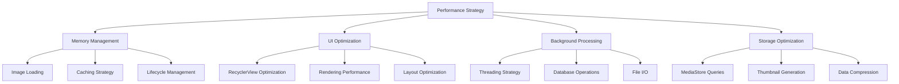

# Performance Optimization - Advanced Techniques

## Overview

This guide covers advanced performance optimization techniques for Fossify Gallery. From memory management to rendering optimization, these techniques ensure smooth operation even with large media collections.

## Performance Architecture



## Memory Management

### Image Loading Optimization
Efficient image loading prevents OutOfMemoryError and ensures smooth scrolling

```kotlin
class OptimizedImageLoader {
    
    companion object {
        private const val MAX_MEMORY_CACHE_SIZE = 50 * 1024 * 1024 // 50MB
        private const val MAX_DISK_CACHE_SIZE = 250 * 1024 * 1024L // 250MB
    }
    
    private val glideRequestOptions by lazy {
        RequestOptions()
            .format(DecodeFormat.PREFER_RGB_565) // Use less memory than ARGB_8888
            .diskCacheStrategy(DiskCacheStrategy.AUTOMATIC)
            .timeout(10000)
    }
    
    fun loadThumbnail(
        context: Context,
        path: String,
        imageView: ImageView,
        size: Int = 512
    ) {
        // Calculate optimal sample size to prevent OOM
        val options = BitmapFactory.Options().apply {
            inJustDecodeBounds = true
        }
        BitmapFactory.decodeFile(path, options)
        
        val sampleSize = calculateInSampleSize(options, size, size)
        
        Glide.with(context)
            .load(path)
            .apply(glideRequestOptions)
            .override(size, size)
            .thumbnail(0.1f) // Load low-res version first
            .into(imageView)
    }
    
    private fun calculateInSampleSize(
        options: BitmapFactory.Options,
        reqWidth: Int,
        reqHeight: Int
    ): Int {
        val height = options.outHeight
        val width = options.outWidth
        var inSampleSize = 1
        
        if (height > reqHeight || width > reqWidth) {
            val halfHeight = height / 2
            val halfWidth = width / 2
            
            while (halfHeight / inSampleSize >= reqHeight && 
                   halfWidth / inSampleSize >= reqWidth) {
                inSampleSize *= 2
            }
        }
        
        return inSampleSize
    }
}
```

### Memory Cache Configuration
```kotlin
class GalleryApplication : Application() {
    
    override fun onCreate() {
        super.onCreate()
        
        // Configure Glide memory cache
        Glide.get(this).apply {
            val memoryCache = LruResourceCache(MAX_MEMORY_CACHE_SIZE)
            registry.replace(
                MemoryCache::class.java,
                memoryCache
            )
        }
        
        // Monitor memory usage
        setupMemoryMonitoring()
    }
    
    private fun setupMemoryMonitoring() {
        registerComponentCallbacks(object : ComponentCallbacks2 {
            override fun onTrimMemory(level: Int) {
                when (level) {
                    ComponentCallbacks2.TRIM_MEMORY_UI_HIDDEN -> {
                        // Clear image cache when UI is hidden
                        Glide.get(this@GalleryApplication).clearMemory()
                    }
                    ComponentCallbacks2.TRIM_MEMORY_MODERATE -> {
                        // Clear some cache
                        Glide.get(this@GalleryApplication).trimMemory(level)
                    }
                    ComponentCallbacks2.TRIM_MEMORY_COMPLETE -> {
                        // Clear all cache
                        Glide.get(this@GalleryApplication).clearMemory()
                    }
                }
            }
            
            override fun onConfigurationChanged(newConfig: Configuration) {}
            override fun onLowMemory() {
                Glide.get(this@GalleryApplication).clearMemory()
            }
        })
    }
}
```

### ViewHolder Memory Optimization
```kotlin
class OptimizedMediaAdapter(
    activity: SimpleActivity,
    var media: ArrayList<ThumbnailItem>,
    recyclerView: MyRecyclerView
) : MyRecyclerViewAdapter(activity, recyclerView) {
    
    override fun onCreateViewHolder(parent: ViewGroup, viewType: Int): ViewHolder {
        val binding = PhotoVideoItemBinding.inflate(
            LayoutInflater.from(parent.context), 
            parent, 
            false
        )
        return MediaViewHolder(binding)
    }
    
    override fun onBindViewHolder(holder: RecyclerView.ViewHolder, position: Int) {
        val mediaViewHolder = holder as MediaViewHolder
        val medium = media[position] as Medium
        
        // Reuse existing drawables to reduce garbage collection
        mediaViewHolder.bindMedium(medium, isSelected(position))
    }
    
    override fun onViewRecycled(holder: RecyclerView.ViewHolder) {
        super.onViewRecycled(holder)
        
        // Clear image loading to prevent memory leaks
        val mediaViewHolder = holder as MediaViewHolder
        mediaViewHolder.clearImage()
    }
    
    inner class MediaViewHolder(private val binding: PhotoVideoItemBinding) : 
        RecyclerView.ViewHolder(binding.root) {
        
        fun bindMedium(medium: Medium, isSelected: Boolean) {
            // Use optimized image loading
            OptimizedImageLoader.loadThumbnail(
                activity,
                medium.path,
                binding.mediumThumbnail,
                activity.config.thumbnailSize
            )
            
            // Optimize view updates
            updateSelectionState(isSelected)
            updateMediaType(medium)
        }
        
        fun clearImage() {
            Glide.with(activity).clear(binding.mediumThumbnail)
        }
        
        private fun updateSelectionState(isSelected: Boolean) {
            // Use visibility instead of alpha for better performance
            binding.mediumCheck.visibility = if (isSelected) View.VISIBLE else View.GONE
        }
    }
}
```

---

## UI Performance Optimization

### RecyclerView Optimization
Maximum performance for smooth scrolling through large media collections

```kotlin
class PerformantRecyclerView @JvmOverloads constructor(
    context: Context,
    attrs: AttributeSet? = null,
    defStyleAttr: Int = 0
) : RecyclerView(context, attrs, defStyleAttr) {
    
    init {
        setupOptimizations()
    }
    
    private fun setupOptimizations() {
        // Enable view caching
        setItemViewCacheSize(20) // Default is 2
        
        // Enable view recycling
        recycledViewPool.setMaxRecycledViews(0, 30)
        
        // Optimize drawing
        setHasFixedSize(true)
        setDrawingCacheEnabled(true)
        setDrawingCacheQuality(View.DRAWING_CACHE_QUALITY_LOW)
        
        // Optimize layout
        clipToPadding = false
        clipChildren = false
        
        // Optimize scrolling
        isNestedScrollingEnabled = false
        
        // Add scroll performance listener
        addOnScrollListener(ScrollPerformanceListener())
    }
    
    private inner class ScrollPerformanceListener : OnScrollListener() {
        private var isScrolling = false
        
        override fun onScrollStateChanged(recyclerView: RecyclerView, newState: Int) {
            super.onScrollStateChanged(recyclerView, newState)
            
            when (newState) {
                SCROLL_STATE_DRAGGING, SCROLL_STATE_SETTLING -> {
                    if (!isScrolling) {
                        isScrolling = true
                        // Pause expensive operations during scroll
                        Glide.with(context).pauseRequests()
                    }
                }
                SCROLL_STATE_IDLE -> {
                    if (isScrolling) {
                        isScrolling = false
                        // Resume operations when scroll stops
                        Glide.with(context).resumeRequests()
                    }
                }
            }
        }
    }
}
```

### Layout Optimization
```kotlin
class OptimizedGridLayoutManager(
    context: Context,
    spanCount: Int
) : GridLayoutManager(context, spanCount) {
    
    init {
        // Optimize layout calculations
        isItemPrefetchEnabled = true
        initialPrefetchItemCount = spanCount * 2
        
        // Enable predictive animations
        supportsPredictiveItemAnimations()
    }
    
    override fun onLayoutChildren(recycler: Recycler?, state: State?) {
        // Optimize layout pass
        try {
            super.onLayoutChildren(recycler, state)
        } catch (e: IndexOutOfBoundsException) {
            // Handle edge case during rapid changes
            Log.w("GridLayoutManager", "Layout inconsistency detected", e)
        }
    }
    
    override fun collectAdjacentPrefetchPositions(
        dx: Int,
        dy: Int,
        state: State,
        layoutPrefetchRegistry: LayoutPrefetchRegistry
    ) {
        super.collectAdjacentPrefetchPositions(dx, dy, state, layoutPrefetchRegistry)
        
        // Add intelligent prefetching
        val direction = if (dy > 0) 1 else -1
        val firstVisiblePosition = findFirstVisibleItemPosition()
        
        if (firstVisiblePosition != NO_POSITION) {
            val prefetchCount = spanCount * 2
            for (i in 1..prefetchCount) {
                val position = firstVisiblePosition + (direction * spanCount * i)
                if (position >= 0 && position < state.itemCount) {
                    layoutPrefetchRegistry.addPosition(position, Math.abs(dy))
                }
            }
        }
    }
}
```

### View Rendering Optimization
```kotlin
class OptimizedImageView @JvmOverloads constructor(
    context: Context,
    attrs: AttributeSet? = null,
    defStyleAttr: Int = 0
) : androidx.appcompat.widget.AppCompatImageView(context, attrs, defStyleAttr) {
    
    private var isDrawingCacheEnabled = false
    
    override fun onAttachedToWindow() {
        super.onAttachedToWindow()
        
        // Enable hardware acceleration for smooth animations
        setLayerType(LAYER_TYPE_HARDWARE, null)
        
        // Optimize for frequent redraws
        if (isInEditMode.not()) {
            enableDrawingCache()
        }
    }
    
    override fun onDetachedFromWindow() {
        super.onDetachedFromWindow()
        
        // Clean up drawing cache
        destroyDrawingCache()
        setLayerType(LAYER_TYPE_NONE, null)
    }
    
    private fun enableDrawingCache() {
        if (!isDrawingCacheEnabled) {
            isDrawingCacheEnabled = true
            setDrawingCacheEnabled(true)
            setDrawingCacheQuality(DRAWING_CACHE_QUALITY_HIGH)
        }
    }
    
    override fun onDraw(canvas: Canvas?) {
        // Optimize drawing operations
        try {
            super.onDraw(canvas)
        } catch (e: Exception) {
            // Handle canvas exceptions gracefully
            Log.w("OptimizedImageView", "Drawing error", e)
        }
    }
}
```

---

## Background Processing Optimization

### Threading Strategy
Efficient background processing for media operations

```kotlin
class OptimizedMediaFetcher(private val context: Context) {
    
    companion object {
        private val CPU_COUNT = Runtime.getRuntime().availableProcessors()
        private val CORE_POOL_SIZE = maxOf(2, minOf(CPU_COUNT - 1, 4))
        private val MAXIMUM_POOL_SIZE = CPU_COUNT * 2 + 1
        private const val KEEP_ALIVE_SECONDS = 30L
    }
    
    private val threadPoolExecutor = ThreadPoolExecutor(
        CORE_POOL_SIZE,
        MAXIMUM_POOL_SIZE,
        KEEP_ALIVE_SECONDS,
        TimeUnit.SECONDS,
        LinkedBlockingQueue<Runnable>(),
        ThreadFactory { runnable ->
            Thread(runnable, "MediaFetcher-${System.currentTimeMillis()}").apply {
                priority = Thread.NORM_PRIORITY - 1 // Lower priority
                isDaemon = true
            }
        }
    )
    
    fun getMediaAsync(
        path: String,
        callback: (ArrayList<Medium>) -> Unit
    ) {
        threadPoolExecutor.execute {
            try {
                val media = getMediaFromPath(path)
                
                // Post result on main thread
                Handler(Looper.getMainLooper()).post {
                    callback(media)
                }
            } catch (e: Exception) {
                Log.e("MediaFetcher", "Error fetching media", e)
                Handler(Looper.getMainLooper()).post {
                    callback(arrayListOf())
                }
            }
        }
    }
    
    private fun getMediaFromPath(path: String): ArrayList<Medium> {
        val media = ArrayList<Medium>()
        
        // Optimize MediaStore query
        val projection = arrayOf(
            MediaStore.Images.Media._ID,
            MediaStore.Images.Media.DATA,
            MediaStore.Images.Media.DISPLAY_NAME,
            MediaStore.Images.Media.DATE_MODIFIED,
            MediaStore.Images.Media.DATE_TAKEN,
            MediaStore.Images.Media.SIZE
        )
        
        val selection = "${MediaStore.Images.Media.DATA} LIKE ?"
        val selectionArgs = arrayOf("$path%")
        val sortOrder = "${MediaStore.Images.Media.DATE_MODIFIED} DESC"
        
        context.contentResolver.query(
            MediaStore.Images.Media.EXTERNAL_CONTENT_URI,
            projection,
            selection,
            selectionArgs,
            sortOrder
        )?.use { cursor ->
            val dataIndex = cursor.getColumnIndexOrThrow(MediaStore.Images.Media.DATA)
            val nameIndex = cursor.getColumnIndexOrThrow(MediaStore.Images.Media.DISPLAY_NAME)
            val modifiedIndex = cursor.getColumnIndexOrThrow(MediaStore.Images.Media.DATE_MODIFIED)
            val takenIndex = cursor.getColumnIndexOrThrow(MediaStore.Images.Media.DATE_TAKEN)
            val sizeIndex = cursor.getColumnIndexOrThrow(MediaStore.Images.Media.SIZE)
            
            while (cursor.moveToNext()) {
                val filePath = cursor.getString(dataIndex)
                val name = cursor.getString(nameIndex)
                val modified = cursor.getLong(modifiedIndex) * 1000
                val taken = cursor.getLong(takenIndex)
                val size = cursor.getLong(sizeIndex)
                
                // Quick file existence check
                if (File(filePath).exists()) {
                    val medium = Medium(
                        path = filePath,
                        name = name,
                        modified = modified,
                        taken = taken,
                        size = size,
                        type = getMediaType(filePath)
                    )
                    media.add(medium)
                }
            }
        }
        
        return media
    }
    
    fun shutdown() {
        threadPoolExecutor.shutdown()
        try {
            if (!threadPoolExecutor.awaitTermination(5, TimeUnit.SECONDS)) {
                threadPoolExecutor.shutdownNow()
            }
        } catch (e: InterruptedException) {
            threadPoolExecutor.shutdownNow()
            Thread.currentThread().interrupt()
        }
    }
}
```

### Database Optimization
```kotlin
class OptimizedDatabaseOperations(private val db: GalleryDatabase) {
    
    fun insertMediaBatch(mediaList: List<Medium>) {
        // Use batch insert for better performance
        db.runInTransaction {
            val mediumDao = db.MediumDao()
            mediaList.chunked(500).forEach { chunk ->
                mediumDao.insertAll(chunk)
            }
        }
    }
    
    fun getMediaWithPaging(
        path: String,
        offset: Int,
        limit: Int
    ): List<Medium> {
        return db.MediumDao().getMediaFromPathPaged(path, offset, limit)
    }
    
    suspend fun getMediaAsync(path: String): List<Medium> = withContext(Dispatchers.IO) {
        db.MediumDao().getMediaFromPath(path)
    }
    
    fun optimizeDatabase() {
        // Run vacuum to optimize database
        db.openHelper.writableDatabase.execSQL("VACUUM")
        
        // Analyze for query optimization
        db.openHelper.writableDatabase.execSQL("ANALYZE")
    }
}
```

---

## Storage & I/O Optimization

### MediaStore Query Optimization
Efficient querying of device media

```kotlin
class OptimizedMediaStoreQuery(private val context: Context) {
    
    private val contentResolver = context.contentResolver
    
    fun queryDirectoriesOptimized(): ArrayList<Directory> {
        val directories = HashMap<String, Directory>()
        
        // Optimized projection - only fetch needed columns
        val projection = arrayOf(
            MediaStore.Images.Media.DATA,
            MediaStore.Images.Media.DATE_MODIFIED,
            MediaStore.Images.Media.DATE_TAKEN,
            MediaStore.Images.Media.SIZE,
            MediaStore.Images.Media.ORIENTATION
        )
        
        // Combine image and video queries
        val uris = arrayOf(
            MediaStore.Images.Media.EXTERNAL_CONTENT_URI,
            MediaStore.Video.Media.EXTERNAL_CONTENT_URI
        )
        
        uris.forEach { uri ->
            queryMediaFromUri(uri, projection, directories)
        }
        
        return ArrayList(directories.values)
    }
    
    private fun queryMediaFromUri(
        uri: Uri,
        projection: Array<String>,
        directories: HashMap<String, Directory>
    ) {
        val selection = "${MediaStore.Images.Media.SIZE} > ?"
        val selectionArgs = arrayOf("0") // Exclude 0-byte files
        val sortOrder = "${MediaStore.Images.Media.DATE_MODIFIED} DESC"
        
        contentResolver.query(uri, projection, selection, selectionArgs, sortOrder)?.use { cursor ->
            val dataIndex = cursor.getColumnIndexOrThrow(MediaStore.Images.Media.DATA)
            val modifiedIndex = cursor.getColumnIndexOrThrow(MediaStore.Images.Media.DATE_MODIFIED)
            val takenIndex = cursor.getColumnIndexOrThrow(MediaStore.Images.Media.DATE_TAKEN)
            val sizeIndex = cursor.getColumnIndexOrThrow(MediaStore.Images.Media.SIZE)
            
            while (cursor.moveToNext()) {
                val path = cursor.getString(dataIndex) ?: continue
                val parentPath = File(path).parent ?: continue
                
                // Update or create directory entry
                val directory = directories[parentPath] ?: Directory(
                    path = parentPath,
                    name = File(parentPath).name,
                    tmb = path,
                    mediaCnt = 0,
                    modified = 0,
                    taken = 0,
                    size = 0,
                    types = 0
                )
                
                directory.mediaCnt++
                directory.size += cursor.getLong(sizeIndex)
                directory.modified = maxOf(directory.modified, cursor.getLong(modifiedIndex) * 1000)
                directory.taken = maxOf(directory.taken, cursor.getLong(takenIndex))
                
                directories[parentPath] = directory
            }
        }
    }
}
```

### File I/O Optimization
```kotlin
class OptimizedFileOperations {
    
    companion object {
        private const val BUFFER_SIZE = 8192
    }
    
    fun copyFileOptimized(source: File, destination: File): Boolean {
        return try {
            source.inputStream().buffered(BUFFER_SIZE).use { input ->
                destination.outputStream().buffered(BUFFER_SIZE).use { output ->
                    input.copyTo(output, BUFFER_SIZE)
                }
            }
            true
        } catch (e: Exception) {
            Log.e("FileOperations", "Copy failed", e)
            false
        }
    }
    
    fun readFileMetadataOptimized(file: File): FileMetadata? {
        if (!file.exists() || !file.canRead()) return null
        
        return try {
            val exifInterface = ExifInterface(file.absolutePath)
            
            FileMetadata(
                name = file.name,
                size = file.length(),
                modified = file.lastModified(),
                orientation = exifInterface.getAttributeInt(
                    ExifInterface.TAG_ORIENTATION,
                    ExifInterface.ORIENTATION_UNDEFINED
                ),
                dateTime = exifInterface.getAttribute(ExifInterface.TAG_DATETIME)
            )
        } catch (e: Exception) {
            // Fallback to basic file info
            FileMetadata(
                name = file.name,
                size = file.length(),
                modified = file.lastModified()
            )
        }
    }
    
    data class FileMetadata(
        val name: String,
        val size: Long,
        val modified: Long,
        val orientation: Int = 0,
        val dateTime: String? = null
    )
}
```

---

## Thumbnail Generation Optimization

### Efficient Thumbnail Creation
```kotlin
class OptimizedThumbnailGenerator(private val context: Context) {
    
    private val thumbnailCache = LruCache<String, Bitmap>(50)
    
    fun generateThumbnail(
        path: String,
        size: Int = 512,
        callback: (Bitmap?) -> Unit
    ) {
        // Check cache first
        thumbnailCache[path]?.let { cached ->
            callback(cached)
            return
        }
        
        // Generate in background
        Thread {
            val thumbnail = when {
                path.isVideoFile() -> generateVideoThumbnail(path, size)
                path.isImageFile() -> generateImageThumbnail(path, size)
                else -> null
            }
            
            thumbnail?.let { thumbnailCache.put(path, it) }
            
            Handler(Looper.getMainLooper()).post {
                callback(thumbnail)
            }
        }.start()
    }
    
    private fun generateImageThumbnail(path: String, size: Int): Bitmap? {
        return try {
            val options = BitmapFactory.Options().apply {
                inJustDecodeBounds = true
            }
            BitmapFactory.decodeFile(path, options)
            
            options.inSampleSize = calculateInSampleSize(options, size, size)
            options.inJustDecodeBounds = false
            options.inPreferredConfig = Bitmap.Config.RGB_565 // Use less memory
            
            BitmapFactory.decodeFile(path, options)
        } catch (e: OutOfMemoryError) {
            System.gc()
            null
        } catch (e: Exception) {
            null
        }
    }
    
    private fun generateVideoThumbnail(path: String, size: Int): Bitmap? {
        return try {
            val retriever = MediaMetadataRetriever()
            retriever.setDataSource(path)
            
            val bitmap = retriever.getFrameAtTime(
                0,
                MediaMetadataRetriever.OPTION_CLOSEST_SYNC
            )
            
            retriever.release()
            
            // Scale down if needed
            bitmap?.let { scaleBitmap(it, size, size) }
        } catch (e: Exception) {
            null
        }
    }
    
    private fun scaleBitmap(bitmap: Bitmap, maxWidth: Int, maxHeight: Int): Bitmap {
        val width = bitmap.width
        val height = bitmap.height
        
        val scaleWidth = maxWidth.toFloat() / width
        val scaleHeight = maxHeight.toFloat() / height
        val scale = minOf(scaleWidth, scaleHeight)
        
        if (scale >= 1f) return bitmap
        
        val matrix = Matrix().apply {
            postScale(scale, scale)
        }
        
        return Bitmap.createBitmap(bitmap, 0, 0, width, height, matrix, true)
    }
    
    private fun calculateInSampleSize(
        options: BitmapFactory.Options,
        reqWidth: Int,
        reqHeight: Int
    ): Int {
        val height = options.outHeight
        val width = options.outWidth
        var inSampleSize = 1
        
        if (height > reqHeight || width > reqWidth) {
            val halfHeight = height / 2
            val halfWidth = width / 2
            
            while (halfHeight / inSampleSize >= reqHeight &&
                   halfWidth / inSampleSize >= reqWidth) {
                inSampleSize *= 2
            }
        }
        
        return inSampleSize
    }
}
```

---

## Performance Monitoring

### Performance Metrics Collection
```kotlin
class PerformanceMonitor {
    
    private var startTime = 0L
    private val metrics = mutableMapOf<String, Long>()
    
    fun startTiming(operation: String) {
        startTime = System.currentTimeMillis()
        Log.d("Performance", "Starting: $operation")
    }
    
    fun endTiming(operation: String) {
        val duration = System.currentTimeMillis() - startTime
        metrics[operation] = duration
        
        Log.d("Performance", "$operation completed in ${duration}ms")
        
        // Alert on slow operations
        if (duration > 1000) {
            Log.w("Performance", "Slow operation detected: $operation (${duration}ms)")
        }
    }
    
    fun measureMemoryUsage(): MemoryInfo {
        val runtime = Runtime.getRuntime()
        val activityManager = context.getSystemService(Context.ACTIVITY_SERVICE) as ActivityManager
        val memoryInfo = ActivityManager.MemoryInfo()
        activityManager.getMemoryInfo(memoryInfo)
        
        return MemoryInfo(
            usedMemory = runtime.totalMemory() - runtime.freeMemory(),
            totalMemory = runtime.totalMemory(),
            maxMemory = runtime.maxMemory(),
            availableMemory = memoryInfo.availMem,
            isLowMemory = memoryInfo.lowMemory
        )
    }
    
    data class MemoryInfo(
        val usedMemory: Long,
        val totalMemory: Long,
        val maxMemory: Long,
        val availableMemory: Long,
        val isLowMemory: Boolean
    )
}
```

### FPS Monitoring
```kotlin
class FPSMonitor {
    
    private var frameCount = 0
    private var lastTime = System.currentTimeMillis()
    private val choreographer = Choreographer.getInstance()
    
    private val frameCallback = object : Choreographer.FrameCallback {
        override fun doFrame(frameTimeNanos: Long) {
            frameCount++
            val currentTime = System.currentTimeMillis()
            
            if (currentTime - lastTime >= 1000) {
                val fps = frameCount.toFloat() / ((currentTime - lastTime) / 1000f)
                Log.d("FPS", "Current FPS: $fps")
                
                if (fps < 30) {
                    Log.w("FPS", "Low FPS detected: $fps")
                }
                
                frameCount = 0
                lastTime = currentTime
            }
            
            choreographer.postFrameCallback(this)
        }
    }
    
    fun startMonitoring() {
        choreographer.postFrameCallback(frameCallback)
    }
    
    fun stopMonitoring() {
        choreographer.removeFrameCallback(frameCallback)
    }
}
```

---

## Performance Testing

### Automated Performance Tests
```kotlin
@RunWith(AndroidJUnit4::class)
class PerformanceTests {
    
    private lateinit var performanceMonitor: PerformanceMonitor
    
    @Before
    fun setup() {
        performanceMonitor = PerformanceMonitor()
    }
    
    @Test
    fun testImageLoadingPerformance() {
        val context = InstrumentationRegistry.getInstrumentation().targetContext
        val testImages = generateTestImagePaths(100)
        
        performanceMonitor.startTiming("image_loading_100_items")
        
        val latch = CountDownLatch(testImages.size)
        testImages.forEach { path ->
            Glide.with(context)
                .load(path)
                .into(object : CustomTarget<Drawable>() {
                    override fun onResourceReady(resource: Drawable, transition: Transition<in Drawable>?) {
                        latch.countDown()
                    }
                    override fun onLoadCleared(placeholder: Drawable?) {
                        latch.countDown()
                    }
                })
        }
        
        assertTrue("Image loading took too long", latch.await(10, TimeUnit.SECONDS))
        performanceMonitor.endTiming("image_loading_100_items")
    }
    
    @Test
    fun testRecyclerViewScrollPerformance() {
        val scenario = ActivityScenario.launch(MainActivity::class.java)
        
        scenario.onActivity { activity ->
            val recyclerView = activity.findViewById<RecyclerView>(R.id.directories_grid)
            
            performanceMonitor.startTiming("scroll_performance")
            
            // Simulate scrolling
            for (i in 0 until 50) {
                recyclerView.smoothScrollBy(0, 100)
                Thread.sleep(16) // ~60 FPS
            }
            
            performanceMonitor.endTiming("scroll_performance")
        }
    }
    
    private fun generateTestImagePaths(count: Int): List<String> {
        return (1..count).map { "/test/image_$it.jpg" }
    }
}
```

---

This comprehensive performance optimization guide ensures Fossify Gallery runs smoothly even with large media collections. The key is implementing these optimizations gradually and measuring their impact to achieve the best results. 