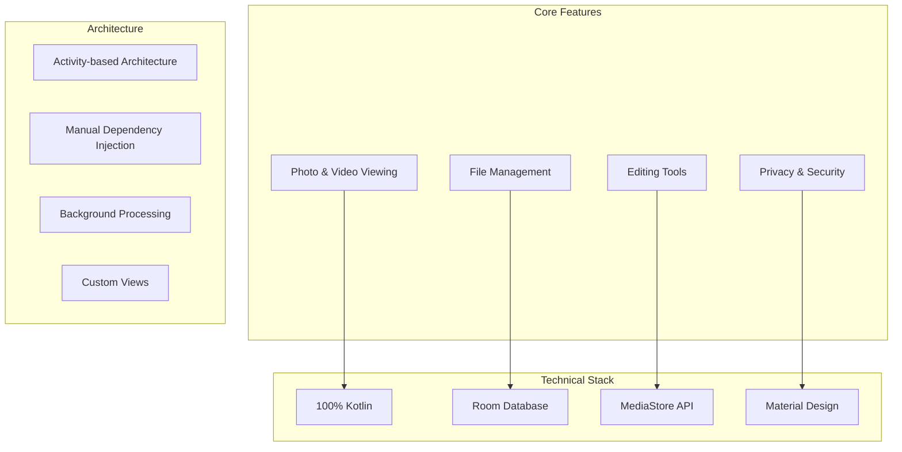
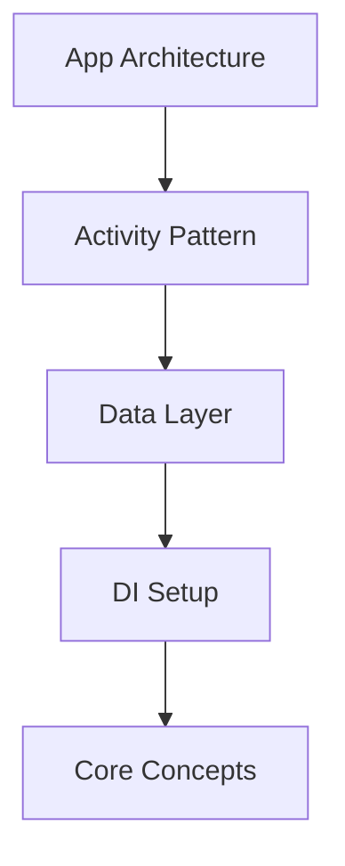
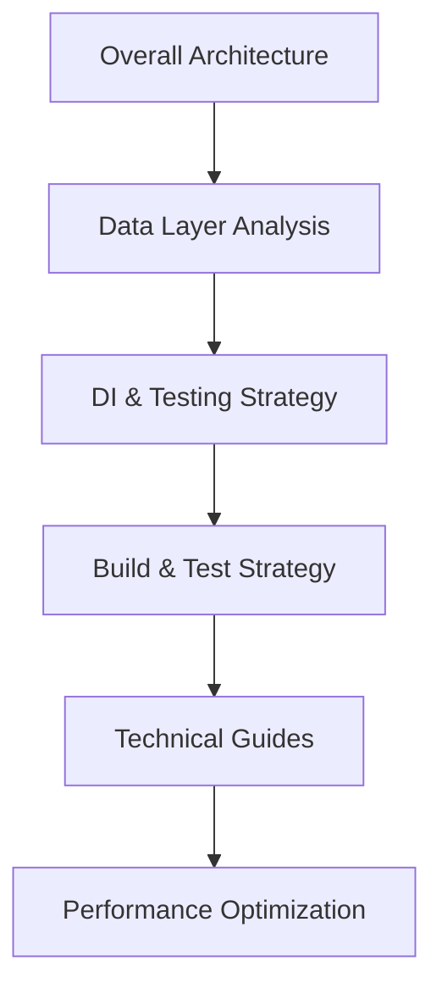
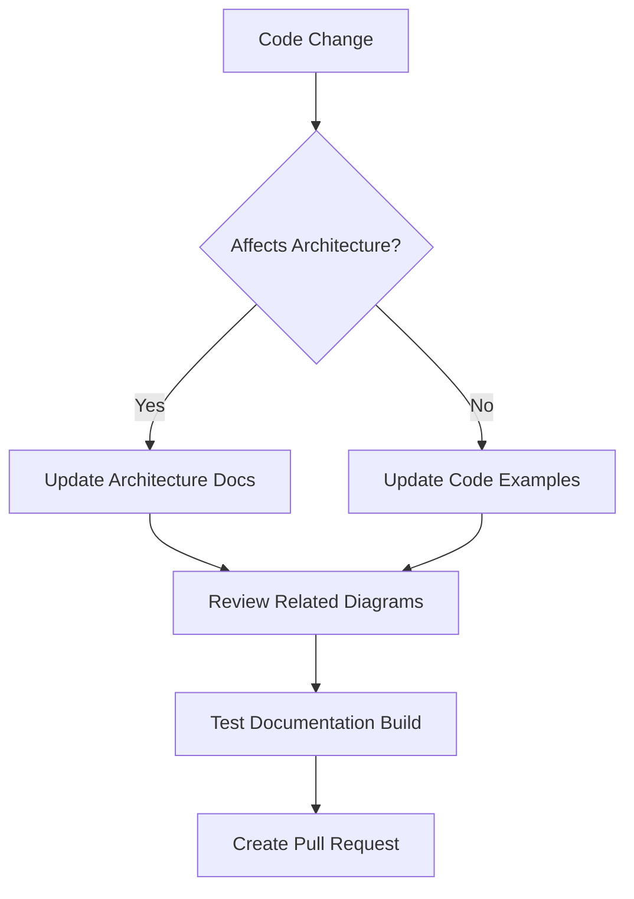

--- FILE: project_documentation/README.md ---

# 📱 Fossify Gallery - Complete Documentation

## Welcome to Fossify Gallery Documentation

Complete documentation for the **Fossify Gallery** project - a leading open-source photo and video management application for Android. This documentation is designed for new developers joining the project, from beginners to experienced developers.

**Documentation Features:**
- **Accessible**: Clear explanations for newcomers
- **Technically comprehensive**: Detailed for experienced developers  
- **Well-structured**: Organized by modules and functionality
- **Practical**: Includes diagrams and code examples

### 🚀 About Fossify Gallery


**Modern Android gallery application with focus on privacy, performance, and user experience**

## 📋 Documentation Structure

### 🏗️ 1. OVERVIEW
**Architecture overview and user flows**

| File | Description | Target Audience |
|------|-------------|-----------------|
| [**app_architecture.md**](1_OVERVIEW/app_architecture.md) | Complete system architecture | All developers |
| [**main_user_flows.md**](1_OVERVIEW/main_user_flows.md) | Main user interaction flows | UI/UX developers, Product |

### 📱 2. APP_MODULE
**Details about the main application module**

#### UI Layer
| File | Description | Target Audience |
|------|-------------|-----------------|
| [**activities_fragments.md**](2_APP_MODULE/ui_layer/activities_fragments.md) | Activities, Fragments, Navigation | Android UI development |

#### ViewModel Layer
| File | Description | Target Audience |
|------|-------------|-----------------|
| [**architecture_pattern.md**](2_APP_MODULE/viewmodel_layer/architecture_pattern.md) | Why no ViewModels, Activity-based architecture | Architecture decisions |

#### Data Layer
| File | Description | Target Audience |
|------|-------------|-----------------|
| [**data_sources.md**](2_APP_MODULE/data_layer/data_sources.md) | MediaStore, Room Database | Storage systems |

#### Dependency Injection
| File | Description | Target Audience |
|------|-------------|-----------------|
| [**di_setup.md**](2_APP_MODULE/di_setup.md) | Manual DI patterns, lifecycle management | Architecture patterns |

### 🧠 3. CORE_CONCEPTS
**Core concepts and advanced features**

| File | Description | Priority |
|------|-------------|----------|
| [**data_persistence.md**](3_CORE_CONCEPTS/data_persistence.md) | Room DB, caching strategy | 🔥 Critical |
| [**permissions_handling.md**](3_CORE_CONCEPTS/permissions_handling.md) | Android permissions, scoped storage | 🔥 Critical |
| [**background_tasks.md**](3_CORE_CONCEPTS/background_tasks.md) | Threading, async operations | 📱 Important |
| [**theming_and_styles.md**](3_CORE_CONCEPTS/theming_and_styles.md) | Material Design, custom themes | 🎨 UI/UX |

### 🔧 4. BUILD_AND_TEST
**Build system and testing strategies**

| File | Description | Target Audience |
|------|-------------|-----------------|
| [**build_logic.md**](4_BUILD_AND_TEST/build_logic.md) | Gradle, build variants, dependencies | DevOps, Build engineers |
| [**testing_strategy.md**](4_BUILD_AND_TEST/testing_strategy.md) | Unit tests, integration tests | QA, Test engineers |

### ⚙️ 5. SYSTEM_INFO
**Setup and system requirements**

| File | Description | Target Audience |
|------|-------------|-----------------|
| [**setup_guide.md**](5_SYSTEM_INFO/setup_guide.md) | Development environment setup | New developers |

### 🔧 6. TECHNICAL_GUIDES
**Advanced technical guides for development**

| File | Description | Target Audience |
|------|-------------|-----------------|
| [**api_reference.md**](6_TECHNICAL_GUIDES/api_reference.md) | Complete API reference for core classes | All developers |
| [**custom_views_guide.md**](6_TECHNICAL_GUIDES/custom_views_guide.md) | Creating and extending custom views | UI developers |
| [**animation_transitions.md**](6_TECHNICAL_GUIDES/animation_transitions.md) | Animation systems and smooth transitions | UI/UX developers |
| [**performance_optimization.md**](6_TECHNICAL_GUIDES/performance_optimization.md) | Advanced performance optimization techniques | Senior developers |

## 🎯 Learning Paths

### 🌱 **Beginners**

**Recommended learning path for new Android developers:**

1. [Setup Guide](5_SYSTEM_INFO/setup_guide.md) - Environment setup
2. [App Architecture](1_OVERVIEW/app_architecture.md) - System overview
3. [Main User Flows](1_OVERVIEW/main_user_flows.md) - User experience
4. [Activities & Fragments](2_APP_MODULE/ui_layer/activities_fragments.md) - UI basics
5. [Data Sources](2_APP_MODULE/data_layer/data_sources.md) - Data handling

### 📱 **Android Developers**


**For developers with Android experience:**
- [App Architecture](1_OVERVIEW/app_architecture.md) - Understand the approach
- [Architecture Pattern](2_APP_MODULE/viewmodel_layer/architecture_pattern.md) - Why no MVVM
- [Activities & Fragments](2_APP_MODULE/ui_layer/activities_fragments.md) - UI architecture
- [Build Logic](4_BUILD_AND_TEST/build_logic.md) - Gradle mastery

### 🚀 **Senior/Lead Developers**


**For architecture and technical decisions:**
- [Complete Architecture](1_OVERVIEW/) - System design
- [Data & DI](2_APP_MODULE/) - Implementation patterns
- [Core Concepts](3_CORE_CONCEPTS/) - Advanced features
- [Build & Test](4_BUILD_AND_TEST/) - DevOps & quality
- [Technical Guides](6_TECHNICAL_GUIDES/) - API reference, custom views, performance

## 🎨 Visual Documentation Features

### 📊 **Interactive Diagrams**
All documentation uses **Mermaid diagrams** rendered directly:

- **Architecture Diagrams**: System overview and component relationships
- **Sequence Diagrams**: User interactions and data flow
- **Flowcharts**: Decision trees and processes
- **Class Diagrams**: Object relationships
- **Mind Maps**: Feature breakdowns

### 💻 **Real Code Examples**
```kotlin
// Real code snippets from the project
class MainActivity : SimpleActivity() {
    private val binding by viewBinding(ActivityMainBinding::inflate)
    private val config: Config by lazy { Config.newInstance(applicationContext) }
    
    override fun onCreate(savedInstanceState: Bundle?) {
        super.onCreate(savedInstanceState)
        setContentView(binding.root)
        setupUI()
    }
}
```

### 📐 **Technical Specifications**
Each document includes:
- Component breakdown
- API interfaces
- Performance considerations

## 🤝 Contributing to Documentation

### 📝 **Updating Documentation**

```bash
# Clone and create documentation branch
git checkout -b feature/docs-update
cd Gallery/project_documentation

# Make your changes
vim 1_OVERVIEW/app_architecture.md

# Commit with clear message
git add .
git commit -m "docs: update architecture diagram for MediaFetcher"
git push origin feature/docs-update
```

### ✨ **Documentation Standards**

- **Headers**: Use `##` and `###` for hierarchy
- **Diagrams**: Always include Mermaid code
- **Code**: Use syntax highlighting
- **Links**: Relative paths within docs

### 🔄 **Keeping Docs Updated**


## 📞 Contact & Support

For questions about this documentation:
- **Discussions**: [GitHub Discussions](https://github.com/FossifyOrg/Gallery/discussions)
- **GitHub Issues**: [Report documentation issues](https://github.com/FossifyOrg/Gallery/issues)

---
**Happy coding! 🚀**

## 📄 Document Metadata

| Property | Value |
|----------|-------|
| **Created** | December 2024 |
| **Last Updated** | December 2024 |
| **Version** | 1.0.0 |
| **Target App Version** | Fossify Gallery 6.30.0+ |
| **Contributors** | Community driven |
| **License** | Same as project (GPL-3.0) |

### 🏷️ **Tags**
`#android` `#kotlin` `#gallery` `#open-source` `#documentation` `#fossify` `#privacy` `#photo-management`

--- END FILE: project_documentation/README.md --- 